# Executive Platform Blueprint
## LeadGenie-AI — Intelligent B2B Revenue Acceleration Platform

---

### Platform Vision

LeadGenie-AI is an enterprise-grade, agentic intelligence platform purpose-built to transform how B2B organizations discover, qualify, engage, and convert high-value prospects. Rather than replacing your revenue team, LeadGenie-AI acts as a tireless, always-on digital workforce — one that thinks, learns, adapts, and executes across the entire lead lifecycle with the precision of your best analyst and the scale of an entire department.

At its core, the platform operates through a coordinated network of specialized AI Agents, each owning a distinct domain of the sales intelligence process. These agents do not simply automate tasks — they reason through ambiguity, synthesize signals from dozens of data sources, and make contextual decisions that surface the right opportunity, to the right person, at the right moment.

---

### The Three Pillars of LeadGenie-AI

**1. Unified Intelligence Layer**
Every action the platform takes is grounded in a continuously enriched, living data foundation — pulling from CRM systems, intent signals, firmographic databases, web activity, and first-party behavioral data. This ensures every agent decision is informed, not assumed.

**2. Orchestrated Agent Workforce**
A central orchestration brain coordinates a team of purpose-built agents — from prospecting and research to outreach sequencing and pipeline scoring — ensuring they collaborate seamlessly rather than operating in silos. Think of it as a highly coordinated revenue operations team that never sleeps.

**3. Human-in-the-Loop Governance**
LeadGenie-AI is designed for trust. Every critical recommendation surfaces through intuitive executive dashboards, giving your team full visibility, override capability, and strategic control. The platform amplifies human judgment — it never circumvents it.

---

### Macro System Flow Diagram

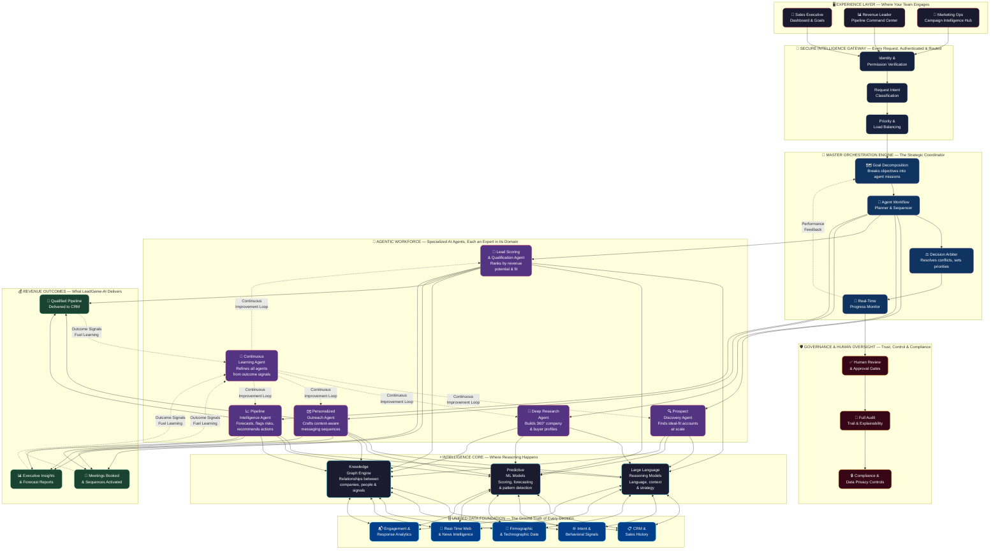
```mermaid
flowchart TD
    classDef userLayer fill:#1a1a2e,stroke:#e94560,color:#ffffff,rx:12
    classDef gatewayLayer fill:#16213e,stroke:#0f3460,color:#ffffff,rx:12
    classDef orchestration fill:#0f3460,stroke:#533483,color:#ffffff,rx:12
    classDef agentLayer fill:#533483,stroke:#e94560,color:#ffffff,rx:12
    classDef intelligenceLayer fill:#1b1b2f,stroke:#00b4d8,color:#ffffff,rx:12
    classDef dataLayer fill:#023e8a,stroke:#00b4d8,color:#ffffff,rx:12
    classDef outputLayer fill:#1b4332,stroke:#52b788,color:#ffffff,rx:12
    classDef governanceLayer fill:#370617,stroke:#f48c06,color:#ffffff,rx:12

    %% ── USER EXPERIENCE LAYER ──
    subgraph UX ["🖥️  EXPERIENCE LAYER  —  Where Your Team Engages"]
        U1["👤 Sales Executive\nDashboard & Goals"]
        U2["📊 Revenue Leader\nPipeline Command Center"]
        U3["🎯 Marketing Ops\nCampaign Intelligence Hub"]
    end

    %% ── SECURE GATEWAY ──
    subgraph GW ["🔐  SECURE INTELLIGENCE GATEWAY  —  Every Request, Authenticated & Routed"]
        G1["Identity &\nPermission Verification"]
        G2["Request Intent\nClassification"]
        G3["Priority &\nLoad Balancing"]
    end

    %% ── ORCHESTRATION BRAIN ──
    subgraph ORCH ["🧠  MASTER ORCHESTRATION ENGINE  —  The Strategic Coordinator"]
        O1["🗺️ Goal Decomposition\nBreaks objectives into agent missions"]
        O2["🔄 Agent Workflow\nPlanner & Sequencer"]
        O3["⚖️ Decision Arbiter\nResolves conflicts, sets priorities"]
        O4["📡 Real-Time\nProgress Monitor"]
    end

    %% ── AGENT WORKFORCE ──
    subgraph AGENTS ["🤖  AGENTIC WORKFORCE  —  Specialized AI Agents, Each an Expert in Its Domain"]
        direction LR
        A1["🔍 Prospect\nDiscovery Agent\nFinds ideal-fit accounts\nat scale"]
        A2["🧬 Deep Research\nAgent\nBuilds 360° company\n& buyer profiles"]
        A3["🎯 Lead Scoring\n& Qualification Agent\nRanks by revenue\npotential & fit"]
        A4["✉️ Personalized\nOutreach Agent\nCrafts context-aware\nmessaging sequences"]
        A5["📈 Pipeline\nIntelligence Agent\nForecasts, flags risks,\nrecommends actions"]
        A6["🔁 Continuous\nLearning Agent\nRefines all agents\nfrom outcome signals"]
    end

    %% ── INTELLIGENCE CORE ──
    subgraph INTEL ["⚡  INTELLIGENCE CORE  —  Where Reasoning Happens"]
        I1["Large Language\nReasoning Models\nLanguage, context\n& strategy"]
        I2["Predictive\nML Models\nScoring, forecasting\n& pattern detection"]
        I3["Knowledge\nGraph Engine\nRelationships between\ncompanies, people & signals"]
    end

    %% ── DATA FOUNDATION ──
    subgraph DATA ["🗄️  UNIFIED DATA FOUNDATION  —  The Ground Truth of Every Decision"]
        direction LR
        D1["📋 CRM &\nSales History"]
        D2["🌐 Intent &\nBehavioral Signals"]
        D3["🏢 Firmographic\n& Technographic Data"]
        D4["📰 Real-Time Web\n& News Intelligence"]
        D5["📬 Engagement &\nResponse Analytics"]
    end

    %% ── GOVERNANCE & CONTROL ──
    subgraph GOV ["🛡️  GOVERNANCE & HUMAN OVERSIGHT  —  Trust, Control & Compliance"]
        V1["✅ Human Review\n& Approval Gates"]
        V2["📜 Full Audit\nTrail & Explainability"]
        V3["🔒 Compliance &\nData Privacy Controls"]
    end

    %% ── REVENUE OUTCOMES ──
    subgraph OUT ["💰  REVENUE OUTCOMES  —  What LeadGenie-AI Delivers"]
        R1["🚀 Qualified Pipeline\nDelivered to CRM"]
        R2["📅 Meetings Booked\n& Sequences Activated"]
        R3["📊 Executive Insights\n& Forecast Reports"]
    end

    %% ── CONNECTIONS ──
    U1 & U2 & U3 --> G1
    G1 --> G2 --> G3

    G3 --> O1
    O1 --> O2
    O2 --> O3
    O3 --> O4

    O2 --> A1 & A2 & A3 & A4 & A5
    A6 -.->|"Continuous\nImprovement Loop"| A1 & A2 & A3 & A4 & A5

    A1 & A2 & A3 & A4 & A5 --> I1 & I2 & I3

    I1 & I2 & I3 <--> D1 & D2 & D3 & D4 & D5

    O4 --> V1
    V1 --> V2
    V2 --> V3

    A3 & A4 & A5 --> R1 & R2 & R3

    O4 -.->|"Performance\nFeedback"| O1

    R1 & R2 & R3 -.->|"Outcome Signals\nFuel Learning"| A6

    class U1,U2,U3 userLayer
    class G1,G2,G3 gatewayLayer
    class O1,O2,O3,O4 orchestration
    class A1,A2,A3,A4,A5,A6 agentLayer
    class I1,I2,I3 intelligenceLayer
    class D1,D2,D3,D4,D5 dataLayer
    class R1,R2,R3 outputLayer
    class V1,V2,V3 governanceLayer
```

---

### Reading the Flow — An Executive Summary

| Layer | Business Role |
|---|---|
| **Experience Layer** | Where your people set goals, review recommendations, and take action |
| **Secure Gateway** | Ensures every interaction is authenticated, classified, and intelligently routed |
| **Orchestration Engine** | The strategic brain that breaks down your revenue goals into coordinated agent missions |
| **Agentic Workforce** | Six specialized AI agents, each owning a critical stage of the revenue process |
| **Intelligence Core** | The reasoning engine — combining language understanding, predictive modeling, and relationship mapping |
| **Data Foundation** | The always-current, unified source of truth that grounds every agent decision |
| **Governance Layer** | Human oversight, explainability, and compliance controls built into every critical decision point |
| **Revenue Outcomes** | Qualified pipeline, booked meetings, and strategic intelligence — delivered continuously |

> *LeadGenie-AI does not operate as a black box. Every recommendation is traceable, every agent action is auditable, and every outcome feeds back into a system that gets measurably smarter with each engagement cycle.*


## Module Blueprint: run_test_pipeline.py
# LeadGenie AI — Test Pipeline: Architectural Breakdown

## What This Module Does (Executive Summary)

`run_test_pipeline.py` is the **end-to-end integration harness** for the LeadGenie AI outreach platform. It simulates a real sales outreach campaign using **6 internal teammates as stand-ins for real leads**, validating that every layer of the AI pipeline — from signal detection to email delivery — works correctly before going live. Think of it as a **dress rehearsal for the entire revenue engine**.

---

## The Full Pipeline Flow

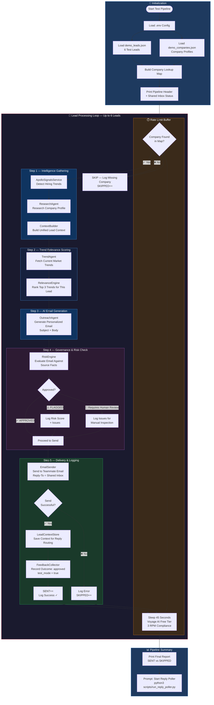
```mermaid
flowchart TD
    subgraph INIT["🚀 Initialization"]
        A([Start Test Pipeline]) --> B[Load .env Config]
        B --> C[Load demo_leads.json\n6 Test Leads]
        B --> D[Load demo_companies.json\nCompany Profiles]
        C --> E[Build Company Lookup Map]
        D --> E
        E --> F[Print Pipeline Header\n+ Shared Inbox Status]
    end

    subgraph LOOP["🔁 Lead Processing Loop — Up to 6 Leads"]
        F --> G{Company Found\nin Map?}
        G -- ❌ No --> SKIP1[SKIP — Log Missing Company\nSKIPPED++]
        G -- ✅ Yes --> H

        subgraph STEP1["Step 1 — Intelligence Gathering"]
            H[ApolloSignalsService\nDetect Hiring Trends] --> I[ResearchAgent\nResearch Company Profile]
            I --> J[ContextBuilder\nBuild Unified Lead Context]
        end

        subgraph STEP2["Step 2 — Trend Relevance Scoring"]
            J --> K[TrendAgent\nFetch Current Market Trends]
            K --> L[RelevanceEngine\nRank Top 3 Trends for This Lead]
        end

        subgraph STEP3["Step 3 — AI Email Generation"]
            L --> M[OutreachAgent\nGenerate Personalized Email\nSubject + Body]
        end

        subgraph STEP4["Step 4 — Governance & Risk Check"]
            M --> N[RiskEngine\nEvaluate Email Against\nSource Facts]
            N --> O{Approved?}
            O -- ✅ APPROVED --> P[Proceed to Send]
            O -- ⚠️ FLAGGED --> Q[Log Risk Score\n+ Issues]
            Q --> P
            O -- 🚨 Requires Human Review --> R[Log Issues for\nManual Inspection]
            R --> P
        end

        subgraph STEP5["Step 5 — Delivery & Logging"]
            P --> S[EmailSender\nSend to Teammate Email\nReply-To = Shared Inbox]
            S --> T{Send\nSuccessful?}
            T -- ✅ Yes --> U[LeadContextStore\nSave Context for Reply Routing]
            U --> V[FeedbackCollector\nRecord Outcome: approved\ntest_mode = true]
            V --> W[SENT++\nLog Success ✓]
            T -- ❌ No --> SKIP2[Log Error\nSKIPPED++]
        end

        subgraph RATE["⏱️ Rate Limit Buffer"]
            W --> X[Sleep 45 Seconds\nVoyage AI Free Tier\n3 RPM Compliance]
            SKIP2 --> X
            X --> G
        end
    end

    subgraph SUMMARY["📊 Pipeline Summary"]
        X --> Y[Print Final Report\nSENT vs SKIPPED]
        Y --> Z[Prompt: Start Reply Poller\npython3 scripts/run_reply_poller.py]
    end

    SKIP1 --> G

    style INIT fill:#1e3a5f,color:#ffffff,stroke:#4a90d9
    style LOOP fill:#1a1a2e,color:#ffffff,stroke:#e94560
    style STEP1 fill:#0f3460,color:#ffffff,stroke:#4a90d9
    style STEP2 fill:#16213e,color:#ffffff,stroke:#4a90d9
    style STEP3 fill:#0f3460,color:#ffffff,stroke:#4a90d9
    style STEP4 fill:#2d1b33,color:#ffffff,stroke:#9b59b6
    style STEP5 fill:#1a3a2a,color:#ffffff,stroke:#27ae60
    style RATE fill:#3a2a1a,color:#ffffff,stroke:#e67e22
    style SUMMARY fill:#1e3a5f,color:#ffffff,stroke:#4a90d9
```

---

## The Reply-Loop Architecture

This diagram shows how the test pipeline connects to the broader **live reply handling system** — the teammate simulation creates a closed feedback loop.

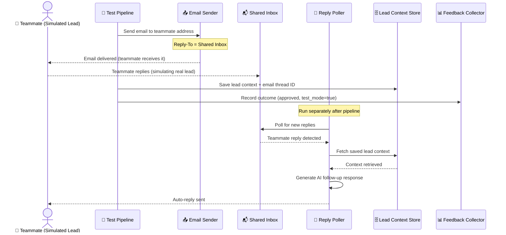
```mermaid
sequenceDiagram
    actor TM as 👤 Teammate (Simulated Lead)
    participant TP as 🧪 Test Pipeline
    participant ES as 📤 Email Sender
    participant SI as 📬 Shared Inbox
    participant RP as 🔄 Reply Poller
    participant LCS as 🗄️ Lead Context Store
    participant FC as 📊 Feedback Collector

    TP->>ES: Send email to teammate address
    Note over ES: Reply-To = Shared Inbox
    ES-->>TM: Email delivered (teammate receives it)
    TM-->>SI: Teammate replies (simulating real lead)
    
    TP->>LCS: Save lead context + email thread ID
    TP->>FC: Record outcome (approved, test_mode=true)

    Note over RP: Run separately after pipeline
    RP->>SI: Poll for new replies
    SI-->>RP: Teammate reply detected
    RP->>LCS: Fetch saved lead context
    LCS-->>RP: Context retrieved
    RP->>RP: Generate AI follow-up response
    RP-->>TM: Auto-reply sent
```

---

## The 5-Stage Processing Engine

Each lead passes through five distinct intelligence layers:

| Stage | Service | What It Does | Business Value |
|-------|---------|-------------|----------------|
| **1. Signal Detection** | `ApolloSignalsService` | Scans hiring activity, funding signals, growth indicators | Identifies *why now* is the right moment to reach out |
| **2. Deep Research** | `ResearchAgent` + `ContextBuilder` | Profiles the company's growth stage and AI readiness (scored /10) | Ensures messaging is grounded in real company context |
| **3. Trend Matching** | `TrendAgent` + `RelevanceEngine` | Pulls live market trends, ranks top 3 most relevant to this lead | Makes emails feel timely and industry-aware, not generic |
| **4. AI Copywriting** | `OutreachAgent` | Generates a fully personalized subject line + email body | Replaces hours of manual SDR writing with seconds |
| **5. Risk Governance** | `RiskEngine` | Scores the email for compliance, accuracy, and brand safety | Prevents embarrassing or legally risky messages from sending |

---

## Governance Decision Logic

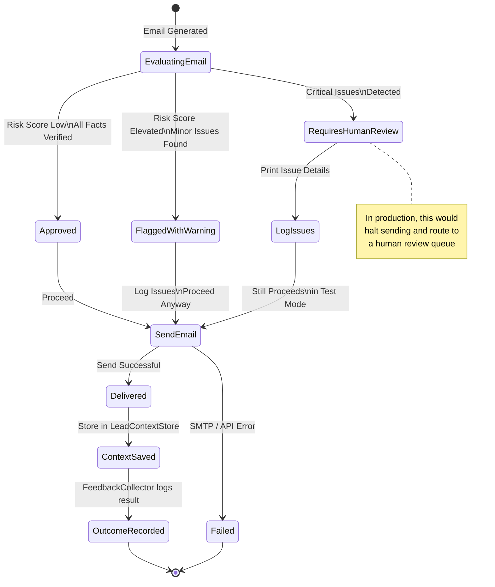
```mermaid
stateDiagram-v2
    [*] --> EvaluatingEmail : Email Generated

    EvaluatingEmail --> Approved : Risk Score Low\nAll Facts Verified
    EvaluatingEmail --> FlaggedWithWarning : Risk Score Elevated\nMinor Issues Found
    EvaluatingEmail --> RequiresHumanReview : Critical Issues\nDetected

    Approved --> SendEmail : Proceed
    FlaggedWithWarning --> SendEmail : Log Issues\nProceed Anyway
    RequiresHumanReview --> LogIssues : Print Issue Details
    LogIssues --> SendEmail : Still Proceeds\nin Test Mode

    SendEmail --> Delivered : Send Successful
    SendEmail --> Failed : SMTP / API Error

    Delivered --> ContextSaved : Store in LeadContextStore
    ContextSaved --> OutcomeRecorded : FeedbackCollector logs result
    OutcomeRecorded --> [*]

    Failed --> [*]

    note right of RequiresHumanReview
        In production, this would
        halt sending and route to
        a human review queue
    end note
```

---

## Key Architectural Decisions Explained

### 🎭 Teammate Simulation Strategy
Rather than sending to real prospects during testing, the pipeline routes emails to **internal team members** who role-play as leads. This is brilliant for two reasons:
- **Real email infrastructure is exercised** — SMTP, threading, reply-to headers all get validated
- **Human feedback is authentic** — teammates can respond naturally, testing the reply poller's AI response quality

### 📬 The Reply-To Trick
Every outbound email has its **Reply-To header pointed at a shared team inbox** (not the sender's personal address). This means when a teammate replies, the reply poller can intercept it, look up the saved lead context, and generate an AI follow-up — **closing the full conversation loop automatically**.

### ⏱️ The 45-Second Sleep
The pipeline deliberately pauses 45 seconds between each lead. This is a **rate-limit compliance mechanism** for the Voyage AI embedding service (free tier: 3 requests/minute, 2 calls per lead). This is a pragmatic cost-optimization decision — the free tier is sufficient for testing without incurring API costs.

### 🗄️ Context Persistence
After a successful send, the lead's full enriched context (signals, research, trends, email content) is saved to `LeadContextStore`. This is the **memory layer** that enables the reply poller to respond intelligently — without it, follow-up replies would have no context about what was originally discussed.

---

## Business Value Summary

| Concern | How This Pipeline Addresses It |
|---------|-------------------------------|
| **Quality Assurance** | Full end-to-end validation before any real prospect is contacted |
| **Personalization at Scale** | Every email is uniquely crafted from live signals, research, and trend data |
| **Brand Safety** | Governance layer catches risky or inaccurate content before delivery |
| **Conversation Continuity** | Context store enables coherent multi-turn AI conversations |
| **Cost Control** | Rate limiting respects free-tier API boundaries during testing |
| **Feedback Loop** | Outcomes are recorded from day one, feeding future model improvements |

> **Bottom Line:** This module is the **confidence gate** for the entire LeadGenie platform. It proves that six independent AI agents, two data stores, a governance layer, and a live email system can orchestrate together seamlessly — before a single real sales prospect ever sees a message.

## Module Blueprint: backend/__init__.py
# Backend Module: Architectural Breakdown

---

## 🏢 What Is This Component?

The `backend/__init__.py` file is the **package initializer** for the entire backend system. In Python's architecture, this file serves as the **front door** of the backend module — it is the first thing Python reads when any part of the application imports from the backend.

In this specific case, the file is **intentionally empty**, which is itself a deliberate and meaningful architectural decision.

---

## 💡 Business Value & Strategic Purpose

An empty `__init__.py` is not a gap — it is a **clean architectural boundary**. Here's what it communicates and enables:

- **🔒 Namespace Declaration:** It formally declares `backend` as a recognized Python package, making it importable across the entire codebase without ambiguity.
- **🧱 Zero Coupling at the Root:** By keeping this file empty, the architecture enforces that **no business logic, no dependencies, and no side effects** are loaded simply by referencing the backend package. This is a hallmark of clean, modular design.
- **🚀 Lazy Loading Strategy:** Sub-modules (e.g., `backend.api`, `backend.services`, `backend.models`) are only loaded when explicitly needed — improving startup performance and reducing memory overhead.
- **🔧 Future Extensibility:** The file can be upgraded at any time to expose a curated public API surface, register plugins, or initialize shared resources — without breaking any existing consumers.

---

## 🗺️ Architectural Position

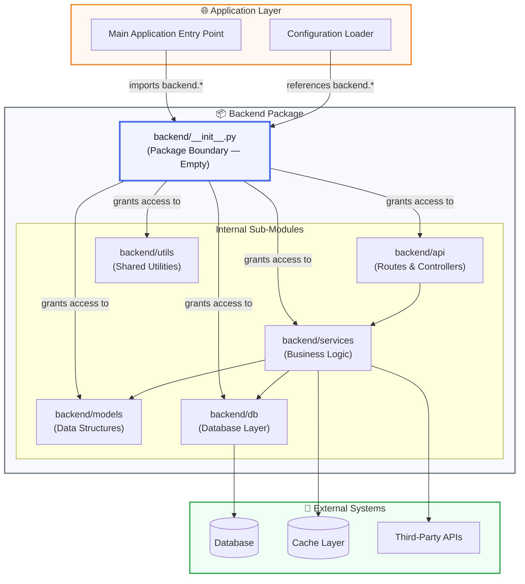
```mermaid
flowchart TD
    subgraph Application["🌐 Application Layer"]
        APP[Main Application Entry Point]
        CONFIG[Configuration Loader]
    end

    subgraph BackendPackage["📦 Backend Package"]
        INIT["backend/__init__.py\n(Package Boundary — Empty)"]
        
        subgraph Submodules["Internal Sub-Modules"]
            API["backend/api\n(Routes & Controllers)"]
            SERVICES["backend/services\n(Business Logic)"]
            MODELS["backend/models\n(Data Structures)"]
            DB["backend/db\n(Database Layer)"]
            UTILS["backend/utils\n(Shared Utilities)"]
        end
    end

    subgraph ExternalSystems["🔌 External Systems"]
        DATABASE[(Database)]
        CACHE[(Cache Layer)]
        THIRDPARTY[Third-Party APIs]
    end

    APP -->|"imports backend.*"| INIT
    CONFIG -->|"references backend.*"| INIT
    INIT -->|"grants access to"| API
    INIT -->|"grants access to"| SERVICES
    INIT -->|"grants access to"| MODELS
    INIT -->|"grants access to"| DB
    INIT -->|"grants access to"| UTILS

    API --> SERVICES
    SERVICES --> MODELS
    SERVICES --> DB
    DB --> DATABASE
    SERVICES --> CACHE
    SERVICES --> THIRDPARTY

    style INIT fill:#f0f4ff,stroke:#4a6cf7,stroke-width:3px,color:#1a1a2e
    style BackendPackage fill:#f8f9ff,stroke:#6c757d,stroke-width:2px
    style Application fill:#fff8f0,stroke:#fd7e14,stroke-width:2px
    style ExternalSystems fill:#f0fff4,stroke:#28a745,stroke-width:2px
```

---

## 🔄 Import Lifecycle Flow

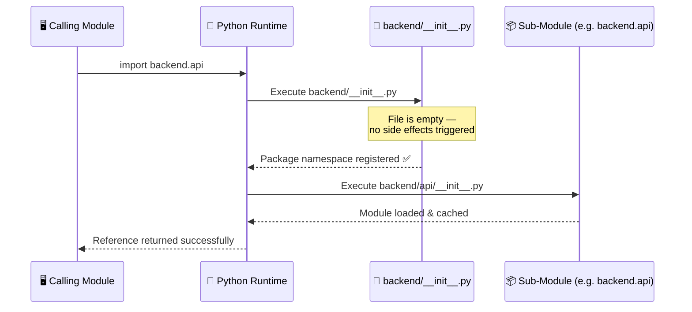
```mermaid
sequenceDiagram
    participant Caller as 🖥️ Calling Module
    participant Python as 🐍 Python Runtime
    participant Init as 📄 backend/__init__.py
    participant SubMod as 📦 Sub-Module (e.g. backend.api)

    Caller->>Python: import backend.api
    Python->>Init: Execute backend/__init__.py
    Note over Init: File is empty — <br/>no side effects triggered
    Init-->>Python: Package namespace registered ✅
    Python->>SubMod: Execute backend/api/__init__.py
    SubMod-->>Python: Module loaded & cached
    Python-->>Caller: Reference returned successfully
```

---

## 📊 Design Pattern Classification

| Attribute | Detail |
|---|---|
| **Pattern** | Clean Package Boundary |
| **Coupling Level** | ⬛⬜⬜⬜⬜ Minimal (None) |
| **Side Effects on Import** | None |
| **Startup Performance Impact** | Zero overhead |
| **Extensibility** | High — ready for future API surface exposure |
| **Risk Level** | 🟢 None |

---

## 🧭 Key Architectural Takeaways

1. **Intentional Minimalism** — The emptiness is a feature, not an oversight. It keeps the backend package lightweight and side-effect-free at the root level.

2. **Separation of Concerns** — Each sub-module owns its own initialization logic. Nothing is centralized prematurely.

3. **Scalability Signal** — This pattern scales well. As the backend grows, individual sub-modules can evolve independently without touching this root boundary.

4. **Team Collaboration Friendly** — Multiple engineers can work on different sub-modules simultaneously with zero risk of merge conflicts or initialization order issues at the package root.

---

> **Bottom Line:** This file is the **silent foundation** of the entire backend. Like a well-designed building lobby, it exists to grant access to everything inside — cleanly, efficiently, and without getting in the way.

## Module Blueprint: backend/test_apollo.py
# Architectural Breakdown: `test_apollo.py` — Apollo.io Lead Intelligence Harvester

---

## 🎯 What This Module Does (Business Summary)

This module is a **two-stage B2B lead generation pipeline** that connects directly to the Apollo.io sales intelligence platform. In a single execution, it:

1. **Discovers companies** operating in India (any size, any industry)
2. **Extracts senior decision-makers** from those companies (C-Suite, VPs, Directors)
3. **Persists the results** as structured data files for downstream use

Think of it as an **automated sales researcher** — replacing hours of manual prospecting with a script that returns qualified leads in seconds.

---

## 🗺️ Logical Flow Diagram

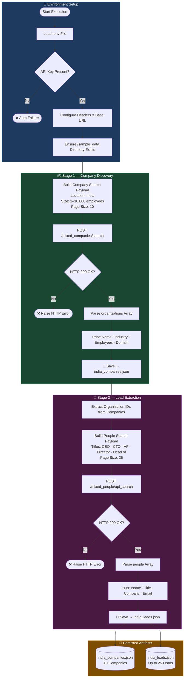
```mermaid
flowchart TD
    subgraph ENV["🔐 Environment Setup"]
        A([Start Execution]) --> B[Load .env File]
        B --> C{API Key Present?}
        C -- No --> Z([❌ Auth Failure])
        C -- Yes --> D[Configure Headers & Base URL]
        D --> E[Ensure /sample_data Directory Exists]
    end

    subgraph STAGE1["📦 Stage 1 — Company Discovery"]
        E --> F[Build Company Search Payload\nLocation: India\nSize: 1–10,000 employees\nPage Size: 10]
        F --> G[POST /mixed_companies/search]
        G --> H{HTTP 200 OK?}
        H -- No --> Z2([❌ Raise HTTP Error])
        H -- Yes --> I[Parse organizations Array]
        I --> J[Print: Name · Industry · Employees · Domain]
        J --> K[💾 Save → india_companies.json]
    end

    subgraph STAGE2["👤 Stage 2 — Lead Extraction"]
        K --> L[Extract Organization IDs from Companies]
        L --> M[Build People Search Payload\nTitles: CEO · CTO · VP · Director · Head of\nPage Size: 25]
        M --> N[POST /mixed_people/api_search]
        N --> O{HTTP 200 OK?}
        O -- No --> Z3([❌ Raise HTTP Error])
        O -- Yes --> P[Parse people Array]
        P --> Q[Print: Name · Title · Company · Email]
        Q --> R[💾 Save → india_leads.json]
    end

    subgraph OUTPUT["📂 Persisted Artifacts"]
        R --> S[(india_companies.json\n10 Companies)]
        R --> T[(india_leads.json\nUp to 25 Leads)]
    end

    style ENV fill:#1e3a5f,color:#ffffff,stroke:#4a90d9
    style STAGE1 fill:#1a4731,color:#ffffff,stroke:#2ecc71
    style STAGE2 fill:#4a1942,color:#ffffff,stroke:#e056fd
    style OUTPUT fill:#7d4e00,color:#ffffff,stroke:#f39c12
```

---

## 🔄 Data Lifecycle Sequence

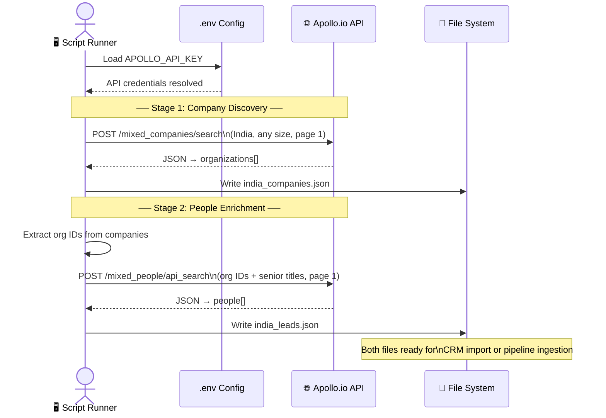
```mermaid
sequenceDiagram
    actor Script as 🖥️ Script Runner
    participant ENV as .env Config
    participant Apollo as 🌐 Apollo.io API
    participant FS as 📁 File System

    Script->>ENV: Load APOLLO_API_KEY
    ENV-->>Script: API credentials resolved

    Note over Script,Apollo: ── Stage 1: Company Discovery ──

    Script->>Apollo: POST /mixed_companies/search\n(India, any size, page 1)
    Apollo-->>Script: JSON → organizations[]
    Script->>FS: Write india_companies.json

    Note over Script,Apollo: ── Stage 2: People Enrichment ──

    Script->>Script: Extract org IDs from companies
    Script->>Apollo: POST /mixed_people/api_search\n(org IDs + senior titles, page 1)
    Apollo-->>Script: JSON → people[]
    Script->>FS: Write india_leads.json

    Note over FS: Both files ready for\nCRM import or pipeline ingestion
```

---

## 🧩 Component Breakdown

### 🔐 Authentication & Configuration Layer
- Reads the **Apollo API key** securely from environment variables — never hardcoded
- Attaches the key via a custom `X-Api-Key` header on every request
- Sets `Cache-Control: no-cache` to ensure **fresh, real-time data** on every run
- Targets Apollo's **v1 REST API** as the data source

---

### 📦 Stage 1 — Company Intelligence
| Parameter | Value | Business Meaning |
|---|---|---|
| `organization_locations` | India | Geographic market filter |
| `organization_num_employees_ranges` | 1–10,000 | Captures SMBs through large enterprises |
| `per_page` | 10 | Lightweight discovery batch |

**Output captured per company:**
- Company name, industry vertical, estimated headcount, and primary web domain

---

### 👤 Stage 2 — Decision-Maker Targeting
- Uses the **company IDs from Stage 1** as the filter anchor — ensuring leads are tied to the discovered companies
- Filters exclusively for **senior buying personas**: CEO, CTO, VP, Director, Head of
- Captures name, title, employer, and email address (where available)
- Returns up to **25 contacts** per run

> 💡 **Why this matters:** By chaining company discovery → people search, the module avoids cold, unqualified contacts. Every lead is anchored to a known, filtered organization.

---

### 💾 Persistence Layer
```
sample_data/
├── india_companies.json   ← 10 enriched company profiles
└── india_leads.json       ← Up to 25 senior contacts
```
- Directory is **auto-created** if it doesn't exist
- JSON format ensures **direct compatibility** with CRM imports, data pipelines, or frontend dashboards
- Indented formatting makes files **human-readable** for QA review

---

## ⚠️ Risk & Maturity Assessment

| Dimension | Current State | Recommendation |
|---|---|---|
| **Error Handling** | `raise_for_status()` only — crashes on failure | Add retry logic with exponential backoff |
| **Pagination** | Hardcoded to page 1 | Implement loop to exhaust all pages |
| **Scalability** | Single geography, single run | Parameterize location, industry, title filters |
| **Data Deduplication** | None | Add ID-based dedup before saving |
| **Rate Limiting** | Not handled | Respect Apollo's API quota headers |
| **Credential Security** | ✅ .env pattern is correct | Ensure `.env` is in `.gitignore` |

---

## 💼 Business Value Summary

> **This module is the top-of-funnel engine for the platform's go-to-market intelligence capability.**

- **Saves 4–8 hours** of manual research per market segment
- Produces **sales-ready, role-filtered contacts** tied to real companies
- Acts as the **seed data layer** for any CRM, outreach automation, or AI enrichment pipeline built downstream
- Easily extensible into a **multi-market, multi-vertical prospecting engine** with minimal refactoring

## Module Blueprint: backend/run_demo.py
# LeadGenie AI — `run_demo.py` Architectural Breakdown

## What This Module Is

`run_demo.py` is the **end-to-end orchestration harness** for the LeadGenie AI platform. It serves as both a **live demonstration script** and a **blueprint of the full production pipeline** — walking a single sales lead through every intelligent layer of the system, from raw company data to a delivered, governance-approved outreach email.

Think of it as the **"golden path" walkthrough**: every major subsystem fires in sequence, producing observable output at each stage, making it invaluable for stakeholder demos, QA validation, and onboarding new engineers.

---

## The 8-Stage Pipeline at a Glance

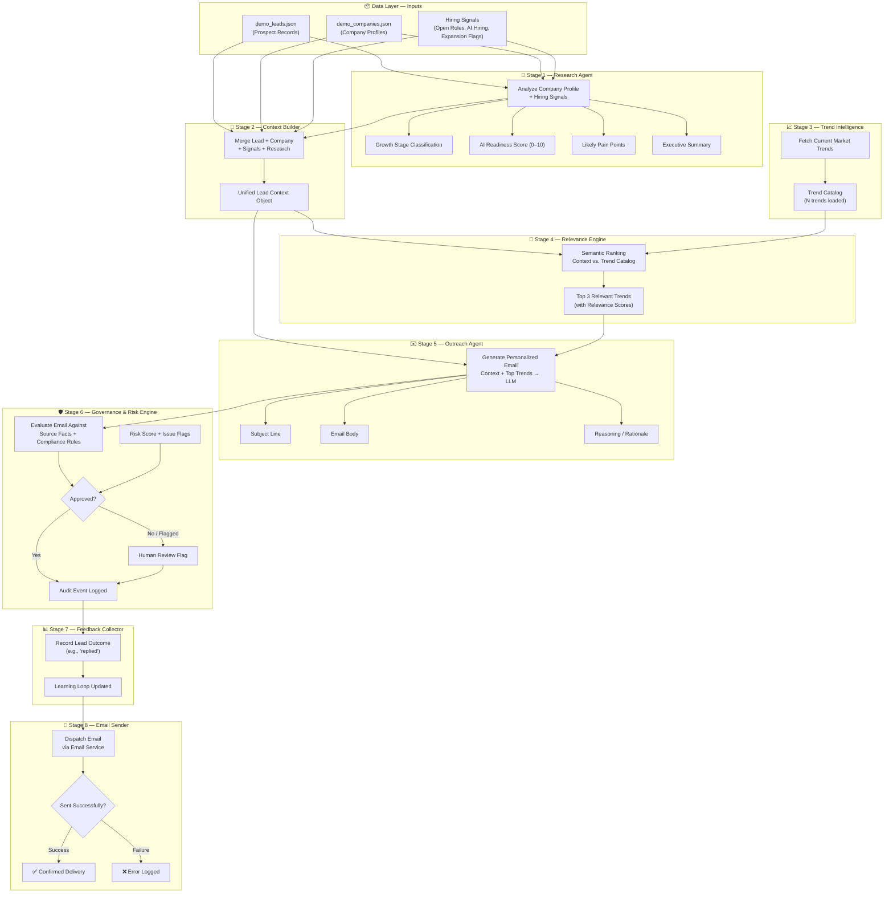
```mermaid
flowchart TD
    subgraph DATA_LAYER["📦 Data Layer — Inputs"]
        DL1["demo_leads.json\n(Prospect Records)"]
        DL2["demo_companies.json\n(Company Profiles)"]
        DL3["Hiring Signals\n(Open Roles, AI Hiring, Expansion Flags)"]
    end

    subgraph STAGE1["🔬 Stage 1 — Research Agent"]
        S1["Analyze Company Profile\n+ Hiring Signals"]
        S1A["Growth Stage Classification"]
        S1B["AI Readiness Score (0–10)"]
        S1C["Likely Pain Points"]
        S1D["Executive Summary"]
    end

    subgraph STAGE2["🧩 Stage 2 — Context Builder"]
        S2["Merge Lead + Company\n+ Signals + Research"]
        S2A["Unified Lead Context Object"]
    end

    subgraph STAGE3["📈 Stage 3 — Trend Intelligence"]
        S3["Fetch Current Market Trends"]
        S3A["Trend Catalog\n(N trends loaded)"]
    end

    subgraph STAGE4["🎯 Stage 4 — Relevance Engine"]
        S4["Semantic Ranking\nContext vs. Trend Catalog"]
        S4A["Top 3 Relevant Trends\n(with Relevance Scores)"]
    end

    subgraph STAGE5["✉️ Stage 5 — Outreach Agent"]
        S5["Generate Personalized Email\nContext + Top Trends → LLM"]
        S5A["Subject Line"]
        S5B["Email Body"]
        S5C["Reasoning / Rationale"]
    end

    subgraph STAGE6["🛡️ Stage 6 — Governance & Risk Engine"]
        S6["Evaluate Email Against\nSource Facts + Compliance Rules"]
        S6A{Approved?}
        S6B["Risk Score + Issue Flags"]
        S6C["Human Review Flag"]
        S6D["Audit Event Logged"]
    end

    subgraph STAGE7["📊 Stage 7 — Feedback Collector"]
        S7["Record Lead Outcome\n(e.g., 'replied')"]
        S7A["Learning Loop Updated"]
    end

    subgraph STAGE8["🚀 Stage 8 — Email Sender"]
        S8["Dispatch Email\nvia Email Service"]
        S8A{Sent Successfully?}
        S8B["✅ Confirmed Delivery"]
        S8C["❌ Error Logged"]
    end

    DL1 --> S1
    DL2 --> S1
    DL3 --> S1
    S1 --> S1A & S1B & S1C & S1D
    S1 --> S2
    DL1 & DL2 & DL3 --> S2
    S2 --> S2A
    S2A --> S4
    S3 --> S3A --> S4
    S4 --> S4A
    S2A & S4A --> S5
    S5 --> S5A & S5B & S5C
    S5 --> S6
    S6 --> S6A
    S6A -->|Yes| S6D --> S7
    S6A -->|No / Flagged| S6C --> S6D
    S6B --> S6A
    S7 --> S7A --> S8
    S8 --> S8A
    S8A -->|Success| S8B
    S8A -->|Failure| S8C
```

---

## Stage-by-Stage Business Breakdown

### 📦 Data Ingestion — The Starting Point
- Loads **prospect records** (leads) and **company profiles** from structured sample datasets
- Builds an instant **company lookup map** so any lead can be matched to its parent company in O(1) time
- Injects **hiring signals** — real-world behavioral indicators (open roles, AI hiring velocity, engineering expansion) that serve as the intelligence fuel for downstream agents
- **Business Value:** Ensures every pipeline run starts with rich, structured context rather than cold, generic data

---

### 🔬 Stage 1 — Research Agent
- Ingests the company profile + hiring signals and produces a **structured intelligence report**
- Outputs: **Growth Stage**, **AI Readiness Score** (0–10), **Pain Points**, and a **narrative summary**
- **Business Value:** Replaces hours of manual SDR research with instant, AI-generated company intelligence — ensuring reps always approach prospects with informed, relevant context

---

### 🧩 Stage 2 — Context Builder
- Acts as the **data fusion layer** — merging the lead's personal profile, company data, raw signals, and research findings into a single, unified **Lead Context Object**
- This context object becomes the **shared language** passed between all downstream agents
- **Business Value:** Eliminates data silos between agents; every subsequent step operates from the same enriched, consistent view of the prospect

---

### 📈 Stage 3 — Trend Intelligence
- Fetches a **live catalog of current market trends** relevant to the platform's domain
- **Business Value:** Grounds outreach in what's happening *right now* in the market — making emails feel timely and topical rather than templated and stale

---

### 🎯 Stage 4 — Semantic Relevance Engine
- Uses **semantic scoring** to rank the full trend catalog against the specific lead's context
- Surfaces only the **Top 3 most relevant trends** (with numerical relevance scores) for use in outreach
- **Business Value:** Prevents generic, spray-and-pray messaging. Every email references trends that are *actually relevant* to that specific company's situation — dramatically improving open and reply rates

---

### ✉️ Stage 5 — Outreach Agent
- The **creative intelligence layer** — takes the enriched context and top trends and generates a fully personalized outreach email via an LLM
- Produces: **Subject Line**, **Email Body**, and a **Reasoning trace** explaining *why* this message was crafted this way
- **Business Value:** Scales personalized, high-quality outreach that would otherwise require a senior SDR's time for every single prospect

---

### 🛡️ Stage 6 — Governance & Risk Engine

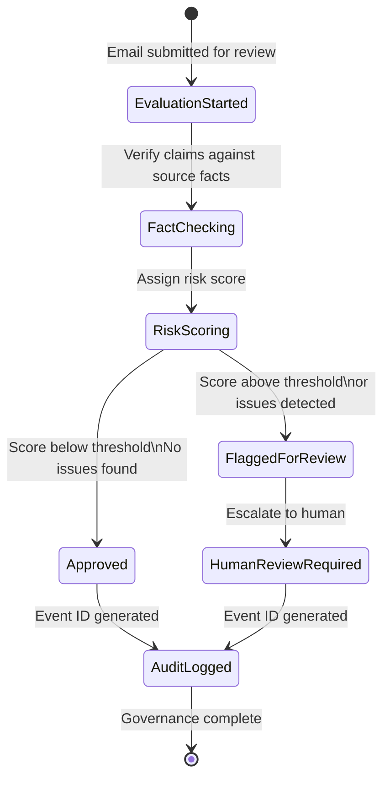
```mermaid
stateDiagram-v2
    [*] --> EvaluationStarted : Email submitted for review

    EvaluationStarted --> FactChecking : Verify claims against source facts
    FactChecking --> RiskScoring : Assign risk score

    RiskScoring --> Approved : Score below threshold\nNo issues found
    RiskScoring --> FlaggedForReview : Score above threshold\nor issues detected

    Approved --> AuditLogged : Event ID generated
    FlaggedForReview --> HumanReviewRequired : Escalate to human
    HumanReviewRequired --> AuditLogged : Event ID generated

    AuditLogged --> [*] : Governance complete
```

- **Fact-checks** the generated email against verified source data (company name, industry, revenue, lead title)
- Produces a **Risk Score**, surfaces any **compliance issues**, and flags whether **human review** is required
- Every evaluation generates an immutable **Audit Event ID** for traceability
- **Business Value:** Prevents hallucinated or inaccurate claims from reaching prospects — protecting brand reputation, ensuring regulatory compliance, and building trust in AI-generated content

---

### 📊 Stage 7 — Feedback Collector
- Records the **outcome of this lead interaction** (e.g., "replied", "bounced", "converted") back into the system
- **Business Value:** Powers the **continuous learning loop** — over time, the system learns which research signals, trend combinations, and email styles drive the best outcomes, enabling self-improvement without manual retraining

---

### 🚀 Stage 8 — Email Sender
- The **final execution layer** — dispatches the governance-approved, personalized email to the prospect
- Returns a clear **success/failure signal** with delivery confirmation or error details
- **Business Value:** Closes the loop from intelligence → action, turning AI-generated insights into real-world revenue-generating touchpoints

---

## Why This Architecture Matters

| Architectural Principle | How `run_demo.py` Embodies It |
|---|---|
| **Separation of Concerns** | Each stage is a discrete, independently testable agent/service |
| **Intelligence Before Action** | 5 stages of enrichment happen *before* a single word is sent |
| **Responsible AI** | Governance sits between generation and delivery — non-negotiable |
| **Continuous Improvement** | Feedback loop ensures the system gets smarter with every interaction |
| **Observability** | Every stage prints structured output — the pipeline is fully transparent |
| **Composability** | Any stage can be swapped, upgraded, or A/B tested without breaking others |

---

## Strategic Business Value Summary

> **LeadGenie AI doesn't just send emails — it conducts research, builds context, reads the market, scores relevance, generates personalized content, validates it for accuracy and compliance, learns from outcomes, and then delivers.** `run_demo.py` proves that this entire intelligent workflow can execute end-to-end for any prospect, at scale, with full auditability — transforming what was once a multi-hour SDR task into a sub-minute, AI-orchestrated operation.

## Module Blueprint: backend/e2e_test.py
# LeadGenie AI — End-to-End Test Suite: Architectural Breakdown

---

## What This Module Is

`e2e_test.py` is the **system-wide integration health check** for the LeadGenie AI platform. It acts as a **living proof-of-concept** — running the entire AI sales pipeline from raw lead data through to conversation handling, memory persistence, and observability validation, all **in-process** (no web server required). Think of it as a flight simulator that exercises every critical system before a real mission.

---

## Why It Matters to the Business

| Business Concern | What This Test Validates |
|---|---|
| **Revenue Pipeline Integrity** | Every lead goes through research → outreach → governance before any email is sent |
| **Brand & Compliance Safety** | Governance orchestrator blocks or retries any email that fails tone/hallucination checks |
| **Customer Experience Quality** | Conversation agent correctly classifies intent (objection, interest, unsubscribe, meeting) |
| **Data Trustworthiness** | Memory layers (episodic, semantic, entity) accumulate and persist correctly |
| **Operational Visibility** | Dashboards reflect real, non-zero data from actual pipeline runs |
| **Regulatory Respect** | Unsubscribe signals are honored; deferred emails go to human review |

---

## The Five-Phase Pipeline

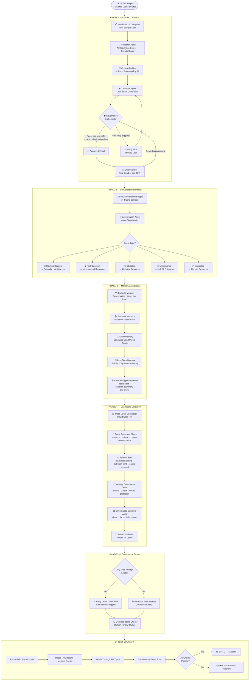
```mermaid
flowchart TD
    START(["🚀 E2E Test Begins\n3 Diverse Leads Loaded"])

    subgraph PHASE1["PHASE 1 — Outreach Pipeline"]
        direction TB
        P1A["📋 Load Lead & Company\nfrom Sample Data"]
        P1B["🔬 Research Agent\nAI Readiness Score + Growth Stage"]
        P1C["🧩 Context Builder\n+ Trend Ranking (Top 3)"]
        P1D["✍️ Outreach Agent\nDraft Email Generation"]
        P1E{"🛡️ Governance\nOrchestrator"}
        P1F["✅ Approved Email"]
        P1G["🔁 Retry with\nRevised Draft"]
        P1H["📧 Email Sender\nReal Send or Log-Only"]

        P1A --> P1B --> P1C --> P1D --> P1E
        P1E -->|"Pass: risk score OK\ntone + hallucination clear"| P1F --> P1H
        P1E -->|"Fail: retry triggered"| P1G --> P1D
        P1E -->|"Defer: human review"| P1H
    end

    subgraph PHASE2["PHASE 2 — Conversation Handling"]
        direction TB
        P2A["📨 Simulated Inbound Reply\n(3–4 turns per lead)"]
        P2B["🧠 Conversation Agent\nIntent Classification"]
        P2C{"Intent Type?"}
        P2D["📅 Meeting Request\n→ Calendly Link Attached"]
        P2E["❓ Fact Question\n→ Informational Response"]
        P2F["💬 Objection\n→ Rebuttal Response"]
        P2G["🚫 Unsubscribe\n→ Halt All Follow-up"]
        P2H["✅ Interested\n→ Nurture Response"]

        P2A --> P2B --> P2C
        P2C --> P2D
        P2C --> P2E
        P2C --> P2F
        P2C --> P2G
        P2C --> P2H
    end

    subgraph PHASE3["PHASE 3 — Memory Architecture"]
        direction TB
        P3A["🗂️ Episodic Memory\nConversation History per Lead"]
        P3B["📚 Semantic Memory\nIndustry Context Facts"]
        P3C["🏷️ Entity Memory\nStructured Lead Profile Fields"]
        P3D["⚡ Short-Term Memory\nEviction Cap Test (20 items)"]
        P3E["🔒 Protected Types Retained\napollo_fact · research_summary · top_trend"]

        P3A --> P3B --> P3C --> P3D --> P3E
    end

    subgraph PHASE4["PHASE 4 — Dashboard Validation"]
        direction TB
        P4A["📊 Trace Count Verification\n(new traces > 0)"]
        P4B["🤖 Agent Coverage Check\nresearch · outreach · intent · conversation"]
        P4C["📈 Pipeline Stats\nleads researched · outreach sent · replies received"]
        P4D["🧮 Memory Governance Stats\nevents · budget · decay · protection"]
        P4E["⚖️ Governance Decision Audit\nallow · block · defer counts"]
        P4F["🎯 Intent Distribution\nAcross All Leads"]

        P4A --> P4B --> P4C --> P4D --> P4E --> P4F
    end

    subgraph PHASE5["PHASE 5 — Governance Stress"]
        direction TB
        P5A{"Any Multi-Attempt\nLeads?"}
        P5B["✅ Retry Chain Confirmed\nMax attempts logged"]
        P5C["ℹ️ All Passed First Attempt\n(Also acceptable)"]
        P5D["📋 Deferred Items Check\nHuman Review Queue"]

        P5A -->|Yes| P5B
        P5A -->|No| P5C
        P5B --> P5D
        P5C --> P5D
    end

    subgraph SUMMARY["📋 TEST SUMMARY"]
        S1["Pass / Fail / Warn Counts"]
        S2["Traces · Validations · Memory Events"]
        S3["Leads Through Full Cycle"]
        S4["Conversation Turns Total"]
        S5{"All Checks\nPassed?"}
        S6["🟢 EXIT 0 — Success"]
        S7["🔴 EXIT 1 — Failures Reported"]

        S1 --> S2 --> S3 --> S4 --> S5
        S5 -->|Yes| S6
        S5 -->|No| S7
    end

    START --> PHASE1 --> PHASE2 --> PHASE3 --> PHASE4 --> PHASE5 --> SUMMARY
```

---

## Memory Architecture Deep Dive

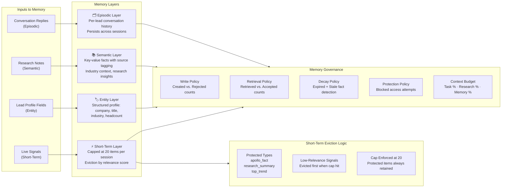
```mermaid
flowchart LR
    subgraph INPUT["Inputs to Memory"]
        I1["Conversation Replies\n(Episodic)"]
        I2["Research Notes\n(Semantic)"]
        I3["Lead Profile Fields\n(Entity)"]
        I4["Live Signals\n(Short-Term)"]
    end

    subgraph LAYERS["Memory Layers"]
        direction TB
        M1["🗂️ Episodic Layer\nPer-lead conversation history\nPersists across sessions"]
        M2["📚 Semantic Layer\nKey-value facts with source tagging\nIndustry context, research insights"]
        M3["🏷️ Entity Layer\nStructured profile: company, title,\nindustry, headcount"]
        M4["⚡ Short-Term Layer\nCapped at 20 items per session\nEviction by relevance score"]
    end

    subgraph GOVERNANCE["Memory Governance"]
        G1["Write Policy\nCreated vs. Rejected counts"]
        G2["Retrieval Policy\nRetrieved vs. Accepted counts"]
        G3["Decay Policy\nExpired + Stale fact detection"]
        G4["Protection Policy\nBlocked access attempts"]
        G5["Context Budget\nTask % · Research % · Memory %"]
    end

    subgraph EVICTION["Short-Term Eviction Logic"]
        E1["Protected Types\napollo_fact\nresearch_summary\ntop_trend"]
        E2["Low-Relevance Signals\nEvicted first when cap hit"]
        E3["Cap Enforced at 20\nProtected items always retained"]
    end

    I1 --> M1
    I2 --> M2
    I3 --> M3
    I4 --> M4

    M1 & M2 & M3 & M4 --> GOVERNANCE
    M4 --> EVICTION
```

---

## Governance Orchestrator — Decision Flow

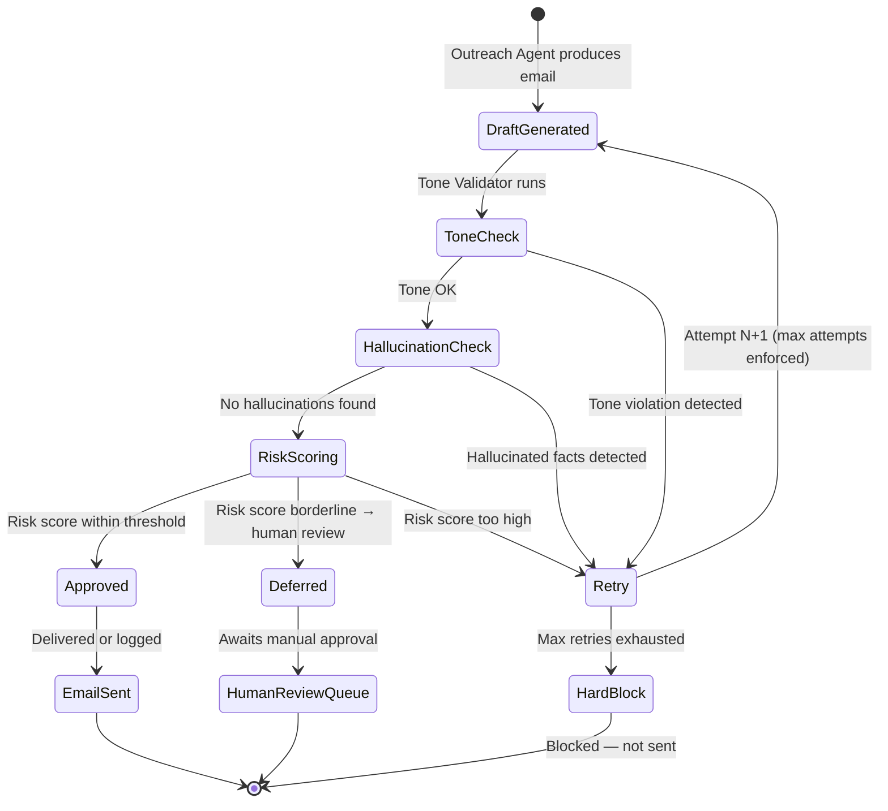
```mermaid
stateDiagram-v2
    [*] --> DraftGenerated : Outreach Agent produces email

    DraftGenerated --> ToneCheck : Tone Validator runs

    ToneCheck --> HallucinationCheck : Tone OK
    ToneCheck --> Retry : Tone violation detected

    HallucinationCheck --> RiskScoring : No hallucinations found
    HallucinationCheck --> Retry : Hallucinated facts detected

    RiskScoring --> Approved : Risk score within threshold
    RiskScoring --> Deferred : Risk score borderline → human review
    RiskScoring --> Retry : Risk score too high

    Retry --> DraftGenerated : Attempt N+1 (max attempts enforced)
    Retry --> HardBlock : Max retries exhausted

    Approved --> EmailSent : Delivered or logged
    Deferred --> HumanReviewQueue : Awaits manual approval
    HardBlock --> [*] : Blocked — not sent

    EmailSent --> [*]
    HumanReviewQueue --> [*]
```

---

## The Three Test Leads & Their Conversation Scenarios

| Lead | Role | Company | Conversation Arc |
|---|---|---|---|
| **Ravi Sharma** | VP-Ops & CTO | Britannia Industries | Fact question → Interest → **Meeting request** |
| **Madhusudhan Rao** | CTO | Swiggy | Objection → Interest → **Unsubscribe** |
| **Sandip Agarwal** | CTO | Traya | Fact question → **Meeting request** → **Meeting request** |

> **Why this matters:** These three arcs deliberately cover the full spectrum of sales outcomes — a warm close, a hard stop, and a fast-track demo request — ensuring the conversation agent handles every real-world scenario correctly.

---

## Key Architectural Decisions Explained

### ✅ In-Process Execution (No HTTP Server)
- The test imports agents **directly** rather than calling REST endpoints
- **Business benefit:** Faster CI/CD feedback loops, no infrastructure dependencies, works in any environment

### ✅ Snapshot-Before / Snapshot-After Pattern
- Baseline counts for traces, validations, and memory events are captured **before** the test runs
- All assertions use **delta values** (what changed), not absolute counts
- **Business benefit:** Tests remain valid even when run against a system with existing data

### ✅ Real LLM Calls
- Unlike mocked unit tests, this suite uses **actual AI model calls**
- **Business benefit:** Catches prompt regressions, model behavior drift, and latency issues that mocks would miss

### ✅ Graceful Email Handling
- If Gmail credentials are absent, the email is **logged but not sent** — the test still passes
- **Business benefit:** Safe to run in any environment without accidentally emailing real prospects

### ✅ Observability as a First-Class Citizen
- Phase 4 validates that the **dashboard has real data** — not just that agents ran, but that their outputs are queryable
- **Business benefit:** Confirms the monitoring layer works end-to-end, not just the agents themselves

---

## What a Passing Run Proves

```
✓ Research agent produces AI readiness scores and growth signals
✓ Context builder + trend ranker surface the 3 most relevant trends per lead
✓ Governance orchestrator approves, retries, or defers — never silently fails
✓ Conversation agent correctly classifies all 9 simulated reply intents
✓ Unsubscribe signals halt follow-up immediately
✓ Meeting requests trigger Calendly link attachment
✓ All three memory layers accumulate data correctly
✓ Short-term memory eviction protects high-value items under pressure
✓ Dashboard traces reflect every agent that ran
✓ Governance decisions (allow/block/defer) are fully auditable
```

---

## Risk & Gap Indicators to Watch

| Warning Signal | What It Means |
|---|---|
| `⚠ Governance required N attempts` | Email quality is borderline — prompt tuning may be needed |
| `⚠ Email not sent (no SMTP creds)` | Expected in dev/CI — not a defect |
| `⚠ No retries triggered` | Either quality is excellent or governance thresholds are too lenient |
| `✗ Intent mismatch` | Conversation agent model drift — retraining or prompt update required |
| `✗ Calendly link not attached` | Meeting request handler broken — direct revenue impact |
| `✗ Episodic memory empty` | Memory persistence layer failure — context loss across sessions |

## Module Blueprint: backend/main.py
# LeadGenie AI — `backend/main.py` Architectural Breakdown

## What This Module Is

`main.py` is the **central nervous system** of the LeadGenie AI platform. It is the single API gateway that wires together every intelligent agent, governance layer, data service, and observability tool into a cohesive, production-ready sales development platform. Think of it as the **air traffic controller** — it doesn't fly the planes, but nothing takes off or lands without it.

---

## Platform Architecture Overview

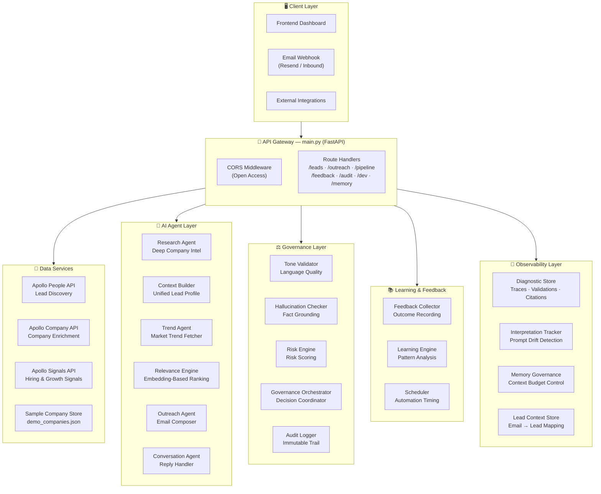
```mermaid
flowchart TB
    subgraph CLIENTS["🖥️ Client Layer"]
        FE["Frontend Dashboard"]
        WH["Email Webhook\n(Resend / Inbound)"]
        EXT["External Integrations"]
    end

    subgraph GATEWAY["🚪 API Gateway — main.py (FastAPI)"]
        direction TB
        CORS["CORS Middleware\n(Open Access)"]
        ROUTES["Route Handlers\n/leads · /outreach · /pipeline\n/feedback · /audit · /dev · /memory"]
    end

    subgraph DATA["📡 Data Services"]
        APL_P["Apollo People API\nLead Discovery"]
        APL_C["Apollo Company API\nCompany Enrichment"]
        APL_S["Apollo Signals API\nHiring & Growth Signals"]
        SAMPLE["Sample Company Store\ndemo_companies.json"]
    end

    subgraph INTELLIGENCE["🧠 AI Agent Layer"]
        RA["Research Agent\nDeep Company Intel"]
        CB["Context Builder\nUnified Lead Profile"]
        TA["Trend Agent\nMarket Trend Fetcher"]
        RE["Relevance Engine\nEmbedding-Based Ranking"]
        OA["Outreach Agent\nEmail Composer"]
        CA["Conversation Agent\nReply Handler"]
    end

    subgraph GOVERNANCE["⚖️ Governance Layer"]
        TV["Tone Validator\nLanguage Quality"]
        HC["Hallucination Checker\nFact Grounding"]
        RK["Risk Engine\nRisk Scoring"]
        GO["Governance Orchestrator\nDecision Coordinator"]
        AL["Audit Logger\nImmutable Trail"]
    end

    subgraph LEARNING["📚 Learning & Feedback"]
        FC["Feedback Collector\nOutcome Recording"]
        LE["Learning Engine\nPattern Analysis"]
        SCH["Scheduler\nAutomation Timing"]
    end

    subgraph OBSERVABILITY["🔬 Observability Layer"]
        DS["Diagnostic Store\nTraces · Validations · Citations"]
        IT["Interpretation Tracker\nPrompt Drift Detection"]
        MG["Memory Governance\nContext Budget Control"]
        LCS["Lead Context Store\nEmail → Lead Mapping"]
    end

    CLIENTS --> GATEWAY
    GATEWAY --> DATA
    GATEWAY --> INTELLIGENCE
    GATEWAY --> GOVERNANCE
    GATEWAY --> LEARNING
    GATEWAY --> OBSERVABILITY
```

---

## The Crown Jewel: The Outreach Generation Pipeline

This is the most sophisticated flow in the entire platform — a **7-stage AI pipeline** that transforms a raw lead ID into a governed, fact-checked, personalized email.

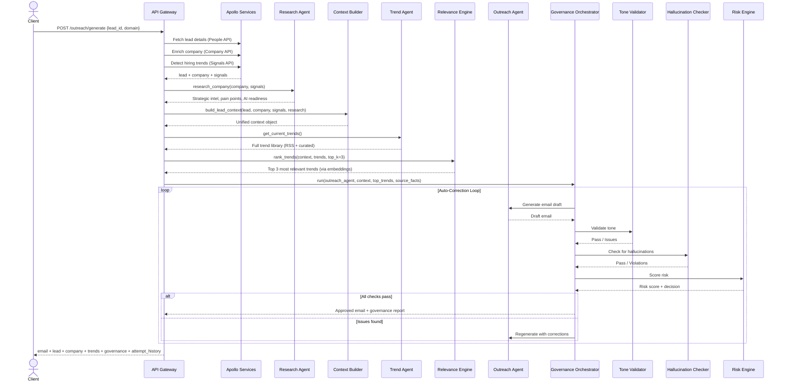
```mermaid
sequenceDiagram
    actor Client
    participant API as API Gateway
    participant Apollo as Apollo Services
    participant RA as Research Agent
    participant CB as Context Builder
    participant TA as Trend Agent
    participant RE as Relevance Engine
    participant OA as Outreach Agent
    participant GO as Governance Orchestrator
    participant TV as Tone Validator
    participant HC as Hallucination Checker
    participant RK as Risk Engine

    Client->>API: POST /outreach/generate {lead_id, domain}
    API->>Apollo: Fetch lead details (People API)
    API->>Apollo: Enrich company (Company API)
    API->>Apollo: Detect hiring trends (Signals API)
    Apollo-->>API: lead + company + signals

    API->>RA: research_company(company, signals)
    RA-->>API: Strategic intel, pain points, AI readiness

    API->>CB: build_lead_context(lead, company, signals, research)
    CB-->>API: Unified context object

    API->>TA: get_current_trends()
    TA-->>API: Full trend library (RSS + curated)

    API->>RE: rank_trends(context, trends, top_k=3)
    RE-->>API: Top 3 most relevant trends (via embeddings)

    API->>GO: run(outreach_agent, context, top_trends, source_facts)

    loop Auto-Correction Loop
        GO->>OA: Generate email draft
        OA-->>GO: Draft email
        GO->>TV: Validate tone
        TV-->>GO: Pass / Issues
        GO->>HC: Check for hallucinations
        HC-->>GO: Pass / Violations
        GO->>RK: Score risk
        RK-->>GO: Risk score + decision
        alt All checks pass
            GO-->>API: Approved email + governance report
        else Issues found
            GO->>OA: Regenerate with corrections
        end
    end

    API-->>Client: email + lead + company + trends + governance + attempt_history
```

---

## Governance Decision Engine

Every AI-generated email passes through a **three-layer compliance gate** before it can be sent. This is what separates LeadGenie from a simple GPT wrapper.

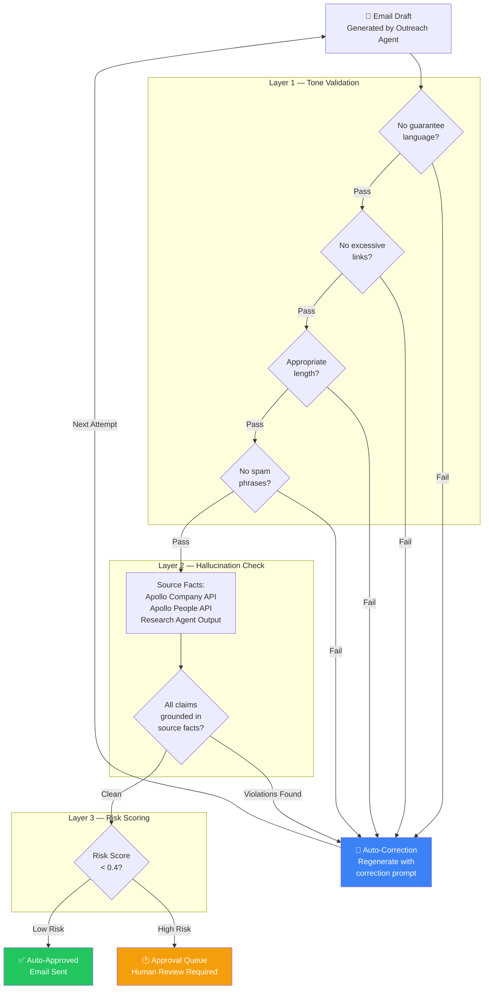
```mermaid
flowchart TD
    DRAFT["📝 Email Draft\nGenerated by Outreach Agent"]

    subgraph LAYER1["Layer 1 — Tone Validation"]
        T1{"No guarantee\nlanguage?"}
        T2{"No excessive\nlinks?"}
        T3{"Appropriate\nlength?"}
        T4{"No spam\nphrases?"}
    end

    subgraph LAYER2["Layer 2 — Hallucination Check"]
        H1{"All claims\ngrounded in\nsource facts?"}
        H2["Source Facts:\nApollo Company API\nApollo People API\nResearch Agent Output"]
    end

    subgraph LAYER3["Layer 3 — Risk Scoring"]
        R1{"Risk Score\n< 0.4?"}
    end

    PASS["✅ Auto-Approved\nEmail Sent"]
    QUEUE["🕐 Approval Queue\nHuman Review Required"]
    REGEN["🔄 Auto-Correction\nRegenerate with\ncorrection prompt"]

    DRAFT --> T1
    T1 -->|Fail| REGEN
    T1 -->|Pass| T2
    T2 -->|Fail| REGEN
    T2 -->|Pass| T3
    T3 -->|Fail| REGEN
    T3 -->|Pass| T4
    T4 -->|Fail| REGEN
    T4 -->|Pass| H2
    H2 --> H1
    H1 -->|Violations Found| REGEN
    H1 -->|Clean| R1
    R1 -->|Low Risk| PASS
    R1 -->|High Risk| QUEUE
    REGEN -->|Next Attempt| DRAFT

    style PASS fill:#22c55e,color:#fff
    style QUEUE fill:#f59e0b,color:#fff
    style REGEN fill:#3b82f6,color:#fff
```

---

## Inbound Reply Handling — Closing the Loop

LeadGenie doesn't just send emails — it **listens and responds**. The webhook endpoint creates a fully autonomous conversation loop.

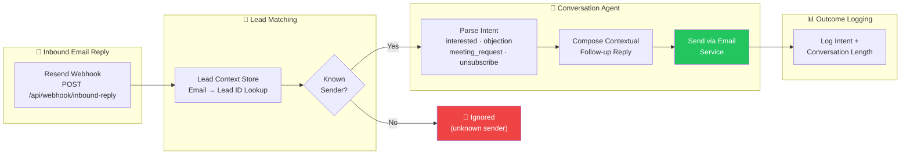
```mermaid
flowchart LR
    subgraph INBOUND["📨 Inbound Email Reply"]
        WH["Resend Webhook\nPOST /api/webhook/inbound-reply"]
    end

    subgraph ROUTING["🔀 Lead Matching"]
        LCS["Lead Context Store\nEmail → Lead ID Lookup"]
        UNK{"Known\nSender?"}
    end

    subgraph PROCESSING["🤖 Conversation Agent"]
        CA["Parse Intent\ninterested · objection\nmeeting_request · unsubscribe"]
        REPLY["Compose Contextual\nFollow-up Reply"]
        SEND["Send via Email\nService"]
    end

    subgraph LOGGING["📊 Outcome Logging"]
        LOG["Log Intent +\nConversation Length"]
    end

    IGNORE["🚫 Ignored\n(unknown sender)"]

    WH --> LCS
    LCS --> UNK
    UNK -->|No| IGNORE
    UNK -->|Yes| CA
    CA --> REPLY
    REPLY --> SEND
    SEND --> LOG

    style IGNORE fill:#ef4444,color:#fff
    style SEND fill:#22c55e,color:#fff
```

---

## Full API Surface Map

| **Category** | **Endpoint** | **Business Purpose** |
|---|---|---|
| 🏥 **Health** | `GET /health` | Platform uptime monitoring |
| 🔍 **Lead Discovery** | `POST /leads/search` | Search for leads by title, seniority, company |
| 🏢 **Company Intel** | `GET /company/enrich` | Deep company profile enrichment |
| 🏢 **Company Intel** | `GET /company/research/{name}` | AI-computed growth signals per company |
| 🏢 **Company Intel** | `GET /company/list` | Browse all demo companies |
| ✉️ **Outreach** | `POST /outreach/generate` | Full 7-stage governed email generation |
| 💬 **Conversation** | `POST /conversation/reply` | Handle a lead's reply with AI |
| 📨 **Webhook** | `POST /api/webhook/inbound-reply` | Receive & process inbound email replies |
| 📊 **Feedback** | `POST /feedback/record` | Record send outcomes (replied, booked, etc.) |
| 📈 **Analytics** | `GET /learning/analytics` | AI-learned patterns from outcomes |
| 📈 **Trends** | `GET /trends` | Current market trends feed |
| 🔎 **Audit** | `GET /audit/{lead_id}` | Full immutable audit trail per lead |
| 📋 **Pipeline** | `GET /pipeline` | Full lead pipeline with stage tracking |
| 📋 **Pipeline** | `GET /pipeline/stats` | Real funnel metrics from observability data |
| 📋 **Pipeline** | `GET /pipeline/lineage/{lead_id}` | Step-by-step AI decision trace per lead |
| 🖥️ **Dashboard** | `GET /dashboard/stats` | KPIs: reply rate, meetings booked, risk dist. |
| ⚖️ **Approval** | `GET /approval-queue` | Emails flagged for human review |
| 🧠 **Memory** | `GET /memory/governance` | Memory budget, decay, and protection stats |
| 🔬 **Dev/Obs** | `GET /dev/diagnostics` | Hallucination event counts & categories |
| 🔬 **Dev/Obs** | `GET /dev/traces` | Raw agent call traces |
| 🔬 **Dev/Obs** | `GET /dev/validation-log` | Shape/context/policy validation history |
| 🔬 **Dev/Obs** | `GET /dev/citations` | Source citation metadata per trace |
| 🔬 **Dev/Obs** | `GET /dev/prompt-versions` | Prompt version performance & drift |
| 🔬 **Dev/Obs** | `GET /dev/self-eval-stats` | Agent self-confidence distributions |

---

## Data Lifecycle: From Signal to Sent Email

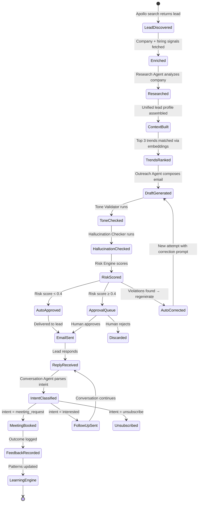
```mermaid
stateDiagram-v2
    [*] --> LeadDiscovered : Apollo search returns lead

    LeadDiscovered --> Enriched : Company + hiring signals fetched
    Enriched --> Researched : Research Agent analyzes company
    Researched --> ContextBuilt : Unified lead profile assembled
    ContextBuilt --> TrendsRanked : Top 3 trends matched via embeddings

    TrendsRanked --> DraftGenerated : Outreach Agent composes email

    DraftGenerated --> ToneChecked : Tone Validator runs
    ToneChecked --> HallucinationChecked : Hallucination Checker runs
    HallucinationChecked --> RiskScored : Risk Engine scores

    RiskScored --> AutoApproved : Risk score < 0.4
    RiskScored --> ApprovalQueue : Risk score ≥ 0.4
    RiskScored --> AutoCorrected : Violations found → regenerate

    AutoCorrected --> DraftGenerated : New attempt with correction prompt

    AutoApproved --> EmailSent : Delivered to lead
    ApprovalQueue --> EmailSent : Human approves
    ApprovalQueue --> Discarded : Human rejects

    EmailSent --> ReplyReceived : Lead responds
    ReplyReceived --> IntentClassified : Conversation Agent parses intent
    IntentClassified --> MeetingBooked : intent = meeting_request
    IntentClassified --> FollowUpSent : intent = interested
    IntentClassified --> Unsubscribed : intent = unsubscribe

    MeetingBooked --> FeedbackRecorded : Outcome logged
    FollowUpSent --> ReplyReceived : Conversation continues
    FeedbackRecorded --> LearningEngine : Patterns updated
    LearningEngine --> [*]
```

---

## Key Business Value Pillars

### 🎯 **Precision Targeting**
The platform doesn't blast generic emails. It filters leads by seniority (VP, C-Suite, Director), enriches them with real company data, and ranks market trends by semantic relevance to each specific lead's context — ensuring every message is **contextually earned**.

### ⚖️ **Built-in Compliance & Trust**
Every AI-generated email is automatically checked for:
- **Tone violations** — no spam language, no false guarantees
- **Hallucinated facts** — every claim must be traceable to a real data source
- **Risk scoring** — high-risk emails never reach a prospect without human review

This means the platform can **scale outreach without scaling legal risk**.

### 🔄 **Self-Correcting AI**
When an email fails governance checks, the system doesn't just reject it — it **automatically regenerates** with correction instructions, logging every attempt. This creates a closed feedback loop that improves output quality without human intervention.

### 📊 **Full Observability**
The `/dev/*` endpoints give engineering teams complete visibility into every AI decision — which prompts fired, what was retrieved, where hallucinations occurred, and how confidence scores trended over time. This is **enterprise-grade AI accountability**.

### 🧠 **Continuous Learning**
Feedback from real outcomes (replies, meetings booked, unsubscribes) flows back into the Learning Engine, which analyzes patterns and informs future outreach strategy. The platform gets **measurably smarter** with every campaign.

### 🔗 **End-to-End Lineage**
The `/pipeline/lineage/{lead_id}` endpoint provides a complete, stage-by-stage reconstruction of every decision made for a specific lead — from discovery through email delivery. This is critical for **sales team trust, debugging, and regulatory audit readiness**.

## Module Blueprint: frontend/eslint.config.js
# ESLint Configuration Module — Architectural Breakdown

## What This Module Does (Plain English)

This is the **frontend code quality enforcement engine**. It acts as an automated gatekeeper that continuously inspects every TypeScript and React file written by developers, catching bugs, bad patterns, and unsafe code *before* it ever reaches production. Think of it as a tireless senior engineer reviewing every line of code in real time.

---

## Business Value at a Glance

| Concern | What It Solves |
|---|---|
| **Bug Prevention** | Catches logic errors and unsafe patterns at write-time, not runtime |
| **Developer Velocity** | Instant feedback in the IDE eliminates slow review cycles |
| **Code Consistency** | Enforces a single standard across all contributors |
| **React Safety** | Prevents entire classes of React-specific runtime crashes |
| **Hot-Reload Reliability** | Ensures the dev server's live-refresh feature works predictably |
| **Build Hygiene** | Excludes compiled output from analysis, keeping checks fast and relevant |

---

## Architectural Flow

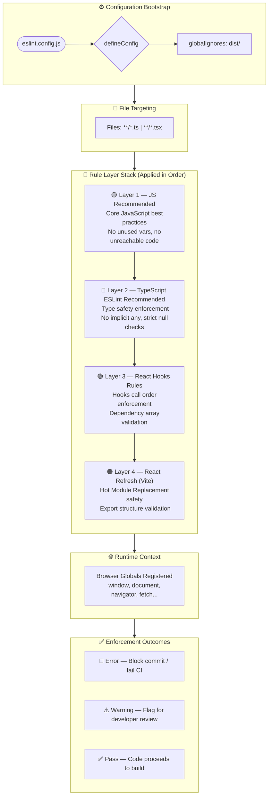
```mermaid
flowchart TD
    subgraph Entry["⚙️ Configuration Bootstrap"]
        A([eslint.config.js]) --> B{defineConfig}
        B --> C[globalIgnores: dist/]
    end

    subgraph Scope["🎯 File Targeting"]
        D["Files: **/*.ts  |  **/*.tsx"]
    end

    subgraph RuleStack["📐 Rule Layer Stack (Applied in Order)"]
        direction TB
        E["🟡 Layer 1 — JS Recommended\n Core JavaScript best practices\n No unused vars, no unreachable code"]
        F["🔵 Layer 2 — TypeScript ESLint Recommended\n Type safety enforcement\n No implicit any, strict null checks"]
        G["🟢 Layer 3 — React Hooks Rules\n Hooks call order enforcement\n Dependency array validation"]
        H["🟠 Layer 4 — React Refresh (Vite)\n Hot Module Replacement safety\n Export structure validation"]
        E --> F --> G --> H
    end

    subgraph Environment["🌐 Runtime Context"]
        I["Browser Globals Registered\n window, document, navigator, fetch..."]
    end

    subgraph Output["✅ Enforcement Outcomes"]
        J["🚫 Error — Block commit / fail CI"]
        K["⚠️ Warning — Flag for developer review"]
        L["✅ Pass — Code proceeds to build"]
    end

    Entry --> Scope
    Scope --> RuleStack
    RuleStack --> Environment
    Environment --> Output
```

---

## The Four Rule Layers — Business Breakdown

### 🟡 Layer 1 — JavaScript Core Rules
- Enforces **universal JavaScript hygiene** — the baseline every JS project should meet
- Catches issues like unreachable code, duplicate keys, and unsafe equality checks
- **Why it matters:** Prevents the most common, well-documented JavaScript pitfalls regardless of framework

### 🔵 Layer 2 — TypeScript Strict Rules
- Enforces **type contract integrity** across the entire codebase
- Flags unsafe type casting, missing return types, and implicit `any` usage
- **Why it matters:** TypeScript's value is only realized when its rules are *enforced*, not just present. This layer ensures the type system is actually protecting the business logic

### 🟢 Layer 3 — React Hooks Rules
- Enforces the **Rules of Hooks** — React's own contract for how stateful logic must be written
- Validates that dependency arrays in `useEffect`, `useCallback`, and `useMemo` are complete and correct
- **Why it matters:** Violations here cause **silent, hard-to-reproduce bugs** in production — stale data, infinite loops, and broken UI state. This layer eliminates that entire risk category

### 🟠 Layer 4 — React Refresh (Vite Integration)
- Ensures component files are structured so **Hot Module Replacement (HMR)** works correctly
- Flags files that mix component exports with non-component exports in ways that break live reload
- **Why it matters:** Developer experience directly impacts velocity. A broken hot-reload forces full page refreshes, slowing down every UI iteration cycle

---

## Decision Architecture — How a File Gets Evaluated

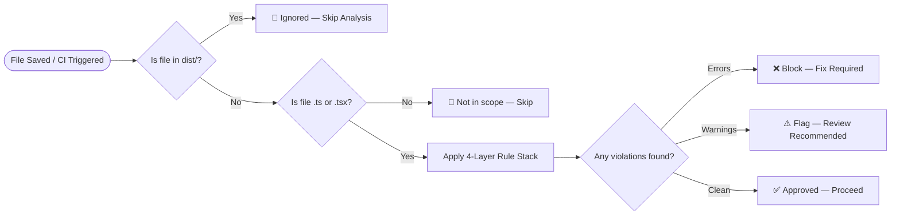
```mermaid
flowchart LR
    A([File Saved / CI Triggered]) --> B{Is file in dist/?}
    B -- Yes --> C[🚫 Ignored — Skip Analysis]
    B -- No --> D{Is file .ts or .tsx?}
    D -- No --> E[🚫 Not in scope — Skip]
    D -- Yes --> F[Apply 4-Layer Rule Stack]
    F --> G{Any violations found?}
    G -- Errors --> H["❌ Block — Fix Required"]
    G -- Warnings --> I["⚠️ Flag — Review Recommended"]
    G -- Clean --> J["✅ Approved — Proceed"]
```

---

## Why the `dist/` Exclusion Matters

- The `dist` folder contains **compiled, machine-generated output** — not human-written source code
- Linting compiled files would produce **false positives**, slow down analysis, and confuse developers
- Excluding it keeps the feedback loop **fast, accurate, and actionable**

---

## Strategic Positioning in the Platform

```mermaid
flowchart TD
    DEV["👨‍💻 Developer writes code"] --> LINT["🔍 ESLint Config\nReal-time analysis"]
    LINT -->|Violations| FB["💬 Instant IDE Feedback"]
    FB --> DEV
    LINT -->|Clean| CI["🏗️ CI/CD Pipeline"]
    CI --> BUILD["📦 Production Build"]
    BUILD --> DEPLOY["🚀 Deployment"]

    style LINT fill:#4A90D9,color:#fff,stroke:#2C5F8A
    style FB fill:#E8A838,color:#fff,stroke:#B07820
    style BUILD fill:#27AE60,color:#fff,stroke:#1A7A42
```

---

## Key Takeaways for Stakeholders

> **This configuration is not optional tooling — it is a quality control system embedded directly into the development workflow.**

- ✅ **Shifts bug detection left** — problems found at write-time cost 10x less to fix than at runtime
- ✅ **Reduces code review burden** — automated rules handle the mechanical checks so humans focus on logic and architecture
- ✅ **Protects the React investment** — ensures the framework is used correctly, preventing the most common React failure modes
- ✅ **Scales with the team** — every new developer automatically inherits the same standards with zero onboarding overhead

## Module Blueprint: frontend/postcss.config.js
# Architectural Breakdown: `frontend/postcss.config.js`

---

## 🎯 What Is This Module?

This is the **CSS Build Pipeline Configuration** — a small but foundational file that acts as the **traffic controller for all stylesheet processing** in the frontend application. Every single CSS rule written by developers passes through this pipeline before reaching end users.

Think of it as the **quality control and compatibility station** on a manufacturing line: raw CSS goes in, polished, optimized, cross-browser-ready CSS comes out.

---

## 🏗️ Architectural Overview

```mermaid
flowchart TD
    subgraph INPUT["📥 Raw Input Sources"]
        A["Developer Writes Utility Classes\ne.g. className='flex p-4 text-blue-500'"]
        B["Custom CSS Files\n*.css, *.scss"]
        C["Component Styles\nJSX / TSX Files"]
    end

    subgraph PIPELINE["⚙️ PostCSS Processing Pipeline"]
        direction TB
        P["PostCSS Engine\nOrchestrates all plugins in sequence"]

        subgraph PLUGIN1["🎨 Plugin 1: TailwindCSS"]
            T1["Scans all source files\nfor utility class usage"]
            T2["Generates only USED CSS\n(Tree-shaking / Purging)"]
            T3["Outputs optimized\nstylesheet bundle"]
            T1 --> T2 --> T3
        end

        subgraph PLUGIN2["🌐 Plugin 2: Autoprefixer"]
            AP1["Reads generated CSS"]
            AP2["Checks browser\ncompatibility targets"]
            AP3["Injects vendor prefixes\n-webkit-, -moz-, -ms-"]
            AP1 --> AP2 --> AP3
        end

        P --> PLUGIN1
        PLUGIN1 --> PLUGIN2
    end

    subgraph OUTPUT["📤 Production-Ready Output"]
        O1["Cross-Browser Compatible CSS"]
        O2["Minimal Bundle Size\n(only used styles)"]
        O3["Served to End Users\nvia Browser"]
    end

    INPUT --> PIPELINE
    PLUGIN2 --> OUTPUT

    style INPUT fill:#1e3a5f,color:#fff,stroke:#4a90d9
    style PIPELINE fill:#1a3a2a,color:#fff,stroke:#4caf50
    style PLUGIN1 fill:#2d4a1e,color:#fff,stroke:#8bc34a
    style PLUGIN2 fill:#1e3a2d,color:#fff,stroke:#26a69a
    style OUTPUT fill:#3a1e1e,color:#fff,stroke:#ef5350
```

---

## 🔌 The Two Plugins — Business Roles Explained

### 🎨 Plugin 1: TailwindCSS
| Aspect | Detail |
|---|---|
| **Role** | Design System Engine |
| **What it does** | Converts utility class names written in components into actual CSS rules |
| **Business Value** | Enables developers to build consistent, on-brand UIs **10x faster** without writing custom CSS |
| **Key Behavior** | Only generates CSS for classes **actually used** — keeping bundle sizes lean |

### 🌐 Plugin 2: Autoprefixer
| Aspect | Detail |
|---|---|
| **Role** | Cross-Browser Compatibility Guardian |
| **What it does** | Automatically adds browser-specific CSS prefixes where needed |
| **Business Value** | Ensures the product looks and works correctly for **100% of target users**, regardless of their browser |
| **Key Behavior** | Runs **after** Tailwind — so it covers all generated styles, not just hand-written ones |

---

## 🔄 Plugin Execution Order — Why It Matters

```mermaid
sequenceDiagram
    participant Build as 🏗️ Build Tool (Vite/Webpack)
    participant PostCSS as ⚙️ PostCSS Engine
    participant Tailwind as 🎨 TailwindCSS Plugin
    participant Auto as 🌐 Autoprefixer Plugin
    participant Browser as 🖥️ User's Browser

    Build->>PostCSS: "Process all CSS assets"
    PostCSS->>Tailwind: Pass raw CSS + source files
    Tailwind-->>PostCSS: Return generated utility CSS
    Note over Tailwind: Scans JSX/TSX for class names,<br/>generates only what's needed
    PostCSS->>Auto: Pass Tailwind's output
    Auto-->>PostCSS: Return prefixed, compatible CSS
    Note over Auto: Adds -webkit-flex, -ms-grid,<br/>etc. where required
    PostCSS-->>Build: Return final optimized CSS
    Build->>Browser: Deliver production bundle
```

> **Critical Insight:** The order is intentional. Autoprefixer must run **last** so it can apply compatibility fixes to *all* CSS — including everything Tailwind just generated. Reversing this order would leave Tailwind's output unprocessed.

---

## 💼 Business Value & Strategic Importance

### ✅ Developer Velocity
- Developers write **zero custom CSS** for standard UI patterns
- The utility-first approach (Tailwind) means **design decisions are made in the component**, not in separate files — reducing context switching

### ✅ Performance & User Experience
- **Tree-shaking behavior** means production CSS bundles are typically **95%+ smaller** than if all Tailwind utilities were included
- Smaller CSS = faster page loads = better SEO rankings and conversion rates

### ✅ Reliability Across Markets
- Autoprefixer ensures the product works on **older browsers and diverse markets** without manual engineering effort
- Protects revenue from users on Safari, legacy Edge, or enterprise-locked browsers

### ✅ Zero Maintenance Overhead
- This configuration is **declarative and self-maintaining** — as Tailwind and Autoprefixer update their rules, the pipeline automatically benefits
- No manual browser compatibility tables to manage

---

## ⚠️ Risk & Dependency Awareness

```mermaid
flowchart LR
    subgraph RISKS["⚠️ Operational Risks"]
        R1["Plugin Version Mismatch\nTailwind v3 vs v4 breaking changes"]
        R2["Missing browserslist Config\nAutoprefixer needs targets to work optimally"]
        R3["Build Tool Compatibility\nMust align with Vite/Webpack PostCSS integration"]
    end

    subgraph MITIGATIONS["🛡️ Mitigations"]
        M1["Lock versions in package.json\nUse semantic versioning carefully"]
        M2["Define .browserslistrc\nor package.json 'browserslist' field"]
        M3["Verify postcss peer dependency\nmatches build tool expectations"]
    end

    R1 --> M1
    R2 --> M2
    R3 --> M3

    style RISKS fill:#3a1e1e,color:#fff,stroke:#ef5350
    style MITIGATIONS fill:#1a3a2a,color:#fff,stroke:#4caf50
```

---

## 📌 Executive Summary

> **This 7-line configuration file is the invisible backbone of the entire frontend visual layer.** It ensures that every pixel rendered to users is optimized, compatible, and efficiently delivered — without requiring ongoing manual engineering effort. Its simplicity is a feature, not a limitation: it represents a mature, industry-standard CSS architecture that scales from prototype to enterprise.

## Module Blueprint: frontend/vite.config.ts
# Architectural Breakdown: `frontend/vite.config.ts`

---

## 🏢 Business Context: What Is This File?

This is the **master build configuration** for the entire frontend application. Think of it as the **blueprint handed to the construction crew** — it tells the development and deployment toolchain *exactly* how to assemble, serve, and optimize the user-facing product. Without this file, the frontend cannot be built, previewed, or deployed.

---

## 🎯 What This Module Achieves

| Concern | What It Does |
|---|---|
| **Build Orchestration** | Instructs Vite (the build engine) on how to compile and bundle the frontend |
| **Framework Integration** | Registers React as the UI framework, enabling JSX transformation and Fast Refresh |
| **Developer Experience** | Enables instant hot-module replacement (HMR) during local development |
| **Production Readiness** | Governs how assets are optimized and packaged for deployment |

---

## 🧠 Conceptual Architecture

```mermaid
flowchart TD
    subgraph CONFIG["⚙️ Vite Configuration Layer"]
        A["vite.config.ts\n(Master Blueprint)"]
        B["defineConfig()\nType-safe config wrapper"]
        A --> B
    end

    subgraph PLUGINS["🔌 Plugin Ecosystem"]
        C["React Plugin\n@vitejs/plugin-react"]
        C1["JSX Transformation\n(Babel/SWC)"]
        C2["Fast Refresh\n(HMR for React)"]
        C3["React DevTools\nIntegration"]
        C --> C1
        C --> C2
        C --> C3
    end

    subgraph DEV["🛠️ Development Pipeline"]
        D["Dev Server\nlocalhost:5173"]
        D1["Instant Module\nHot Reload"]
        D2["Native ESM\nNo Bundling Needed"]
        D --> D1
        D --> D2
    end

    subgraph PROD["🚀 Production Pipeline"]
        E["Build Command\nvite build"]
        E1["Rollup Bundler\n(under the hood)"]
        E2["Tree Shaking\nDead Code Removal"]
        E3["Asset Optimization\nMinify + Chunk Split"]
        E4["dist/ Output\nDeployable Artifact"]
        E --> E1
        E1 --> E2
        E2 --> E3
        E3 --> E4
    end

    B --> C
    C --> D
    C --> E

    style CONFIG fill:#1e3a5f,color:#ffffff,stroke:#4a90d9
    style PLUGINS fill:#1a4731,color:#ffffff,stroke:#2ecc71
    style DEV fill:#4a2c00,color:#ffffff,stroke:#f39c12
    style PROD fill:#3d1a4a,color:#ffffff,stroke:#9b59b6
```

---

## 🔄 Lifecycle: From Code to Browser

```mermaid
sequenceDiagram
    participant DEV as 👨‍💻 Developer
    participant CFG as ⚙️ vite.config.ts
    participant VITE as ⚡ Vite Engine
    participant REACT as ⚛️ React Plugin
    participant BROWSER as 🌐 Browser

    DEV->>CFG: Runs `vite dev` or `vite build`
    CFG->>VITE: Passes plugin array + settings
    VITE->>REACT: Initializes React plugin
    REACT-->>VITE: Registers JSX transform + HMR hooks

    alt Development Mode
        VITE->>BROWSER: Serves native ESM modules
        DEV->>DEV: Edits source file
        VITE->>REACT: Detects file change
        REACT->>BROWSER: Pushes hot update (no full reload)
        BROWSER-->>DEV: Instant visual feedback
    else Production Build
        VITE->>REACT: Processes all JSX/TSX files
        REACT-->>VITE: Returns optimized JS
        VITE->>VITE: Rollup bundles + tree-shakes
        VITE-->>DEV: Outputs dist/ folder
    end
```

---

## 💡 Key Architectural Decisions & Their Business Impact

### ✅ **Choosing Vite as the Build Tool**
- **Speed Advantage:** Vite uses native browser ES modules during development — meaning the dev server starts in **milliseconds**, not seconds. This directly translates to **faster developer iteration cycles**.
- **Competitive Edge:** Compared to legacy tools (Webpack, CRA), Vite can be **10–100x faster** on cold starts, reducing friction for engineering teams.

### ✅ **React Plugin Registration**
- **Why It Matters:** Without this plugin, React's JSX syntax would be unreadable to the browser. The plugin acts as a **universal translator** between developer-friendly syntax and browser-executable JavaScript.
- **Fast Refresh:** Component state is **preserved across edits** during development — developers see changes instantly without losing their place in the UI, dramatically improving UX testing speed.

### ⚠️ **Current State: Minimal Configuration**
This configuration is currently in its **"zero-config" baseline state** — functional but not yet tuned for enterprise needs. This is both a strength (simplicity) and a flag for future growth:

| Future Need | Configuration Gap |
|---|---|
| API Proxying | No proxy rules for backend routing |
| Path Aliases | No `@/components` style imports configured |
| Environment Segmentation | No env-specific build profiles |
| Bundle Analysis | No chunk size warnings or visualizers |
| Performance Budgets | No build size limits enforced |

---

## 📊 Strategic Assessment

```mermaid
quadrantChart
    title Configuration Maturity vs. Business Risk
    x-axis Low Complexity --> High Complexity
    y-axis Low Risk --> High Risk
    quadrant-1 Optimize Now
    quadrant-2 Critical Gap
    quadrant-3 Acceptable
    quadrant-4 Monitor

    Current State: [0.15, 0.2]
    With API Proxy: [0.35, 0.15]
    With Path Aliases: [0.3, 0.1]
    With Env Profiles: [0.55, 0.25]
    Full Enterprise Config: [0.75, 0.3]
```

---

## 🏁 Summary

> **This file is the ignition key for the entire frontend.** In its current form, it is clean, minimal, and production-capable for a React application at early-to-mid stage. It correctly wires the React ecosystem into Vite's high-performance pipeline. The primary business recommendation is to **treat this file as a living document** — as the platform scales, proxy rules, environment configurations, and performance budgets should be layered in here to maintain developer velocity and deployment reliability.

## Module Blueprint: frontend/tailwind.config.js
# Tailwind Design System Configuration — Architectural Breakdown

## What This Module Is

This file is the **single source of truth for the platform's visual design language**. It acts as a bridge between raw CSS variables (defined elsewhere, likely in a global stylesheet) and the utility-class system that every UI component consumes. Think of it as the **brand constitution** — every color, font, shadow, and animation used across the entire frontend is governed here.

---

## Why It Matters to the Business

- **Brand Consistency at Scale** — Every developer on the team automatically uses the same colors, fonts, and spacing without memorizing hex codes or debating design choices.
- **Dark Mode Ready** — The `class`-based dark mode strategy means the platform can switch themes dynamically (e.g., user preference, system setting) without rebuilding the UI.
- **CSS Variable Architecture** — Colors are wired to CSS custom properties (`--c-brand`, `--c-gold`, etc.), meaning the entire color palette can be **swapped at runtime** — enabling white-labeling, theming, or seasonal campaigns with zero code changes.
- **Performance** — Tailwind's `content` scanning ensures only the CSS classes actually used in production are shipped, keeping bundle sizes lean.

---

## Architectural Flow

```mermaid
flowchart TD
    subgraph INPUT["📥 Source Scanning"]
        A["index.html"] 
        B["src/**/*.{js,ts,jsx,tsx}"]
    end

    subgraph CONFIG["⚙️ Tailwind Config Engine"]
        C["Content Paths\n(What to scan)"]
        D["Dark Mode Strategy\n(class-based toggle)"]
        E["Theme Extensions"]
    end

    subgraph THEME["🎨 Design Token System"]
        direction TB
        F["Color Palette\n(brand, gold, ink, canvas,\nsurface, line, info, danger, magenta)"]
        G["Typography\n(DM Sans · Instrument Serif · JetBrains Mono)"]
        H["Font Scale\n(display-xl → label)"]
        I["Shadows\n(card · card-hover · btn-brand)"]
        J["Animations\n(soft-pulse · fade-in)"]
    end

    subgraph CSS_VARS["🔗 CSS Variable Bridge"]
        K["--c-brand\n--c-gold\n--c-ink\n--c-canvas\n--c-surface\netc."]
        L["Runtime Theme Switching\n(Light / Dark / White-label)"]
    end

    subgraph OUTPUT["📤 Generated Utility Classes"]
        M["bg-brand · text-gold · border-line"]
        N["font-sans · font-serif · font-mono"]
        O["text-display-xl · text-label"]
        P["shadow-card · shadow-btn-brand"]
        Q["animate-fade-in · animate-soft-pulse"]
    end

    subgraph CONSUMER["🖥️ UI Components"]
        R["Buttons · Cards · Modals"]
        S["Navigation · Dashboards"]
        T["Data Tables · Forms"]
    end

    A --> C
    B --> C
    C --> CONFIG
    D --> CONFIG
    E --> CONFIG

    CONFIG --> THEME
    THEME --> F & G & H & I & J

    F -->|"rgb(var(--c-brand) / alpha)"| K
    K --> L

    F --> M
    G --> N
    H --> O
    I --> P
    J --> Q

    M & N & O & P & Q --> CONSUMER
    L -->|"Swap CSS vars at runtime"| CONSUMER
```

---

## Deep Dive: The Color Architecture

The most architecturally significant decision here is **how colors are defined**. Rather than hardcoding hex values, every color references a CSS custom property with alpha-channel support.

```mermaid
flowchart LR
    subgraph DESIGN_INTENT["🎯 Design Intent Layer"]
        A["Brand Purple\n(Primary actions, CTAs)"]
        B["Gold\n(Premium, highlights, rewards)"]
        C["Ink\n(Text hierarchy: default → muted)"]
        D["Canvas\n(Page background)"]
        E["Surface\n(Cards, panels, hover states)"]
        F["Line\n(Borders, dividers)"]
        G["Semantic\n(Info · Danger · Magenta)"]
    end

    subgraph TOKEN_LAYER["🔗 Token Layer (CSS Vars)"]
        H["--c-brand / --c-brand-soft / --c-brand-dark"]
        I["--c-gold / --c-gold-tint / --c-gold-dark"]
        J["--c-ink / --c-ink-2 / --c-ink-mute"]
        K["--c-canvas"]
        L["--c-surface / --c-surface-2 / --c-surface-hover"]
        M["--c-line / --c-line-soft"]
        N["--c-info / --c-danger / --c-magenta"]
    end

    subgraph UTILITY_LAYER["⚡ Utility Class Layer"]
        O["bg-brand · text-brand · border-brand"]
        P["bg-gold · text-gold-dark"]
        Q["text-ink · text-ink-mute"]
        R["bg-canvas"]
        S["bg-surface · bg-surface-hover"]
        T["border-line · border-line-soft"]
        U["bg-danger-tint · text-info"]
    end

    A --> H --> O
    B --> I --> P
    C --> J --> Q
    D --> K --> R
    E --> L --> S
    F --> M --> T
    G --> N --> U
```

**Key insight:** Each color group has **tonal variants** (default, soft/tint, dark) — this is a deliberate design system pattern that gives developers a safe, pre-approved range of shades without needing to invent new colors.

---

## Typography System

| Font Role | Typeface | Business Purpose |
|---|---|---|
| **Sans** (`font-sans`) | DM Sans → system-ui fallback | Primary UI text — clean, modern, highly legible for dashboards |
| **Serif** (`font-serif`) | Instrument Serif | Editorial, premium, or marketing moments — adds brand character |
| **Mono** (`font-mono`) | JetBrains Mono | Code snippets, data values, technical content |

### Display Scale Logic

```mermaid
flowchart LR
    A["display-xl\n38px · tight tracking\nHero headlines"] 
    --> B["display-lg\n28px · slightly loose\nSection titles"]
    --> C["display-md\n20px · balanced\nCard headers"]
    --> D["label\n10px · wide tracking\nCAPS LABELS / TAGS"]
```

> **Why this matters:** Tight letter-spacing on large display text is a professional typographic technique that prevents headlines from feeling "floaty." Wide tracking on the tiny `label` size improves readability at small sizes. These are intentional, expert-level choices baked in for all developers automatically.

---

## Shadow & Animation System

### Shadows — Depth Hierarchy

| Token | Visual Effect | Use Case |
|---|---|---|
| `shadow-card` | Barely-there 1px lift | Default card resting state |
| `shadow-card-hover` | Soft 12px bloom | Card on mouse hover — signals interactivity |
| `shadow-btn-brand` | Purple-tinted 24px glow | Primary CTA buttons — brand-colored depth |

> The brand button shadow uses the **brand purple color** in its shadow — a sophisticated technique that makes buttons feel "glowing" rather than generically grey.

### Animations — Motion Language

```mermaid
stateDiagram-v2
    [*] --> Idle

    Idle --> SoftPulse : Loading / Skeleton state
    SoftPulse --> Idle : Content loaded

    Idle --> FadeIn : Component mounts / Route change
    FadeIn --> Visible : 0.3s ease complete
    Visible --> [*]

    note right of SoftPulse
        Opacity oscillates 100% → 40% → 100%
        every 2 seconds (infinite)
    end note

    note right of FadeIn
        Slides up 8px + fades in
        over 300ms — feels snappy
        but not jarring
    end note
```

---

## Dark Mode Architecture

The `darkMode: "class"` strategy is a deliberate, **user-controlled** approach:

- A CSS class (typically `dark`) is toggled on the root `<html>` element
- Because all colors are CSS variables, the dark theme simply **redefines those variables** under the `.dark` selector
- **Result:** Zero duplicate Tailwind classes needed — the same `bg-surface` class works in both light and dark mode automatically

```mermaid
flowchart TD
    A["User Preference\nor System Setting"] --> B{Dark Mode Toggle}
    B -->|"Add .dark to html"| C["CSS Variables\nRedefined for Dark Theme"]
    B -->|"Remove .dark"| D["CSS Variables\nDefault Light Values"]
    C --> E["Same Tailwind Classes\nbg-surface · text-ink · etc."]
    D --> E
    E --> F["Correct Colors Rendered\nAutomatically"]
```

---

## Summary: Business Value at a Glance

| Capability | Business Benefit |
|---|---|
| **CSS Variable color bridge** | White-labeling and runtime theming without redeployment |
| **Class-based dark mode** | User experience parity with modern OS/app expectations |
| **Semantic color naming** | Faster developer onboarding — `bg-danger` is self-documenting |
| **Content path scanning** | Minimal CSS bundle shipped to users — faster page loads |
| **Curated animation tokens** | Consistent motion design without per-developer improvisation |
| **Display type scale** | Professional editorial quality built into the design system |

> **Bottom line:** This configuration file punches far above its weight. It is not just a styling config — it is the **entire visual contract** of the platform, enabling design consistency, developer velocity, runtime flexibility, and brand integrity simultaneously.

## Module Blueprint: scripts/backfill_lead_contexts.py
# Architectural Breakdown: `backfill_lead_contexts.py`

---

## 🎯 What This Module Does (Executive Summary)

This is a **one-time data healing script** — a surgical tool designed to retroactively reconstruct and persist the intelligence profile ("context") for leads who were already contacted *before* the platform had a memory system in place. Think of it as **filling in a patient's medical history after the fact**, so the system can now respond intelligently to any replies those leads send.

---

## 🏛️ Business Problem Being Solved

When the **LeadContextStore** (the platform's lead memory layer) was introduced, it created a gap: leads who had already received outreach emails existed in the wild with **no stored context**. If any of those leads replied to an email, the inbound webhook (`/api/webhook/inbound-reply`) would have **no intelligence to draw upon** — it couldn't personalize a response, understand the lead's company signals, or continue a meaningful conversation.

This script **closes that gap permanently**.

| Without This Script | With This Script |
|---|---|
| Inbound replies from early leads → blind response | Inbound replies → fully contextualized, intelligent response |
| Lead memory store has holes | Lead memory store is complete and consistent |
| AI agent has no research baseline | AI agent has full hiring signals + company research |

---

## 🔄 Logical Flow & Data Lifecycle

```mermaid
flowchart TD
    subgraph INPUT["📂 Data Sources"]
        A[demo_leads.json\nAll candidate leads]
        B[demo_companies.json\nAll company profiles]
    end

    subgraph SCOPE["🎯 Scope Definition"]
        C[Load First 6 Leads\nOnly emailed targets]
        D[Build Company Lookup Map\nname → company object]
    end

    subgraph PIPELINE["🧠 Intelligence Pipeline — Per Lead"]
        E{Company\nFound?}
        F[SKIP\nLog missing company]
        G[ApolloSignalsService\nDetect Hiring Trends]
        H[ResearchAgent\nResearch Company]
        I[ContextBuilder\nAssemble Lead Context]
    end

    subgraph STORAGE["💾 Persistence Layer"]
        J[LeadContextStore\nSave context by email + lead_id]
        K[✅ SAVED\nLog success]
        L[❌ FAIL\nLog error, continue]
    end

    subgraph OUTCOME["🚀 Unlocked Capability"]
        M[Inbound Reply Webhook\n/api/webhook/inbound-reply\nCan now match & respond intelligently]
    end

    A --> C
    B --> D
    C --> E
    D --> E
    E -- No --> F
    E -- Yes --> G
    G --> H
    H --> I
    I --> J
    J --> K
    J -- Exception --> L
    K --> M
    F --> E
    L --> E
```

---

## 🧩 Component Roles Explained

### 1. 📂 **Data Ingestion Layer**
- Reads two static JSON files: a list of **leads** (people) and **companies** (organizations)
- Builds an efficient **company lookup map** (keyed by name) so each lead can be instantly matched to its parent company
- **Scope is intentionally narrow**: only the first 6 leads are processed — the exact cohort that received emails before the memory system existed

---

### 2. 🎯 **Scope Guard**
- The `TARGET_LEADS = leads[:6]` boundary is a **deliberate business decision**, not a technical limitation
- It prevents unnecessary reprocessing of leads who were never contacted and ensures the script is **idempotent** (safe to run multiple times without side effects)

---

### 3. 🧠 **Intelligence Pipeline** *(The Core Value Engine)*

For each targeted lead, three AI/data services are chained together:

```mermaid
sequenceDiagram
    participant Script as Backfill Script
    participant Apollo as ApolloSignalsService
    participant Research as ResearchAgent
    participant Builder as ContextBuilder
    participant Store as LeadContextStore

    Script->>Apollo: detect_hiring_trends(company_id, company)
    Apollo-->>Script: Hiring signals & growth indicators
    Script->>Research: research_company(company, signals)
    Research-->>Script: Deep company intelligence
    Script->>Builder: build_lead_context(lead, company, signals, research)
    Builder-->>Script: Unified lead context object
    Script->>Store: save(email, lead_id, context)
    Store-->>Script: ✅ Persisted
```

| Service | Role | Business Value |
|---|---|---|
| **ApolloSignalsService** | Detects hiring trends & growth signals from company data | Identifies *why* this company is a good target right now |
| **ResearchAgent** | Deep-dives into the company using signals as a guide | Builds the narrative intelligence layer |
| **ContextBuilder** | Assembles all data into a unified, structured lead context | Creates the single source of truth for this lead |
| **LeadContextStore** | Persists the context keyed by email address and lead ID | Makes context retrievable at reply-time |

---

### 4. 🛡️ **Resilience Design**
- Each lead is processed inside a **try/except block** — a failure on one lead (bad data, API timeout, etc.) **never stops the batch**
- Three terminal states are logged clearly:
  - ✅ `SAVED` — context built and stored successfully
  - ⚠️ `SKIP` — company not found in the lookup map
  - ❌ `FAIL` — an exception occurred during processing

---

## 🔗 System Integration Map

```mermaid
flowchart LR
    subgraph SCRIPT["🔧 Backfill Script\n(One-Time Operation)"]
        BS[backfill_lead_contexts.py]
    end

    subgraph SERVICES["⚙️ Platform Services"]
        AS[ApolloSignalsService]
        RA[ResearchAgent]
        CB[ContextBuilder]
        LCS[LeadContextStore]
    end

    subgraph DOWNSTREAM["🌐 Live Platform Capability"]
        WH["/api/webhook/inbound-reply\nInbound Reply Handler"]
        AI[AI Response Engine\nPersonalized Follow-up]
    end

    BS --> AS
    BS --> RA
    BS --> CB
    BS --> LCS
    LCS -.->|"Context retrieved\nat reply time"| WH
    WH --> AI
```

---

## 💡 Why This Matters to the Platform

### **Continuity of Intelligence**
The platform's core value proposition is *intelligent, personalized outreach*. Without stored context, any reply from an early lead would break that chain — the system would be responding blind. This script **restores the intelligence continuity** for the entire early cohort.

### **Idempotency = Operational Safety**
The script is explicitly documented as *safe to re-run*. This is a hallmark of well-engineered data operations — no duplicate records, no corrupted state, no fear of accidental re-execution.

### **Architectural Bridge**
This script represents a **clean migration pattern**: when a new capability (LeadContextStore) is introduced to a live system, a backfill operation bridges the historical gap without requiring any changes to the core platform logic.

### **Unlocks the Reply Loop**
The final log line says it all — *"Webhook `/api/webhook/inbound-reply` can now match replies from these addresses."* This script is the **prerequisite activation step** for the platform's inbound conversation intelligence to function correctly for its earliest leads.

---

## ⚡ Key Architectural Characteristics

| Characteristic | Detail |
|---|---|
| **Execution Model** | One-time batch, manually triggered |
| **Idempotency** | ✅ Safe to re-run |
| **Failure Handling** | Per-record isolation — failures don't cascade |
| **Scope Control** | Hard-coded to first 6 leads (the emailed cohort) |
| **Dependencies** | 4 platform services + 2 static data files |
| **Output** | Populated LeadContextStore entries + console audit log |
| **Downstream Beneficiary** | Inbound reply webhook + AI response engine |

## Module Blueprint: scripts/debug_gmail_poller.py
# Architectural Breakdown: `debug_gmail_poller.py`

---

## 🎯 What This Module Does (Executive Summary)

This is a **diagnostic utility script** — a developer's "flashlight" into the Gmail inbox that powers the platform's email reply-detection system. It does **not** process or act on emails; instead, it **validates that the email polling infrastructure is correctly configured and functioning**, surfacing exactly what the production poller would see when it runs.

Think of it as a **health check dashboard for the email ingestion pipeline**, run manually by an engineer when something seems off.

---

## 🔄 Logical Flow Diagram

```mermaid
flowchart TD
    subgraph ENV["🔐 Environment Bootstrap"]
        A([Script Start]) --> B[Load .env File]
        B --> C{Credentials Present?}
        C -- Missing --> D[⚠️ Empty String / Silent Fail]
        C -- Present --> E[GMAIL_USER + GMAIL_APP_PASSWORD Loaded]
    end

    subgraph CONNECT["📡 Gmail IMAP Connection"]
        E --> F[Open SSL Connection\nimap.gmail.com : 993]
        F --> G[Authenticate with App Password]
        G --> H[Select INBOX Folder]
    end

    subgraph PROBE1["🔍 Probe 1 — Unread Reply Detection"]
        H --> I[Search: UNSEEN + Subject contains 'Re:']
        I --> J[Count Matching Email IDs]
        J --> K[Print Count to Console]
    end

    subgraph PROBE2["📋 Probe 2 — Recent Inbox Snapshot"]
        K --> L[Search: ALL Emails in INBOX]
        L --> M[Slice Last 5 Email IDs]
        M --> N[Fetch Full RFC822 Message\nfor Each]
        N --> O[Decode Subject Header\nUTF-8 Safe]
        O --> P[Print From + Subject\nto Console]
    end

    subgraph PROBE3["⚙️ Probe 3 — Config Validation"]
        P --> Q[Read REPLY_TO_EMAIL\nfrom .env]
        Q --> R{Value Set?}
        R -- Yes --> S[Print Configured Address]
        R -- No --> T[Print 'NOT SET' Warning]
    end

    subgraph TEARDOWN["🔒 Cleanup"]
        S --> U[Logout from IMAP Session]
        T --> U
        U --> V([Script End])
    end

    style ENV fill:#1e3a5f,color:#ffffff,stroke:#4a90d9
    style CONNECT fill:#1a4731,color:#ffffff,stroke:#2ecc71
    style PROBE1 fill:#4a2040,color:#ffffff,stroke:#9b59b6
    style PROBE2 fill:#3d2b00,color:#ffffff,stroke:#f39c12
    style PROBE3 fill:#3d1a1a,color:#ffffff,stroke:#e74c3c
    style TEARDOWN fill:#2c2c2c,color:#ffffff,stroke:#95a5a6
```

---

## 🧩 Component Breakdown

### 1. 🔐 Environment Bootstrap
- Pulls credentials **securely from a `.env` file** — never hardcoded
- Loads two critical secrets: the Gmail account address and an **App Password** (Google's OAuth-safe alternative to a real password)
- Also checks for `REPLY_TO_EMAIL`, a third config value that tells the production system *which address to watch for replies*
- **Risk flag:** If credentials are missing, the script fails silently with empty strings rather than a clear error — a known rough edge for a debug tool

---

### 2. 📡 Gmail IMAP Connection
- Establishes an **encrypted SSL connection** on the standard IMAP port (993)
- Uses **IMAP protocol** — the industry standard for reading mail server state without destructively downloading messages
- Selects the `INBOX` folder as the target scope — matching exactly what the production poller monitors

---

### 3. 🔍 Probe 1 — Unread Reply Detection *(The Core Business Check)*
- Runs the **exact same search query** the production poller uses: find emails that are **unread AND have "Re:" in the subject**
- This directly answers the most common debugging question: *"Why isn't the system detecting customer replies?"*
- Output is a simple count — zero means either no replies exist, or the poller has already processed them (marked them as read)

---

### 4. 📋 Probe 2 — Recent Inbox Snapshot
- Fetches the **last 5 emails regardless of read/unread status**
- Safely decodes email subjects using **UTF-8 fallback handling** — critical for international senders
- Gives the engineer a ground-truth view of what's actually in the inbox, independent of filter logic
- Answers: *"Is mail even arriving? What does it look like?"*

---

### 5. ⚙️ Probe 3 — Configuration Validation
- Prints the value of `REPLY_TO_EMAIL` from the environment
- This is the address the production system expects replies to be *sent to* — if misconfigured, the entire reply-detection loop breaks silently
- The explicit `NOT SET` output is a deliberate signal to catch missing configuration in deployment environments

---

## 💼 Business Value & Strategic Role

| Dimension | Value Delivered |
|---|---|
| **Incident Response** | Cuts debugging time from hours to minutes when email reply detection fails |
| **Deployment Validation** | Acts as a smoke test after environment changes or credential rotations |
| **Visibility** | Gives non-production insight into live mailbox state without touching production logic |
| **Risk Reduction** | Catches misconfigured `REPLY_TO_EMAIL` before it silently breaks customer communication loops |
| **Zero Side Effects** | Read-only operations — running this script changes nothing in the mailbox or database |

---

## ⚠️ Architectural Observations & Recommendations

- **🔴 No Error Handling:** A failed login or network timeout will crash with an unformatted Python traceback — for a debug tool used under stress, friendly error messages would be more useful
- **🟡 Silent Credential Failure:** Missing env vars produce empty strings, not warnings — consider an explicit pre-flight check
- **🟢 Correctly Scoped:** The script is intentionally narrow and stateless — it does exactly one job and exits cleanly
- **🔵 Upgrade Path:** This could evolve into a lightweight `/health/email` API endpoint that CI/CD pipelines or monitoring tools (like Datadog or PagerDuty) could call automatically, replacing the need for manual execution

---

> **Bottom Line:** This script is the **diagnostic heartbeat check for the email reply pipeline**. When the system goes quiet and engineers need to know if the problem is credentials, configuration, or message content — this is the first tool they reach for.

## Module Blueprint: scripts/process_reply_now.py
# Architectural Breakdown: `process_reply_now.py`

---

## 🎯 What This Module Does (In Plain English)

This is a **surgical bypass tool** — a developer/operator-facing script that **immediately processes inbound email replies from known leads**, completely skipping the standard queue of 678 pending emails. Think of it as a "jump the line" mechanism for high-priority lead engagement, allowing the team to instantly see and act on a specific lead's reply without waiting for the normal batch processing cycle to reach it.

---

## 🏗️ Architectural Role in the Platform

```mermaid
flowchart TD
    subgraph TRIGGER["🚀 Trigger Layer"]
        OPS["Operator / Developer\nRuns Script Manually"]
        ENV["Environment Config\n(.env loaded at runtime)"]
    end

    subgraph BYPASS["⚡ Queue Bypass Engine"]
        SCRIPT["process_reply_now.py\n(This Module)"]
        NOTE["⚠️ Skips 678-email\nstandard queue entirely"]
    end

    subgraph CORE_SERVICE["📬 Core Polling Service"]
        POLLER["GmailReplyPoller\n.process_once()"]
        
        subgraph POLLER_INTERNALS["Internal Logic (Inferred)"]
            FETCH["Fetch Recent Replies\nfrom Gmail API"]
            FILTER["Filter: Known Leads Only\n(CRM / Lead Registry Match)"]
            CLASSIFY["Intent Classification\nAI / NLP Engine"]
            RESPOND["Auto-Response\nEngine"]
        end
    end

    subgraph OUTPUT["📊 Result Layer"]
        NO_MATCH["No Match Found\n→ Already processed\n   OR not a known lead"]
        MATCH["Match Found\n→ Print Lead Summary"]
        
        subgraph LEAD_CARD["Lead Engagement Card"]
            EMAIL["Lead Email Address"]
            INTENT["Detected Intent\ne.g. Interested / Unsubscribe / Question"]
            CONFIDENCE["Confidence Score\n0.00 → 1.00"]
            REPLIED["Response Sent?\nTrue / False"]
        end
    end

    OPS --> SCRIPT
    ENV --> SCRIPT
    SCRIPT --> NOTE
    SCRIPT --> POLLER
    POLLER --> FETCH
    FETCH --> FILTER
    FILTER --> CLASSIFY
    CLASSIFY --> RESPOND
    RESPOND --> OUTPUT

    OUTPUT --> NO_MATCH
    OUTPUT --> MATCH
    MATCH --> LEAD_CARD
```

---

## 🔄 Step-by-Step Operational Flow

### **Phase 1 — Initialization**
- The script is **manually triggered** by an operator or developer from the command line
- It immediately loads **environment variables** (API keys, Gmail credentials, CRM configs) from the `.env` file — ensuring secure, environment-aware execution without hardcoded secrets

### **Phase 2 — Queue Bypass**
- Rather than entering the standard 678-email processing queue, the script **directly instantiates** the `GmailReplyPoller` service and calls `process_once()` — a single, immediate execution cycle
- This is the architectural "fast lane" — same engine, zero wait time

### **Phase 3 — Reply Detection & Lead Matching**
- The poller connects to Gmail and scans for **inbound replies**
- Replies are cross-referenced against a **known leads registry** (CRM or database) — unrecognized senders are ignored entirely
- Only replies from **verified leads** in the system proceed forward

### **Phase 4 — Intent Classification**
- Each matched reply is run through an **AI/NLP classification engine** that determines the lead's intent
- The output includes:
  - **Intent Label** — e.g., *Interested*, *Not Interested*, *Asking a Question*, *Unsubscribe*
  - **Confidence Score** — a decimal between 0.00 and 1.00 indicating how certain the model is

### **Phase 5 — Response & Reporting**
- Based on intent, an **automated response** may be triggered
- Results are printed to the console in a clean, human-readable **Lead Engagement Card** format

---

## 📊 Output Decision Logic

```mermaid
flowchart LR
    RESULTS{"Results\nReturned?"}
    
    RESULTS -- "Empty / None" --> EMPTY["🔴 Print: No matching replies found\nReason A: Already processed\nReason B: Not from a known lead"]
    
    RESULTS -- "One or More Results" --> LOOP["🔁 Iterate Each Result"]
    
    LOOP --> CARD["📋 Print Lead Card\n─────────────────\n📧 Lead Email\n🧠 Intent + Confidence Score\n✉️ Response Sent Status"]
```

---

## 💼 Business Value & Strategic Importance

| Dimension | Value Delivered |
|---|---|
| **Speed to Engagement** | Eliminates queue latency — a hot lead's reply is processed in seconds, not hours |
| **Operator Control** | Gives the team a manual override for time-sensitive situations without disrupting the main pipeline |
| **AI-Powered Qualification** | Intent classification automatically scores and categorizes lead responses, reducing manual review burden |
| **Auditability** | Console output creates an immediate, readable audit trail of what was processed and how it was handled |
| **Separation of Concerns** | The script is a thin orchestration layer — all heavy logic lives in `GmailReplyPoller`, keeping this tool clean and maintainable |

---

## ⚠️ Key Architectural Observations & Risks

- **🔴 Hardcoded Context in Comments** — The script references a specific email address (`vickyiter@gmail.com`) and queue size (`678`) in its docstring. This suggests it was written for a **specific operational moment**, which raises questions about whether it generalizes or needs to be parameterized for reuse
- **🟡 Manual Trigger Only** — This is not scheduled or event-driven. It relies on a human knowing *when* to run it, which could create gaps if the team forgets
- **🟢 Safe Isolation** — Because it calls `process_once()`, there is no risk of infinite loops or runaway processing — it executes exactly one cycle and exits cleanly
- **🟡 No Error Handling Visible** — The script does not appear to handle exceptions from the poller service, meaning a Gmail API failure or credential issue would surface as an unhandled crash rather than a graceful message

---

## 🔧 Recommended Enhancements

- **Parameterize the target lead** — Accept an email address as a CLI argument so the script is reusable across any lead, not just one
- **Add error handling** — Wrap the `process_once()` call in a try/catch with meaningful failure messages
- **Log to file** — Persist the output to a structured log for post-session auditing
- **Promote to scheduled job** — If this pattern proves valuable, consider making it a lightweight cron job that runs every N minutes for all priority leads

## Module Blueprint: scripts/run_reply_poller.py
# LeadGenie — Gmail Reply Poller: Architectural Breakdown

---

## 🎯 What This Module Does (Business Summary)

This script is the **always-on listening engine** of the LeadGenie platform. It acts as a dedicated background worker whose sole responsibility is to **continuously monitor a Gmail inbox for replies from leads** — ensuring that when a prospect responds to an outreach email, the platform captures that signal in near real-time (every 60 seconds).

Think of it as the **"ears" of the system**: while the rest of the backend handles sending campaigns and managing leads, this process quietly watches for incoming replies and feeds that intelligence back into the pipeline.

---

## 🏗️ Architectural Role & Context

| Attribute | Detail |
|---|---|
| **Process Type** | Long-running background daemon / sidecar process |
| **Trigger Model** | Time-based polling (every 60 seconds) |
| **Monitored Inbox** | `vickyiter@gmail.com` (configured outreach account) |
| **Core Dependency** | `GmailReplyPoller` service from the backend layer |
| **Deployment Pattern** | Runs **alongside** (not inside) the main backend server |
| **Termination** | Manual interrupt only (`Ctrl+C`) |

---

## 🔄 Logical Flow Diagram

```mermaid
flowchart TD
    subgraph Bootstrap["🚀 Bootstrap & Environment Setup"]
        A([Script Invoked]) --> B[Resolve Project Root Path]
        B --> C[Inject Backend & Root into sys.path]
        C --> D[Load .env Environment Variables]
        D --> E[Configure INFO-Level Logging]
    end

    subgraph Initialization["⚙️ Service Initialization"]
        E --> F[Print Startup Banner to Console]
        F --> G[Instantiate GmailReplyPoller]
    end

    subgraph PollingLoop["🔁 Continuous Polling Loop — Every 60s"]
        G --> H[Call run_forever]
        H --> I{Poll Gmail Inbox\nfor New Replies}
        I -->|New Reply Detected| J[Capture & Process Reply]
        J --> K[Feed Reply Data into Backend Pipeline]
        K --> I
        I -->|No New Replies| L[Sleep 60 Seconds]
        L --> I
    end

    subgraph Termination["🛑 Graceful Shutdown"]
        I -->|Ctrl+C Received| M[Interrupt Signal Caught]
        M --> N([Process Exits Cleanly])
    end

    style Bootstrap fill:#1e3a5f,color:#ffffff,stroke:#4a90d9
    style Initialization fill:#1a4731,color:#ffffff,stroke:#2ecc71
    style PollingLoop fill:#4a2040,color:#ffffff,stroke:#9b59b6
    style Termination fill:#5a3010,color:#ffffff,stroke:#e67e22
```

---

## 🧩 Component Breakdown

### 1. 🚀 Bootstrap Layer
- **Path Resolution** — Dynamically locates the project root and injects both the root and the `/backend` directory into Python's module search path. This allows the script to live in `/scripts` while importing services from `/backend` without any package installation.
- **Environment Loading** — Pulls in secrets and configuration (API keys, Gmail credentials, database URLs) from a `.env` file, keeping sensitive data out of source code.
- **Logging Setup** — Establishes a timestamped, INFO-level log stream so every poll cycle and detected reply is traceable in production logs.

---

### 2. ⚙️ Service Initialization
- A single instance of **`GmailReplyPoller`** is created — this object encapsulates all Gmail API authentication, message threading logic, and reply detection intelligence.
- The startup banner printed to the console serves as a **human-readable health signal**: operators running this in a terminal or process manager (like `supervisord` or `pm2`) immediately know the service is alive and what it's watching.

---

### 3. 🔁 The Polling Loop (`run_forever`)
This is the heart of the module. The `run_forever()` method (defined in the `GmailReplyPoller` service) executes an **infinite polling cycle**:

- **Every 60 seconds**, it queries the Gmail inbox for messages that are replies to previously sent outreach emails
- When a reply is found, it is **captured and routed** back into the LeadGenie backend (likely updating lead status, triggering follow-up workflows, or notifying sales reps)
- When no replies are found, the process simply **sleeps and waits** — consuming minimal resources
- The loop **never exits on its own** — it is designed to run indefinitely as a persistent service

---

### 4. 🛑 Termination Model
- The only exit path is a **manual `Ctrl+C`** (SIGINT), making this a classic daemon-style process
- This design implies it should be managed by a **process supervisor** in production (Docker, systemd, PM2, Supervisor) to ensure automatic restarts on failure

---

## 💡 Why This Matters to the Business

| Business Outcome | How This Module Delivers It |
|---|---|
| **No missed lead replies** | Continuous 60s polling ensures replies are captured within 1 minute of arrival |
| **Closed-loop outreach** | Connects outbound email campaigns back to inbound reply intelligence |
| **Automated pipeline progression** | Reply detection can trigger next-step workflows without human monitoring |
| **Operational simplicity** | Single-command startup; no complex configuration needed at runtime |
| **Auditability** | Timestamped logs create a full audit trail of when replies were detected |

---

## ⚠️ Architectural Considerations & Risks

- **Single Point of Failure** — If this process crashes, reply detection stops entirely. A **process supervisor with auto-restart** is strongly recommended for production.
- **Polling vs. Webhooks** — The 60-second polling interval introduces up to a 1-minute delay. For higher-velocity sales teams, migrating to **Gmail Push Notifications (Pub/Sub)** would deliver instant reply detection.
- **Single Inbox Hardcoded** — The monitored address (`vickyiter@gmail.com`) appears to be fixed. A multi-tenant or multi-sender architecture would require this to be dynamically configurable.
- **No Retry/Backoff Logic Visible at This Layer** — Error handling and exponential backoff would need to live inside `GmailReplyPoller` itself to prevent rapid failure loops.

---

> **In one sentence:** This module is the always-listening reply intelligence daemon that closes the loop between LeadGenie's outbound email campaigns and inbound prospect engagement — ensuring no lead response ever goes unnoticed.

## Module Blueprint: scripts/test_gmail_imap.py
# Gmail IMAP Connectivity Validator — Architectural Breakdown

---

## 🎯 What This Module Does (Business Summary)

This script is a **pre-flight health check** for the platform's email integration layer. Before any production workflow attempts to read, process, or respond to emails via Gmail, this validator confirms that the credentials are valid, the connection is reachable, and the mailbox is accessible — all in under a few seconds.

Think of it as the **"can we open the mailbox?"** test before building the mail-reading pipeline on top of it.

---

## 🏗️ Architectural Flow

```mermaid
flowchart TD
    A([🚀 Script Invoked]) --> B[Load Environment Variables\nvia dotenv]

    B --> C{Credentials\nPresent?}

    C -- ❌ Missing --> D[Print: FAIL\nGMAIL_USER or\nGMAIL_APP_PASSWORD not set]
    D --> E([🔴 Exit Code 1\nHard Stop])

    C -- ✅ Both Present --> F[Initiate SSL Connection\nimap.gmail.com : 993]

    subgraph IMAP_SESSION ["📬 IMAP Session Lifecycle"]
        F --> G[Authenticate\nwith App Password]
        G --> H[Select INBOX\nMailbox]
        H --> I[Search ALL Messages\nGet Count]
        I --> J[Logout Gracefully]
    end

    J --> K([🟢 RESULT: PASS\nGmail IMAP Working])

    F -- ⚠️ IMAP Error --> L[Catch IMAP4 Exception]
    G -- ⚠️ Auth Failure --> L
    H -- ⚠️ Mailbox Error --> L
    I -- ⚠️ Search Error --> L

    L --> M[Print: FAIL + Error Detail\nTroubleshooting Hints]
    M --> N([🔴 Script Ends\nNo Exit Code — Visible Failure])

    style IMAP_SESSION fill:#1a1a2e,stroke:#4a90d9,color:#ffffff
    style E fill:#c0392b,color:#ffffff
    style K fill:#27ae60,color:#ffffff
    style N fill:#e67e22,color:#ffffff
    style D fill:#c0392b,color:#ffffff,stroke:#922b21
    style M fill:#e67e22,color:#ffffff,stroke:#ca6f1e
```

---

## 🔑 Key Operational Concepts

### 1. 🔐 Credential Validation Gate
- The script **refuses to proceed** if either the Gmail username or App Password is absent from the environment
- This is a **fail-fast pattern** — it surfaces misconfiguration immediately rather than producing a cryptic network error downstream
- Credentials are loaded from a `.env` file, keeping secrets **out of source code** entirely

### 2. 🔒 Secure Connection Protocol
- Uses **IMAP over SSL on port 993** — the industry-standard encrypted channel for Gmail inbox access
- Authenticates using a **Google App Password**, not the account's primary password — this is required when Google's 2-Factor Authentication is enabled and is a security best practice

### 3. 📥 Mailbox Smoke Test
- Beyond just logging in, the script **selects the INBOX and counts messages** — this proves end-to-end read access, not just authentication
- A login can succeed while mailbox permissions fail; this extra step catches that edge case

### 4. 🛡️ Graceful Error Handling
- All IMAP-layer failures (wrong password, IMAP disabled in Gmail settings, network issues) are caught and surfaced with **human-readable troubleshooting hints**
- This dramatically reduces debugging time for developers and DevOps engineers during environment setup

---

## 📊 Decision & State Summary

| Stage | Success Path | Failure Path |
|---|---|---|
| **Env Vars Check** | Both credentials found → proceed | Missing → hard exit with clear message |
| **SSL Connection** | Socket opens to Gmail → proceed | Network/DNS error → IMAP exception caught |
| **Authentication** | App password accepted → proceed | Wrong credentials → IMAP error + hint |
| **Inbox Selection** | INBOX accessible → proceed | Permission issue → IMAP error caught |
| **Message Count** | Returns integer count → proceed | Malformed response → IMAP error caught |
| **Final Result** | ✅ PASS printed | ❌ FAIL + diagnostic guidance printed |

---

## 💼 Why This Matters to the Platform

| Business Value | Detail |
|---|---|
| **Reduces Onboarding Friction** | New developers or deployment environments can validate email connectivity in one command |
| **Prevents Silent Failures** | Without this check, a misconfigured email integration would fail silently inside a larger workflow — this surfaces the problem at the source |
| **Security Compliance** | App Password pattern ensures the platform never stores or uses the primary Google account password |
| **CI/CD Ready** | The `sys.exit(1)` on credential failure means this script can be wired into a deployment pipeline to **block releases** when email config is broken |
| **Operational Confidence** | Gives product and ops teams a one-line answer: *"Is our Gmail integration alive right now?"* |

---

## 🔗 Platform Integration Context

```mermaid
flowchart LR
    ENV[".env File\n🔑 Credentials Store"] --> SCRIPT["test_gmail_imap.py\n🩺 Health Check Script"]
    SCRIPT --> GMAIL["Gmail IMAP Server\n📬 imap.gmail.com:993"]
    SCRIPT --> RESULT{Result}
    RESULT -- PASS --> PIPELINE["✅ Email Pipeline\nSafe to Activate"]
    RESULT -- FAIL --> FIX["🔧 Fix Config\nBefore Proceeding"]

    style ENV fill:#2c3e50,color:#ecf0f1
    style SCRIPT fill:#2980b9,color:#ffffff
    style GMAIL fill:#c0392b,color:#ffffff
    style PIPELINE fill:#27ae60,color:#ffffff
    style FIX fill:#e67e22,color:#ffffff
```

---

## ⚡ Summary

This module is a **lightweight but critical infrastructure validator**. It acts as the **gatekeeper** for any email-dependent feature in the platform — ensuring that before a single line of business logic attempts to read or process emails, the foundational connection is proven to be alive, authenticated, and authorized. Small script, high leverage.

## Module Blueprint: tests/test_conversation_agent.py
# Conversation Agent — Architectural Breakdown

## What This Module Does (Business Summary)

This test suite is the **quality assurance command center** for the platform's AI-powered sales conversation engine. It validates that the system can intelligently read, classify, and respond to prospect replies — simulating the full lifecycle of a B2B sales conversation from first reply to meeting booked.

Think of it as a **flight simulator for your AI sales rep**: before any real prospect interaction happens, this module proves the system can handle every type of human response with accuracy, memory, and appropriate follow-through.

---

## The Four Pillars Being Validated

| Test Group | Business Capability | Why It Matters |
|---|---|---|
| **Group 1** — Intent Detection | Classify 6 distinct reply types accurately | Wrong classification = wrong response = lost deal |
| **Group 2** — Context-Grounded Answers | Answer industry-specific questions using real company data | Generic answers kill credibility |
| **Group 3** — Multi-Turn Memory | Remember what was said across a conversation | Prospects expect continuity, not amnesia |
| **Group 4** — Email Send-Back | Trigger actual email delivery on positive signals | Closes the loop from AI decision → real action |

---

## System Architecture — Component Map

```mermaid
flowchart TB
    subgraph DataLayer["📦 Data Foundation"]
        DL1[demo_leads.json]
        DL2[demo_companies.json]
        DL3[Apollo Signals Service]
        DL4[Research Agent]
        DL5[Context Builder]
        DL1 & DL2 --> DL3 --> DL4 --> DL5
        DL5 --> CTX["🧠 Enriched Lead Context\n(growth stage, AI score, signals)"]
    end

    subgraph CoreEngine["⚙️ Conversation Engine"]
        CE1[Conversation Agent]
        CE2[Intent Detector]
        CE3[Memory Manager]
        CE1 --> CE2
        CE1 --> CE3
    end

    subgraph TestOrchestrator["🧪 Test Orchestrator"]
        TO1[run_test Helper]
        TO2[reset_memory Utility]
        TO3[Pass / Fail Counter]
        TO1 --> TO3
        TO2 --> CE3
    end

    subgraph TestGroups["📋 Test Groups"]
        G1["Group 1\nIntent Classification\n6 scenarios"]
        G2["Group 2\nContext-Grounded Responses\n2 scenarios"]
        G3["Group 3\nMulti-Turn Memory\n3-turn simulation"]
        G4["Group 4\nEmail Send-Back\n1 scenario"]
    end

    subgraph Analytics["📊 Analytics Layer"]
        AN1[IntentDetector.get_summary]
        AN2["Per-Intent Stats\n(count, avg confidence, top signals)"]
        AN1 --> AN2
    end

    CTX --> CE1
    TestOrchestrator --> TestGroups
    TestGroups --> CoreEngine
    CoreEngine --> Analytics
```

---

## The Full Test Execution Flow

```mermaid
sequenceDiagram
    participant Data as 📦 Data Layer
    participant Context as 🧠 Context Builder
    participant Test as 🧪 Test Runner
    participant Conv as 🤖 Conversation Agent
    participant Intent as 🎯 Intent Detector
    participant Memory as 💾 Memory Manager
    participant Email as 📧 Email Service

    Data->>Context: Load lead + company + Apollo signals
    Context->>Context: Run ResearchAgent (growth stage, AI score)
    Context->>Test: Deliver enriched lead context

    Note over Test: GROUP 1 — Intent Classification

    loop For each of 6 intent scenarios
        Test->>Memory: reset_memory (clean slate)
        Test->>Conv: handle_reply(lead_id, reply_text, context)
        Conv->>Intent: Classify reply → intent + confidence + signal + reasoning
        Intent-->>Conv: Return classification result
        Conv->>Memory: Persist turn to conversation history
        Conv-->>Test: Return full result object
        Test->>Test: Validate intent, response, memory turn count
    end

    Note over Test: GROUP 2 — Context-Grounded Responses

    Test->>Conv: handle_reply with industry-specific question
    Conv->>Intent: Classify as fact_question
    Conv->>Context: Ground answer in company industry data
    Conv-->>Test: Return context-aware response

    Note over Test: GROUP 3 — Multi-Turn Memory

    loop 3 consecutive turns (same ConversationAgent instance)
        Test->>Conv: handle_reply (turn N)
        Conv->>Memory: Append turn N
        Memory-->>Conv: Return updated conversation_length
        Conv-->>Test: Confirm turn count increased
    end

    Note over Test: GROUP 4 — Email Send-Back

    Test->>Conv: handle_reply + lead_email provided
    Conv->>Intent: Detect interested OR fact_question
    Conv->>Email: Trigger email send to lead
    Email-->>Conv: Confirm sent / report error
    Conv-->>Test: Return email_sent status

    Note over Test: ANALYTICS SUMMARY

    Test->>Intent: get_summary()
    Intent-->>Test: Aggregate stats across all test runs
```

---

## Intent Classification — Decision Tree

```mermaid
flowchart TD
    START([Prospect Reply Received]) --> CLASSIFY{Intent Detector\nAnalyzes Reply}

    CLASSIFY -->|Positive language\nrelevance signals| INT[🟢 INTERESTED\nEngage & expand]
    CLASSIFY -->|Has vendor\ncontract barrier| OBJ[🔴 OBJECTION\nHandle & reframe]
    CLASSIFY -->|ROI / how-it-works\nspecific question| FAQ[🔵 FACT QUESTION\nContext-grounded answer]
    CLASSIFY -->|Passive acknowledgment\nno clear signal| NEU[⚪ NEUTRAL\nNurture & follow up]
    CLASSIFY -->|Calendar / call\nrequest language| MTG[🟡 MEETING REQUEST\nBook & confirm]
    CLASSIFY -->|Remove / unsubscribe\nopt-out language| UNS[⛔ UNSUBSCRIBE\nHonor & suppress]

    INT --> RESP[Generate Contextual Response]
    OBJ --> RESP
    FAQ --> RESP
    NEU --> RESP
    MTG --> RESP
    UNS --> RESP

    RESP --> MEM[Persist to Memory Manager]
    MEM --> EMAIL{Email\nRequested?}
    EMAIL -->|Yes| SEND[Send Reply Email]
    EMAIL -->|No| LOG[Log to Intent Analytics]
    SEND --> LOG
    LOG --> END([Return Result Object])
```

---

## What the Result Object Carries

Every call to the Conversation Agent returns a structured payload that the test runner validates against strict criteria:

```mermaid
flowchart LR
    subgraph ResultObject["📬 Result Object — Validated Fields"]
        R1["intent\nClassified category"]
        R2["intent_confidence\nNumeric score 0–1"]
        R3["intent_signal\nKey phrase that triggered it"]
        R4["intent_reasoning\nHuman-readable explanation"]
        R5["response\nAI-generated reply text"]
        R6["conversation_length\nTotal turns in memory"]
        R7["email_sent\nBoolean — Group 4 only"]
        R8["email_error\nFailure detail if applicable"]
    end

    subgraph ValidationGates["✅ Pass / Fail Gates"]
        V1["response must not be empty"]
        V2["intent must be present"]
        V3["intent must match expected value(s)"]
        V4["conversation_length must be > 0"]
        V5["email_sent must be true (Group 4)"]
    end

    ResultObject --> ValidationGates
```

---

## Memory Persistence — The Multi-Turn Test Logic

**Why this matters:** A sales conversation that forgets what was said two messages ago is useless. The multi-turn test (Group 3) specifically validates that memory **accumulates monotonically** — each new turn must produce a higher turn count than the previous one.

```mermaid
stateDiagram-v2
    [*] --> Fresh : reset_memory called
    Fresh --> Turn1 : Reply 1 — "Sounds interesting, tell me more"\nIntent: interested | Turns: 1
    Turn1 --> Turn2 : Reply 2 — "What's the implementation timeline?"\nIntent: fact_question | Turns: 2
    Turn2 --> Turn3 : Reply 3 — "Let's find a time to chat"\nIntent: meeting_request | Turns: 3
    Turn3 --> Validated : turn_count grew each step → PASS
    Turn3 --> Failed : any turn_count stagnated → FAIL
```

---

## Analytics Layer — What Gets Measured

After all test groups run, the **Intent Analytics Summary** aggregates performance across every single test invocation:

- **Total events logged** — how many intent classifications were made
- **Per-intent breakdown** including:
  - **Count** — how often each intent was triggered
  - **Average confidence** — how certain the model was (higher = more reliable)
  - **Top signals** — the exact phrases that most reliably triggered each intent category

> **Business Value:** This analytics layer is not just for testing — it's a **live feedback loop** that can inform prompt tuning, signal library expansion, and confidence threshold calibration in production.

---

## Why This Module Is Strategically Critical

| Risk Without This | Protection It Provides |
|---|---|
| AI misclassifies "objection" as "interested" → sends wrong follow-up | Intent accuracy gates catch misclassification before production |
| AI gives generic answers to industry-specific questions | Context-grounding tests ensure company data is actually used |
| AI forgets prior conversation turns → prospect feels ignored | Memory persistence tests enforce continuity guarantees |
| Positive reply triggers no email → opportunity lost | Email send-back tests close the action loop |
| No visibility into model confidence trends | Analytics summary surfaces degradation early |

---

## Summary

This test module is the **trust foundation** of the entire AI sales platform. It doesn't just check that code runs — it validates that the system **behaves like a skilled human sales professional**: reading intent accurately, answering with relevant context, remembering the conversation, and taking real action when the moment is right. Every passing test is a guarantee that the AI can be trusted to represent your brand in a live prospect conversation.

## Module Blueprint: tests/test_research_agent.py
# Research Agent Module — Architectural Breakdown

---

## 🎯 What This Module Does (Business Summary)

This test module serves as the **quality gate and integration harness** for the platform's core intelligence pipeline. It validates that the system can take a raw sales lead, enrich it with market signals, generate AI-powered research insights, and assemble a complete context package — all in one coherent flow. Think of it as the **"dress rehearsal"** before the system goes live with real prospects.

---

## 🏗️ System Architecture Overview

```mermaid
flowchart TD
    subgraph DATA_LAYER["📦 Data Layer — Sample Inputs"]
        DC["demo_companies.json\n(Company Profiles)"]
        DL["demo_leads.json\n(Sales Leads)"]
        CM["Company Map\nname → company object"]
        DC --> CM
        DL --> CM
    end

    subgraph SERVICE_LAYER["⚙️ Service Layer — Intelligence Stack"]
        AS["ApolloSignalsService\nHiring Trend Detector"]
        RA["ResearchAgent\nAI Company Analyst"]
        CB["ContextBuilder\nLead Context Assembler"]
    end

    subgraph PIPELINE["🔄 Per-Lead Processing Pipeline"]
        L1["Select Lead\n(up to 6 leads)"]
        L2["Match Lead → Company"]
        L3["Detect Hiring Signals\nvia Apollo"]
        L4["Generate Research\nvia AI Agent"]
        L5["Build Lead Context\nPackage"]
        L6{"Validate\nAll Fields?"}
        PASS["✅ PASS"]
        FAIL["❌ FAIL + Error Log"]
    end

    subgraph VALIDATION["🔍 Validation Checkpoints"]
        V1["growth_stage present?"]
        V2["ai_readiness_score present?"]
        V3["pain_points identified?"]
        V4["summary generated?"]
        V5["context has lead + company keys?"]
    end

    subgraph OUTPUT["📊 Test Summary Report"]
        SR["Pass / Fail / Total Count"]
        LOG["Per-Lead Console Output\nSignals + Research + Result"]
    end

    DATA_LAYER --> PIPELINE
    SERVICE_LAYER --> PIPELINE

    L1 --> L2
    L2 --> L3
    L3 --> L4
    L4 --> L5
    L5 --> L6

    L6 --> VALIDATION
    VALIDATION --> V1 & V2 & V3 & V4 & V5
    V1 & V2 & V3 & V4 & V5 --> |All Pass| PASS
    V1 & V2 & V3 & V4 & V5 --> |Any Fail| FAIL

    PASS --> OUTPUT
    FAIL --> OUTPUT
    OUTPUT --> SR
    OUTPUT --> LOG
```

---

## 🔬 The Intelligence Pipeline — Step by Step

### Stage 1 — Signal Detection (Apollo Layer)
```mermaid
sequenceDiagram
    participant T as Test Harness
    participant A as ApolloSignalsService
    participant C as Company Profile

    T->>C: Look up company by lead's employer name
    T->>A: detect_hiring_trends(company_id, company_data)
    A-->>T: Return Signal Bundle
    Note over T: Signals include:<br/>• Headcount growth (6m & 12m)<br/>• AI hiring count<br/>• Engineering expansion count<br/>• Scaling signal flag<br/>• AI signal flag<br/>• Total open roles estimate
```

**What this means in plain English:**
- The system reads how fast a company is **growing its headcount** over 6 and 12 months
- It detects whether the company is **investing in AI talent** specifically
- It flags whether there's an **engineering expansion** underway
- These signals are the **raw intelligence** that feeds the AI research layer

---

### Stage 2 — AI Research Generation
```mermaid
sequenceDiagram
    participant T as Test Harness
    participant R as ResearchAgent
    participant S as Signal Bundle

    T->>R: research_company(company_profile, signals)
    R-->>T: Return Research Object
    Note over T: Research includes:<br/>• growth_stage classification<br/>• ai_readiness_score (0–10)<br/>• likely_pain_points (list)<br/>• summary (narrative text)
```

**What this means in plain English:**
- The **ResearchAgent** synthesizes raw signals into actionable sales intelligence
- It classifies the company's **growth stage** (e.g., scaling, mature, early-stage)
- It scores **AI readiness** on a 0–10 scale — critical for targeting AI-adjacent solutions
- It surfaces **likely pain points** — the problems the prospect is probably experiencing right now
- It generates a **human-readable summary** that a sales rep can use immediately

---

### Stage 3 — Context Assembly & Validation
```mermaid
stateDiagram-v2
    [*] --> ResearchComplete

    ResearchComplete --> ValidatingFields : Run field checks

    ValidatingFields --> CheckGrowthStage
    CheckGrowthStage --> CheckAIScore : Present ✅
    CheckGrowthStage --> FailState : Missing ❌

    CheckAIScore --> CheckPainPoints : Present ✅
    CheckAIScore --> FailState : Missing ❌

    CheckPainPoints --> CheckSummary : Present ✅
    CheckPainPoints --> FailState : Missing ❌

    CheckSummary --> BuildContext : Present ✅
    CheckSummary --> FailState : Missing ❌

    BuildContext --> CheckContextKeys : ContextBuilder runs
    CheckContextKeys --> PassState : lead + company keys found ✅
    CheckContextKeys --> FailState : Keys missing ❌

    PassState --> [*] : PASS logged
    FailState --> [*] : FAIL + error details logged
```

---

## 📋 What Gets Validated — The Quality Contract

| Field | Why It Matters |
|---|---|
| **growth_stage** | Determines sales urgency and deal size potential |
| **ai_readiness_score** | Qualifies whether the prospect is a fit for AI solutions |
| **likely_pain_points** | Powers personalized outreach messaging |
| **summary** | Enables reps to walk into calls fully briefed |
| **context lead/company keys** | Ensures downstream agents receive complete data packages |

---

## 🧩 Component Roles — Who Does What

```mermaid
flowchart LR
    subgraph INPUTS["Inputs"]
        L["Lead Data\n(name, title, company)"]
        CO["Company Data\n(industry, size, id)"]
    end

    subgraph SERVICES["Intelligence Services"]
        AP["🔭 ApolloSignalsService\nMarket Signal Detector\n\nAnswers: Is this company growing?\nAre they hiring AI talent?"]
        RA["🧠 ResearchAgent\nAI-Powered Analyst\n\nAnswers: What stage are they at?\nWhat problems do they have?"]
        CB["📦 ContextBuilder\nData Packager\n\nAnswers: Is everything assembled\nfor downstream agents?"]
    end

    subgraph OUTPUTS["Outputs"]
        SI["Signal Intelligence\n7 data points"]
        RI["Research Intelligence\n4 structured fields"]
        CTX["Unified Lead Context\nReady for outreach agents"]
    end

    L & CO --> AP --> SI
    SI --> RA --> RI
    L & CO & SI & RI --> CB --> CTX
```

---

## 💼 Business Value — Why This Matters

### **For the Sales Team**
- Eliminates **hours of manual research** per prospect
- Ensures every lead is enriched with **consistent, structured intelligence** before outreach
- Pain points and AI readiness scores enable **hyper-personalized messaging** at scale

### **For the Platform**
- This test acts as a **contract enforcement layer** — if any intelligence service degrades, this catches it immediately
- Running against **6 real sample leads** provides meaningful coverage without being a full regression suite
- The **pass/fail summary** gives engineering teams an instant health check on the entire research pipeline

### **For Product Confidence**
- Every field validated here represents a **downstream dependency** — outreach agents, scoring models, and CRM enrichment all rely on this data being present and correct
- A failing test here means a **broken sales workflow** somewhere downstream — making this a critical early-warning system

---

## ⚡ Key Design Observations

- **Fail-safe architecture:** Each lead is processed independently — one failure doesn't cascade to others
- **Transparent logging:** Every input signal and output field is printed, making debugging fast and human-readable
- **Scope-limited:** Testing only the first 6 leads keeps execution fast while still being representative
- **Exception handling:** Runtime errors are caught gracefully and logged as failures, not crashes
- **Composability signal:** The fact that `ContextBuilder` takes outputs from *all three* upstream services confirms this is a **pipeline architecture**, not isolated microservices

## Module Blueprint: frontend/src (Part 1)
# Frontend `src` — Architectural Breakdown (Part 1)

## Executive Summary

This module is the **complete client-side application shell** for an AI-powered B2B sales automation platform. It bootstraps the entire React application, wires together all global infrastructure (data fetching, theming, routing), and delivers **12 distinct product surfaces** — from a live sales pipeline to a sophisticated AI observability dashboard. The architecture is deliberately layered: infrastructure concerns are resolved at the root, leaving every page component clean and focused purely on business logic.

---

## 1. Application Bootstrap & Infrastructure Layer

The entry point establishes **four nested providers** that every component in the application inherits. This is a deliberate "outside-in" dependency resolution pattern.

```mermaid
flowchart TD
    subgraph Bootstrap["🚀 Application Bootstrap (main.tsx)"]
        A[Browser DOM Root] --> B[React StrictMode\nDevelopment safety checks]
        B --> C[ThemeProvider\nDark / Light mode state]
        C --> D[QueryClientProvider\nServer state & caching]
        D --> E[BrowserRouter\nURL-based navigation]
        E --> F[App Component\nRoute definitions]
    end

    subgraph QueryConfig["⚙️ Data Fetching Policy"]
        G[No refetch on window focus]
        H[30s stale time cache]
        I[1 retry on failure]
    end

    D -.->|configured with| QueryConfig

    subgraph Pages["📄 12 Product Pages"]
        F --> P1[Dashboard]
        F --> P2[Lead Discovery]
        F --> P3[Campaigns]
        F --> P4[Pipeline]
        F --> P5[Conversations]
        F --> P6[Approval Queue]
        F --> P7[Audit Trail]
        F --> P8[Dev Dashboard]
        F --> P9[Command Center]
        F --> P10[Pipeline Lineage]
        F --> P11[Prompt Versions]
        F --> P12[DevDashboard]
    end
```

**Why this matters:**
- **ThemeProvider wraps everything** — theme state is universally available without prop drilling
- **QueryClient is configured conservatively** — 30-second cache prevents redundant API calls; no window-focus refetch avoids noisy re-requests in a multi-tab sales workflow
- **BrowserRouter enables deep-linking** — every page has a shareable, bookmarkable URL

---

## 2. Navigation & Page Routing Map

```mermaid
flowchart LR
    subgraph Shell["🏠 AppShell (persistent layout)"]
        NAV[Sidebar Navigation\n+ Topbar]
    end

    subgraph Workspace["💼 Workspace — Sales Operations"]
        R1["/dashboard → Mission Control"]
        R2["/discover → Lead Discovery"]
        R3["/campaigns → Campaign Studio"]
        R4["/pipeline → Active Pipeline"]
        R5["/conversations → Conversation Inbox"]
    end

    subgraph Governance["🛡️ Governance — Human Oversight"]
        R6["/approval → Approval Queue"]
        R7["/audit → Audit Trail"]
    end

    subgraph Observability["🔬 Observability — AI Engineering"]
        R8["/dev → AI Observability"]
        R9["/command-center → Command Center"]
        R10["/lineage → Pipeline Lineage"]
        R11["/prompt-versions → Prompt Performance"]
    end

    Shell --> Workspace
    Shell --> Governance
    Shell --> Observability

    R_ROOT["/ (root)"] -->|redirect| R1
```

**Key architectural decision:** All routes are **children of AppShell**, meaning the sidebar, navigation, and persistent UI chrome render once and never unmount. Only the page content area swaps — this is a standard SPA shell pattern that delivers instant perceived navigation.

---

## 3. The 12 Product Pages — Business Function Map

| Page | Route | Business Purpose | Data Source |
|---|---|---|---|
| **Mission Control** | `/dashboard` | Real-time KPIs, funnel health, agent activity feed | Live API |
| **Lead Discovery** | `/discover` | Search & enrich prospects via Apollo.io | Live API (mutation) |
| **Campaign Studio** | `/campaigns` | Build ICP-targeted multi-channel outreach sequences | Local state |
| **Active Pipeline** | `/pipeline` | Track all prospects by stage + reply probability | Live API |
| **Conversations** | `/conversations` | AI-drafted reply inbox with objection classification | Static seed data |
| **Approval Queue** | `/approval` | Human review gate for high-risk AI-generated messages | Live API |
| **Audit Trail** | `/audit` | Immutable log of every AI decision (pass/review/block) | Static seed data |
| **AI Observability** | `/dev` | Full AI ops dashboard — traces, latency, cost, hallucinations | Live API (multi-query) |
| **Command Center** | `/command-center` | *(Loaded, not shown in this payload)* | — |
| **Pipeline Lineage** | `/lineage` | *(Loaded, not shown in this payload)* | — |
| **Prompt Versions** | `/prompt-versions` | Per-prompt-version performance, correction history | Live API |

---

## 4. Core Data Flows — How Pages Fetch & Mutate

```mermaid
sequenceDiagram
    participant User
    participant Page
    participant ReactQuery
    participant API
    participant Cache

    Note over User,Cache: READ pattern (Dashboard, Pipeline, Approval Queue)
    User->>Page: Navigate to page
    Page->>ReactQuery: useQuery(queryKey, queryFn)
    ReactQuery->>Cache: Check cache (staleTime: 30s)
    alt Cache is fresh
        Cache-->>Page: Return cached data instantly
    else Cache is stale or empty
        ReactQuery->>API: HTTP GET request
        API-->>ReactQuery: JSON response
        ReactQuery->>Cache: Store result
        ReactQuery-->>Page: Render with data
    end

    Note over User,Cache: WRITE pattern (Lead Discovery)
    User->>Page: Click "Search Leads"
    Page->>ReactQuery: useMutation(mutationFn)
    ReactQuery->>API: HTTP POST (search params)
    API-->>ReactQuery: Lead results
    ReactQuery-->>Page: Display results table

    Note over User,Cache: OPTIMISTIC UPDATE (Approval Queue)
    User->>Page: Approve / Reject item
    Page->>ReactQuery: setQueryData (remove item)
    ReactQuery->>Cache: Mutate cache directly
    Cache-->>Page: UI updates instantly (no round-trip)
```

**Business value of this pattern:**
- **Instant UI feedback** on approval actions — no loading spinners when a manager approves a message
- **30-second cache** means the dashboard doesn't hammer the API on every render
- **Single retry** on failure prevents cascading load during API instability

---

## 5. The Governance Layer — Approval Queue & Audit Trail

This is one of the most strategically important parts of the platform. The AI never sends messages autonomously without a human checkpoint for high-risk content.

```mermaid
flowchart TD
    subgraph AI["🤖 AI Agent Output"]
        A1[Message Generated]
        A2{Risk Score}
    end

    subgraph Routing["📋 Governance Routing"]
        A2 -->|Low risk| B1[Auto-Pass → Sent]
        A2 -->|Medium risk| B2[Routed to Approval Queue]
        A2 -->|High risk / Policy violation| B3[Auto-Blocked]
    end

    subgraph ApprovalQueue["✅ Approval Queue Page"]
        B2 --> C1[Human Reviews Draft]
        C1 -->|Approve| C2[Message Released]
        C1 -->|Reject| C3[Message Discarded]
        C2 --> D1[Removed from queue\nOptimistic cache update]
        C3 --> D1
    end

    subgraph AuditTrail["📜 Audit Trail Page"]
        B1 -->|Logged as PASS| E1[Immutable Decision Log]
        B2 -->|Logged as REVIEW| E1
        B3 -->|Logged as BLOCK| E1
        C2 -->|Logged with actor| E1
    end

    subgraph Stats["📊 Governance KPIs"]
        E1 --> F1[14,827 total decisions]
        E1 --> F2[14,082 auto-passed]
        E1 --> F3[689 human reviewed]
        E1 --> F4[56 blocked]
    end
```

**Why this matters to the business:**
- **Explicit pricing commitments** (like quoting $48k) are flagged as high-risk and require human approval — protecting the company from unauthorized commercial commitments
- **Missing unsubscribe footers** are auto-blocked — compliance protection
- **Every decision is logged** with timestamp, actor, and outcome — full auditability for legal/compliance review

---

## 6. The Conversations Module — AI Reply Intelligence

```mermaid
stateDiagram-v2
    [*] --> InboundReceived: Prospect replies

    InboundReceived --> Classified: AI classifies intent
    
    Classified --> Objection: Budget / Pricing concern
    Classified --> Positive: Meeting booked / Interest
    Classified --> Neutral: FAQ / Comparison request

    Objection --> DraftGenerated: AI drafts response\nwith risk assessment
    Neutral --> DraftGenerated

    DraftGenerated --> HighRisk: Contains pricing\nor commitments
    DraftGenerated --> LowRisk: Standard response

    HighRisk --> ApprovalQueue: Routed for human review
    LowRisk --> ReadyToSend: Auto-approved

    Positive --> NoActionNeeded: Meeting already booked

    ApprovalQueue --> Sent: Human approves
    ReadyToSend --> Sent: Dispatched
```

**The conversation data model captures:**
- **Thread history** — full inbound/outbound message chain per prospect
- **AI classification** — objection type, tone, confidence score
- **Risk level + reason** — why the draft needs human review
- **Explainer text** — the AI's reasoning, visible to the human reviewer

---

## 7. The AI Observability Dashboard — Engineering Intelligence

This is the most technically sophisticated page in the application. It surfaces **8 distinct observability pillars** for the AI engineering team.

```mermaid
flowchart TD
    subgraph DevDash["🔬 AI Observability Dashboard"]
        
        subgraph P1["Pillar 1: AI Operations"]
            A1[Per-agent metrics\nCalls · Success Rate · Latency · Tokens · Confidence]
        end

        subgraph P2["Pillar 2: Retrieval Intelligence"]
            A2[Context coverage scores\nAmbiguity scores by agent]
        end

        subgraph P3["Pillar 3: Governance & Validation"]
            A3[Allow / Defer / Block counts\nStacked bar + live event feed]
        end

        subgraph P4["Pillar 4: Hallucination Root Cause"]
            A4[5 diagnostic categories\nRetrieval failure · Insufficient context\nAmbiguous prompt · Validation gap\nTask-model mismatch]
        end

        subgraph P5["Pillar 5: Prompt Analytics"]
            A5[Prompt version breakdown\nFlag counts per version]
        end

        subgraph P6["Pillar 6: System Insights"]
            A6[Latency bottleneck ranking\nToken cost estimation\nSonnet 4.6 blended rate]
        end

        subgraph P7["Pillar 7: Retrieval Grounding"]
            A7[Score histogram 0→1\nSelf-eval confidence by agent\nBelow-threshold alerts]
        end

        subgraph P8["Pillar 8: Source Citations"]
            A8[Fact provenance per generation\nWhat data came from which source]
        end

        subgraph P9["Pillar 9: Interpretation Drift"]
            A9[Structural output drift detection\nPer prompt version stability tracking]
        end

        subgraph P10["Pillar 10: Live Trace Feed"]
            A10[Real-time agent call stream\nAuto-refreshes every 10 seconds]
        end
    end

    subgraph Agents["🤖 AI Agents Being Monitored"]
        B1[Research Agent]
        B2[Outreach Agent]
        B3[Intent Agent]
        B4[Conversation Agent]
        B5[Governance Agent]
    end

    Agents -->|emit traces| DevDash
```

**Business value of this layer:**
- **Cost visibility** — real-time token usage and estimated USD cost per agent (Sonnet 4.6 blended rate)
- **Hallucination prevention** — root cause analysis categorizes *why* the AI produced unreliable output, enabling targeted prompt fixes
- **Drift detection** — catches when a prompt version starts producing structurally different outputs, a leading indicator of quality regression
- **Retrieval grounding scores** — quantifies how well AI-generated content maps back to verified source data (0 = hallucinated, 1 = fully grounded)

---

## 8. Shared UI Components — Design System Primitives

```mermaid
flowchart LR
    subgraph DesignSystem["🎨 Shared Component Primitives"]
        
        subgraph Indicators["Status Indicators"]
            S1[StatusPill\nAnimated pulse dot\nBrand / Danger tones]
            S2[ThemeToggle\nDark ↔ Light\nAnimated slider]
        end

        subgraph DataDisplay["Data Display"]
            S3[StageChip\nPipeline stage badge]
            S4[SignalPill\nBuying signal tag]
            S5[GovStatCard\nGovernance KPI tile]
        end

        subgraph Layout["Layout"]
            S6[AppShell\nPersistent sidebar + outlet]
            S7[Topbar\nBreadcrumb + title + actions]
        end
    end

    subgraph Usage["Used Across Pages"]
        U1[Dashboard]
        U2[Pipeline]
        U3[Approval Queue]
        U4[Audit Trail]
    end

    DesignSystem --> Usage
```

**Key design decisions:**
- **`StatusPill`** uses a CSS `animate-soft-pulse` class on its dot indicator — communicates live system activity without being distracting
- **`ThemeToggle`** is a fully accessible toggle with `aria-label` that switches between brand-purple (dark) and neutral (light) states
- **`cn()` utility** (classnames merger) is used throughout — enables conditional Tailwind class composition without string concatenation bugs

---

## 9. The Campaign Studio — ICP Builder

The Campaigns page is a **3-step wizard** for configuring AI outreach campaigns. It manages all state locally (no API calls in this payload), suggesting it's a form that submits on "Activate Campaign."

```mermaid
flowchart LR
    subgraph Step1["Step 1: Ideal Customer Profile"]
        A1[Campaign Name]
        A2[Target Region]
        A3[Industry chips\nremovable tags]
        A4[Company Size]
        A5[Funding Stage chips]
        A6[Tech Stack signals]
        A7[Target Roles]
        A8[Brand Voice]
    end

    subgraph Step2["Step 2: Outreach Sequence\n14-day cadence"]
        B1[Day 0 · Email\nFirst touch with research signals]
        B2[Day 3 · LinkedIn\nSoft cross-channel touch]
        B3[Day 6 · Email\nFollow-up with new signals]
        B4[Day 10 · WhatsApp\nOpt-in only regions]
        B5[Day 14 · Email\nGraceful breakup]
    end

    subgraph Step3["Step 3: Activate"]
        C1[Save Draft]
        C2[Activate Campaign]
    end

    Step1 --> Step2 --> Step3
```

**Business intelligence embedded in the sequence design:**
- WhatsApp is explicitly gated to **double opt-in** and region-appropriate use — compliance-aware by default
- Day 14 "breakup email" is a recognized sales best practice — leaves the door open without burning the relationship
- Tech stack signals (Snowflake, dbt, Airflow) enable hyper-personalized first-touch emails

---

## 10. Prompt Version Performance — Quality Assurance Loop

```mermaid
flowchart TD
    subgraph VersionList["📋 Version Selector"]
        V1[prompt_v1.2]
        V2[prompt_v1.3]
        V3[prompt_v2.0]
    end

    subgraph VersionDetail["📊 Selected Version Detail"]
        D1[Total Runs]
        D2[1st-Pass Rate\n% passing all checks first try]
        D3[Avg Attempts\nper successful generation]
        D4[Avg Retrieval Score\ngrounding quality]
        D5[Avg Self-Eval Confidence]
    end

    subgraph AttemptDist["📈 Attempt Distribution Bar"]
        E1[Green = 1 attempt\nno corrections]
        E2[Amber = 2 attempts\none correction cycle]
        E3[Red = 3 attempts\nmultiple corrections]
    end

    subgraph RunDetail["🔍 Individual Run Drill-Down"]
        F1[Prompt preview]
        F2[Final output]
        F3[Auto-correction history\nper attempt]
        F4[Layer badges\nValidator · Tone · Hallucination]
    end

    VersionList -->|select| VersionDetail
    VersionDetail --> AttemptDist
    VersionDetail --> RunDetail
```

**Why this is strategically valuable:**
- A **high 1st-pass rate** means the prompt is well-calibrated — the AI rarely needs correction loops, reducing latency and cost
- **Attempt distribution** immediately reveals if a prompt version is causing systematic quality issues (too many 3-attempt runs = prompt needs revision)
- **Layer-by-layer failure detail** (validator / tone / hallucination) tells engineers *exactly which governance check* is failing, not just that something failed

---

## Summary: What This Module Achieves

| Dimension | Capability |
|---|---|
| **Sales Velocity** | End-to-end pipeline from prospect discovery → personalized outreach → meeting booked |
| **AI Governance** | Every AI action is risk-scored, routed for human review if needed, and permanently logged |
| **Compliance** | Auto-blocking of policy violations (missing footers, guaranteed claims) before they reach prospects |
| **AI Quality** | Full observability stack — hallucination root cause, retrieval grounding, prompt drift detection |
| **Cost Control** | Real-time token usage and USD cost estimation per AI agent |
| **Developer Experience** | 10-second auto-refresh traces, per-version prompt performance, correction history drill-down |

## Module Blueprint: frontend/src (Part 2)
# Frontend `src` (Part 2) — Architectural Breakdown

## What This Module Does

This module delivers the **operational brain of the AI sales platform** — two mission-critical pages that give operators complete visibility and control over every AI decision made in the pipeline. Together they form the **Observability & Governance Layer** of the frontend.

---

## The Two Core Pages at a Glance

| Page | Purpose | Audience |
|---|---|---|
| **Command Center** | Real-time health dashboard — KPIs, agent metrics, risk scoring, governance decisions | Sales Ops, AI Ops, Management |
| **Pipeline Lineage** | Per-lead DAG explorer — trace every AI step, retry, and governance checkpoint | Technical reviewers, Compliance, QA |

---

## 1. Command Center Page — Architectural Flow

```mermaid
flowchart TD
    subgraph DataLayer["🔄 Data Layer — Polling Every 30s"]
        A1[pipeline-stats API]
        A2[diagnostics API]
        A3[agent-metrics API]
        A4[traces API — last 100]
        A5[validation-log API]
        A6[retrieval-stats API]
        A7[prompt-versions API]
        A8[approval-queue API]
        A9[memory-governance API — 60s]
    end

    subgraph Derived["⚙️ Derived Computations"]
        B1[Avg Risk Score\nfrom confidence traces]
        B2[Governance Decision\nCounts — allow/block/defer]
        B3[Validation Pass Rates\nshape · context · policy]
        B4[Top Validation Issues\naggregated from log]
        B5[Agent Performance Rows\nsuccess · latency · pass rate]
        B6[Prompt Ambiguity\nper version from traces]
        B7[Model Performance\nClaude + Voyage AI]
    end

    subgraph UI["🖥️ UI Rendering — 5 Visual Rows"]
        C1["Row 1 — Funnel Strip\nLeads → Outreach → Replies → Meetings → Rate"]
        C2["Row 2 — Diagnostic Cards\n5 error categories + Risk Gauge"]
        C3["Row 3 — Agent Perf Table\n+ Governance Donut\n+ Live Execution Trace"]
        C4["Row 4 — Retrieval Quality\n+ Validation Checks\n+ Top Issues"]
        C5["Row 5 — Prompt Perf\n+ Model Perf\n+ Human Review Queue"]
        C6["Row 6 — Memory Governance\nWrite · Retrieval · Decay · Protection · Context Budget"]
    end

    DataLayer --> Derived
    Derived --> UI

    A1 --> B2
    A4 --> B1
    A4 --> B6
    A4 --> B7
    A5 --> B3
    A5 --> B4
    A3 --> B5
    A8 --> B2
```

---

## 2. Command Center — Risk & Governance Decision Flow

```mermaid
flowchart LR
    subgraph Inputs["Raw Signals"]
        T[Trace Confidence Scores]
        V[Validation Log Events]
        S[Pipeline Stats]
        Q[Approval Queue Items]
    end

    subgraph RiskEngine["Risk Computation"]
        R1["avgRisk = 1 − avg_confidence\nacross all traces"]
        R2{Risk Level}
        R3["🟢 LOW — < 0.4"]
        R4["🟡 MED — 0.4–0.7"]
        R5["🔴 HIGH — ≥ 0.7"]
    end

    subgraph GovDecisions["Governance Decisions"]
        G1[✅ Approved / Allow]
        G2[⏳ Deferred]
        G3[🚫 Blocked]
        G4[👤 Human Review]
        G5[Donut Chart\nwith % breakdown]
    end

    T --> R1 --> R2
    R2 --> R3 & R4 & R5
    S --> G1 & G2 & G3
    V --> G1 & G2 & G3
    Q --> G4
    G1 & G2 & G3 & G4 --> G5
```

---

## 3. Pipeline Lineage Page — DAG Exploration Flow

```mermaid
flowchart TD
    subgraph Entry["Entry Points"]
        E1["Direct URL /lineage"]
        E2["?lead= query param\nfrom Command Center link"]
        E3["Lead Index Sidebar\nclick to select"]
    end

    subgraph DataFetch["Data Fetching"]
        F1[lineageIndex API\nall lead runs — 30s poll]
        F2[pipelineLineage API\nper selected lead]
    end

    subgraph StageModel["Stage Data Model"]
        S1[Top-Level Stages\nno parent_stage]
        S2[Child Stages\ngrouped by parent_stage]
        S3[Validation Data\ncheckpoints · attempts · history]
    end

    subgraph DAGRender["DAG Rendering Engine"]
        D1[DAGNode\nstandalone stage card]
        D2[StageGroupBox\nOutreach + Governance cluster]
        D3[SubTaskNode\nchild stage inside group]
        D4[DAGEdge\ndashed arrow connector]
        D5{Has Retries?}
        D6[AttemptSubgraph\nauto-correction timeline]
    end

    subgraph Inspection["Detail Inspection"]
        I1[DetailDrawer\nslide-in panel]
        I2[Stage Mode\nInputs · Outputs · Perf · Governance]
        I3[Attempt Mode\nper-attempt layer breakdown]
        I4[CheckpointRow\nShape · Context · Policy · Hallucination]
    end

    Entry --> F1 & F2
    F2 --> StageModel
    S1 --> D1 & D2
    S2 --> D3
    D2 --> D5
    D5 -->|Yes| D6
    D5 -->|No| D3
    D1 & D3 --> |click| I1
    D6 --> |click layer| I3
    I1 --> I2 & I3
    I2 --> I4
    I3 --> I4
```

---

## 4. Auto-Correction Subgraph — Retry State Machine

```mermaid
stateDiagram-v2
    [*] --> Attempt1 : Initial AI generation

    Attempt1 --> ValidationCheck1 : Output produced

    ValidationCheck1 --> Success : All layers pass
    ValidationCheck1 --> CorrectionInjected : Any layer fails

    CorrectionInjected --> Attempt2 : Correction prompt injected

    Attempt2 --> ValidationCheck2 : New output produced

    ValidationCheck2 --> Success : All layers pass
    ValidationCheck2 --> CorrectionInjected2 : Still failing

    CorrectionInjected2 --> AttemptN : Further correction

    AttemptN --> FinalSuccess : Passes
    AttemptN --> FinalBlock : Max attempts reached

    Success --> [*] : consequence = allow
    FinalSuccess --> [*] : consequence = allow
    FinalBlock --> [*] : consequence = block / defer
```

---

## 5. Context & Theme Infrastructure

```mermaid
flowchart LR
    subgraph Contexts["React Context Providers"]
        TC["ThemeContext\nlight / dark toggle\nOS preference detection\npersisted to localStorage"]
        SC["SidebarContext\nisOpen · toggle · close\nglobal nav state"]
    end

    subgraph Utilities["lib/utils.ts — Shared Helpers"]
        U1["cn()\nclsx + tailwind-merge\nconditional class composition"]
        U2["formatNumber()\nIntl locale-aware formatting"]
        U3["formatRelativeTime()\njust now · Xm · Xh · Xd ago"]
        U4["STAGE_LABELS\nlead pipeline stage display names"]
    end

    TC -->|theme class on html root| Pages
    SC -->|sidebar open state| Layout
    Utilities -->|imported across all components| Pages
```

---

## Key Business Capabilities Delivered

### **Command Center — What It Achieves**

- **Pipeline Funnel Visibility** — Executives see the full sales funnel in one strip: leads researched → outreach sent → replies → meetings booked → reply rate. All sourced from live backend stats.

- **AI Risk Monitoring** — The **Risk Gauge** computes a real-time risk score by inverting AI confidence scores across all traces. This is the platform's "engine warning light" — operators know immediately if AI quality is degrading.

- **Diagnostic Intelligence** — Five diagnostic categories (retrieval failures, context issues, prompt ambiguity, validation gaps, model mismatches) are surfaced as live counters with sparkline trend indicators. This tells the team *why* the AI is underperforming, not just *that* it is.

- **Governance Accountability** — The donut chart breaks down every AI decision into Approved / Deferred / Blocked / Human Review. This is the compliance audit trail in visual form.

- **Memory Governance** — A dedicated section tracks how the AI's memory system is behaving: what gets written, what gets retrieved, what decays, and critically — whether any **cross-tenant data leakage** or **namespace violations** have occurred. This is a direct data privacy safeguard.

---

### **Pipeline Lineage — What It Achieves**

- **Full Auditability Per Lead** — Every AI action taken for a specific prospect is visualized as a **Directed Acyclic Graph (DAG)**. Operators can click any node to see exactly what data went in, what came out, and how long it took.

- **Auto-Correction Transparency** — When the AI fails a governance check and self-corrects, the **Auto-Correction Subgraph** makes this visible. Each retry attempt is shown with its pass/fail status per validation layer (shape, context, policy, hallucination). This builds trust in the AI's self-governance.

- **Deep Governance Inspection** — The **Detail Drawer** exposes checkpoint-level detail: did the output have the right shape? Was the company name grounded in context? Did it violate any policy? This is the evidence layer for compliance reviews.

- **Cross-Page Navigation** — The Command Center's Live Execution Trace links directly to the Pipeline Lineage page for any lead, creating a seamless drill-down from macro health → micro trace.

---

### **Why This Architecture Matters**

| Design Decision | Business Benefit |
|---|---|
| **30-second auto-refresh** on all queries | Operators always see near-real-time state without manual intervention |
| **Lead-selectable trace filter** in Command Center | Quickly isolate a specific prospect's AI journey without leaving the dashboard |
| **Worst-status propagation** in DAG groups | A single blocked sub-task correctly colors the entire group red — no false positives |
| **Seeded sparklines** for diagnostic cards | Even low-volume metrics show trend shape, preventing misinterpretation of flat data |
| **OS-aware theme detection** with localStorage persistence | Professional UX that respects user preferences across sessions |
| **`cn()` utility** (clsx + tailwind-merge) | Eliminates CSS class conflicts across all conditional styling — zero visual bugs from class collisions |

## Module Blueprint: frontend/src (Part 3)
# Frontend Source — Part 3: Architectural Breakdown

## What This Module Is

This module represents the **complete client-side foundation** of the LeadGenie AI sales platform. It encompasses three distinct layers working in concert:

1. **The API Contract Layer** — a typed, centralized communication bridge to the backend
2. **The UI Component Library** — reusable, design-system-aligned building blocks
3. **The Application Shell** — the navigation, layout, and routing infrastructure

Together, these files define *how the platform looks, navigates, and communicates* — the entire user-facing experience from data fetching to pixel rendering.

---

## Architectural Overview

```mermaid
flowchart TB
    subgraph SHELL["🏗️ Application Shell"]
        AppShell["AppShell\n(Root Layout)"]
        Sidebar["Sidebar\n(Navigation)"]
        Topbar["Topbar\n(Page Header)"]
        SidebarCtx["SidebarContext\n(Mobile State)"]
        AppShell --> Sidebar
        AppShell --> Topbar
        AppShell --> SidebarCtx
    end

    subgraph API["🔌 API Contract Layer (api.ts)"]
        direction TB
        BaseHTTP["Base HTTP Primitives\nGET / POST"]
        
        subgraph DOMAINS["Domain Endpoints"]
            D1["Dashboard Stats\n+ Agent Feed"]
            D2["Pipeline\n+ Lineage"]
            D3["Lead Discovery\n+ Company Research"]
            D4["Approval Queue"]
            D5["Conversations\n+ Outreach"]
            D6["Memory Governance"]
            D7["Dev Observability\n(Traces, Metrics, Validations)"]
        end

        BaseHTTP --> DOMAINS
    end

    subgraph COMPONENTS["🧩 UI Component Library"]
        direction TB
        subgraph DASH["Dashboard Components"]
            KpiCard
            FunnelCard
            RiskDistributionCard
            AgentFeedCard
            ApprovalPreviewCard
        end
        subgraph APPROVAL["Approval Components"]
            ApprovalItem["ApprovalItem\n(Full Review Card)"]
            GovStatCard["GovStatCard\n(Governance KPI)"]
        end
        subgraph PIPELINE["Pipeline Components"]
            StageChip["StageChip\n(Stage Badge)"]
            SignalPill["SignalPill\n(Signal Badge)"]
        end
        subgraph CONV["Conversation Components"]
            ConvListItem["ConvListItem\n(Thread Preview)"]
            ConvThread["ConvThread\n(Message View)"]
        end
        subgraph RESEARCH["Research Components"]
            ResearchPanel["ResearchPanel\n(Company Slide-out)"]
        end
    end

    SHELL --> COMPONENTS
    API --> COMPONENTS
    COMPONENTS --> PAGES["📄 Page Views\n(Routes)"]
```

---

## Layer 1: The API Contract (`api.ts`)

This is the **single source of truth** for all backend communication. Rather than scattering fetch calls across the codebase, every API interaction is centralized, typed, and named.

### How It Works

```mermaid
flowchart LR
    subgraph CLIENT["Frontend"]
        COMP["UI Component\nor Page"]
        RQ["React Query\nCache Layer"]
        API_FN["Named API Function\ne.g. dashboardStats()"]
        HTTP["Base HTTP Primitive\nGET / POST"]
    end

    subgraph BACKEND["Backend API"]
        ENV["VITE_API_URL\nor localhost:8000"]
        ROUTE["REST Endpoint\ne.g. /dashboard/stats"]
    end

    COMP -->|"useQuery / useMutation"| RQ
    RQ -->|"queryFn call"| API_FN
    API_FN --> HTTP
    HTTP -->|"fetch + JSON"| ENV
    ENV --> ROUTE
    ROUTE -->|"Typed JSON Response"| HTTP
    HTTP -->|"Throws on non-2xx"| API_FN
    API_FN -->|"Typed T"| RQ
    RQ -->|"data / isLoading / error"| COMP
```

### Domain Coverage Map

| Domain | Key Endpoints | Business Purpose |
|---|---|---|
| **Dashboard** | `/dashboard/stats`, `/agent-feed/recent` | Real-time KPIs, agent activity stream |
| **Pipeline** | `/pipeline`, `/pipeline/stats`, `/pipeline/lineage` | Lead progression tracking, full audit trail |
| **Lead Discovery** | `/leads/search`, `/company/research/:name` | Prospect identification and enrichment |
| **Approval Queue** | `/approval-queue` | Human-in-the-loop governance review |
| **Outreach** | `/outreach/generate`, `/conversation/reply` | AI email generation and reply handling |
| **Memory Governance** | `/memory/governance` | AI memory health and policy compliance |
| **Dev Observability** | `/dev/traces`, `/dev/agent-metrics`, `/dev/validation-log` | Engineering diagnostics and AI quality monitoring |
| **Prompt Versions** | `/dev/prompt-versions` | A/B performance tracking across prompt iterations |

### Why This Matters
- **Type Safety** — Every response shape is declared upfront, preventing runtime surprises
- **Environment Flexibility** — The `VITE_API_URL` environment variable means the same code runs against local, staging, or production backends with zero changes
- **Centralized Error Handling** — Non-OK HTTP responses throw immediately, giving React Query a clean signal to surface errors to users
- **Single Export Object** — The `api` default export acts as a clean namespace, making imports predictable across the entire frontend

---

## Layer 2: The UI Component Library

### Dashboard Components

```mermaid
flowchart TD
    subgraph DASHBOARD_PAGE["Dashboard Page"]
        direction LR
        K["KpiCard\n📊 Metric + Delta"]
        F["FunnelCard\n🔽 Stage Conversion Bars"]
        R["RiskDistributionCard\n🛡️ Low/Med/High Bars"]
        A["AgentFeedCard\n⚡ Live Activity Stream"]
        AP["ApprovalPreviewCard\n⚠️ Top 2 Pending Items"]
    end

    API_DASH["/dashboard/stats"] --> K
    API_DASH --> F
    API_DASH --> R
    API_FEED["/agent-feed/recent\n↻ polls every 8s"] --> A
    API_APPROVAL["/approval-queue"] --> AP
```

**Key behaviors:**
- **KpiCard** — Displays a headline metric with a directional delta indicator (up/down), color-coded by performance. Gold variant highlights revenue-critical metrics
- **FunnelCard** — Renders a horizontal bar chart showing pipeline conversion at each stage, with gradient fills that visually communicate progression from top-of-funnel to close
- **RiskDistributionCard** — Shows the governance health of outgoing messages split by risk tier, plus a "blocked patterns" breakdown that tells operators *why* messages are being stopped
- **AgentFeedCard** — **Live-polling** (every 8 seconds) activity stream showing which AI agent did what and when. Color-coded by agent type (research = blue, outreach = brand purple, governance = gold)
- **ApprovalPreviewCard** — A dashboard teaser showing the top 2 pending approvals with direct action buttons, linking to the full approval queue

---

### Approval Components — The Governance Review Interface

This is one of the most sophisticated component clusters in the system. It surfaces the AI's reasoning for human review.

```mermaid
flowchart TD
    subgraph APPROVAL_ITEM["ApprovalItem Card"]
        HEADER["Header\nRisk Badge · Lead Name · Title · Company · Timestamp"]
        SNIPPET["Email Content Snippet\n(What the AI wants to send)"]
        META["Trigger · Policy · Confidence · Failed Check Count"]
        
        TOGGLE{"Expand\nValidator Detail?"}
        
        subgraph CHECKPOINTS["Validator Checkpoints Panel"]
            CP_SHAPE["Shape Check\n✓/✗ + Issues"]
            CP_CONTEXT["Context Check\n✓/✗ + Issues"]
            CP_POLICY["Policy Check\n✓/✗ + Issues"]
            CP_HALLUC["Hallucination Check\n✓/✗ + Confidence + Explanation"]
        end

        subgraph CITATIONS["Source Citations Panel"]
            CIT_KEY["Field Name"]
            CIT_VAL["Cited Value"]
            CIT_SRC["Source Tag\n(Apollo API / Research Agent / LeadGenie)"]
        end

        ACTIONS["Actions\n✅ Approve & Send | ✏️ Edit Draft | ❌ Reject | 👁️ View Context"]
    end

    HEADER --> SNIPPET --> META --> TOGGLE
    TOGGLE -->|"Yes"| CHECKPOINTS
    TOGGLE -->|"Yes"| CITATIONS
    TOGGLE -->|"No"| ACTIONS
    CHECKPOINTS --> ACTIONS
    CITATIONS --> ACTIONS
```

**Why this matters for the business:**
- **Explainable AI** — Reviewers don't just see a flagged message; they see *exactly which validation layer failed* and *why*
- **Source Transparency** — The citations panel shows whether each data point came from a verified API (Apollo), an AI inference (Research Agent), or an unknown source — enabling trust calibration
- **Risk-tiered UX** — High-risk items get a red left border; medium-risk get gold. This allows reviewers to triage at a glance without reading every card
- **Progressive Disclosure** — Validator details are hidden by default to reduce cognitive load, expandable on demand

---

### Pipeline Components

```mermaid
stateDiagram-v2
    [*] --> new : Lead Discovered
    new --> researching : Research Agent Starts
    researching --> sent : Outreach Approved & Sent
    sent --> engaged : Reply Received
    sent --> closed_no_reply : No Response
    engaged --> pending_approval : AI Draft Needs Review
    pending_approval --> meeting_booked : Approved & Positive Reply
    pending_approval --> engaged : Rejected / Edited
    meeting_booked --> [*]
    closed_no_reply --> [*]
```

- **StageChip** — A color-coded badge rendering the above pipeline state. Each stage has a distinct color (info blue for researching, brand purple for sent, gold for meeting booked, danger red for pending approval)
- **SignalPill** — A compact badge showing buying signals attached to a lead (e.g., "Hiring AI Engineers", "Series B Funding"). Hot signals render in gold; standard signals in neutral grey

---

### Conversation Components

```mermaid
flowchart LR
    subgraph CONV_VIEW["Conversations View"]
        LIST["ConvListItem\n(Left Panel)\n· Name + Timestamp\n· Preview snippet\n· Intent tag (objection/positive/neutral)"]
        THREAD["ConvThread\n(Right Panel)\n· Message bubbles\n· Inbound vs Outbound styling"]
        DRAFT["AiDraftPane\n(Bottom of Thread)\n· AI-suggested reply\n· Classification + Risk reason\n· Explainer text\n· Approve / Edit / Regenerate / Route to Human"]
    end

    LIST -->|"User selects"| THREAD
    THREAD --> DRAFT
```

**Key design decisions:**
- Outbound messages (sent by AI/rep) render in brand purple; inbound replies render in neutral surface color — immediately communicating message direction
- The **AiDraftPane** includes a pulsing gold indicator and a "why this draft" explainer, reinforcing the platform's commitment to transparent AI reasoning
- The **"Route to Human AE"** button is a critical escape hatch — when the AI isn't confident, a human account executive can take over seamlessly

---

### Research Panel

```mermaid
flowchart TD
    TRIGGER["User clicks lead\nin Discover view"]
    PANEL["ResearchPanel\n(Slide-out overlay, 440px wide)"]
    
    subgraph CONTENT["Panel Content"]
        OVERVIEW["Company Overview\nIndustry · Employees · Revenue · Founded · Funding Stage"]
        SIGNALS["Hiring Signals\nHot / Med / Low strength badges"]
        HEADCOUNT["Headcount Growth Bars\n6-month & 12-month %"]
        TECH["Tech Stack\nAI tools highlighted in brand purple"]
        ABOUT["Company Description"]
        LINKEDIN["LinkedIn Link"]
    end

    ACTIONS_FOOTER["Footer CTAs\n⚡ Generate Outreach | Add to Pipeline"]

    TRIGGER --> PANEL
    PANEL -->|"useQuery → /company/research/:name"| CONTENT
    CONTENT --> ACTIONS_FOOTER
```

**Business value:** This panel transforms a raw lead name into a rich intelligence brief — funding stage, headcount trajectory, tech stack, and buying signals — all surfaced in a non-disruptive slide-out so the user never loses their place in the lead list.

---

## Layer 3: The Application Shell

```mermaid
flowchart TD
    subgraph SHELL["AppShell (Root)"]
        CTX["SidebarContext\n(isOpen / toggle / close)"]
        OVERLAY["Mobile Backdrop\n(tap to close)"]
        SIDEBAR["Sidebar Component"]
        MAIN["Main Content Area\n(React Router Outlet)"]
    end

    subgraph SIDEBAR_DETAIL["Sidebar Contents"]
        LOGO["LeadGenie Logo + Version"]
        NAV["Navigation Items\n· Discover Leads\n· Command Center (NEW)\n· AI Observability (DEV)\n· Pipeline Lineage\n· Prompt Versions (NEW)"]
        USER["User Profile\nPriya R. · Sales Ops + Theme Toggle"]
    end

    subgraph TOPBAR["Topbar (Per-Page)"]
        BREADCRUMB["Breadcrumb Path"]
        TITLE["Page Title (Serif font)"]
        RIGHT_SLOT["Right Slot\n(Page-specific actions)"]
        HAMBURGER["Hamburger Menu\n(Mobile only)"]
    end

    CTX --> OVERLAY
    CTX --> SIDEBAR
    SIDEBAR --> SIDEBAR_DETAIL
    MAIN --> TOPBAR
```

**Key architectural decisions:**
- **Context-driven sidebar state** — The `SidebarContext` allows any deeply nested component (like the Topbar's hamburger button) to toggle the sidebar without prop drilling
- **Responsive-first** — The sidebar is fixed and off-screen on mobile (`-translate-x-full`), sliding in on demand. On desktop (`md:` breakpoint), it's always visible and part of the normal document flow
- **Active route indicator** — A 3px brand-colored left bar appears on the active nav item, providing clear wayfinding
- **Badge system** — Navigation items support `NEW`, `DEV`, and count badges, allowing the team to call attention to new features or pending items directly in the nav

---

## Summary: Business Value Delivered

| Capability | Business Outcome |
|---|---|
| **Centralized typed API layer** | Zero ambiguity about data contracts; faster feature development; instant error visibility |
| **Governance review UI** | Human oversight of AI decisions with full explainability — reduces compliance risk |
| **Live agent feed** | Real-time operational visibility into what the AI is doing — builds operator trust |
| **Risk distribution dashboard** | Instant health check on outbound message quality — prevents brand damage |
| **Research slide-out panel** | Reps get company intelligence without leaving their workflow — increases conversion |
| **Pipeline stage visualization** | Everyone on the team sees the same lead status — eliminates coordination overhead |
| **Responsive shell with context** | Works on any device — field reps on mobile, ops on desktop |
| **Conversation thread with AI draft** | AI assists but humans control — the right balance of automation and oversight |

## Module Blueprint: backend/agents
# Architectural Breakdown: `backend/agents`

## What This Module Does (Business Summary)

The `agents` module is the **intelligent core of the LeadGenie platform** — a collection of specialized AI agents that work in concert to automate the entire B2B sales development lifecycle. From the moment a lead is identified to the point of booking a meeting, these agents handle research, personalized outreach generation, real-time conversation management, and market intelligence — all autonomously.

Think of it as a **virtual SDR team** that never sleeps, never forgets a conversation, and continuously improves its targeting based on real-world signals.

---

## The Five Agents at a Glance

| Agent | Role | Business Value |
|---|---|---|
| **ResearchAgent** | Analyzes company data to produce strategic intelligence briefs | Eliminates hours of manual prospect research |
| **TrendAgent** | Ingests and curates live market trends from RSS + curated sources | Ensures outreach is timely and market-aware |
| **OutreachAgent** | Generates hyper-personalized cold emails and objection responses | Replaces generic templates with context-driven messaging |
| **ConversationAgent** | Manages multi-turn reply handling with intent-aware routing | Keeps leads engaged without human intervention |
| **RelevanceEngine** | Semantically ranks trends against each lead's specific context | Ensures the *right* trend is used for the *right* prospect |

---

## System-Level Architecture

```mermaid
flowchart TB
    subgraph Inputs["📥 Data Inputs"]
        APOLLO["Apollo API\n(Lead + Company Data)"]
        RSS["RSS Feeds\n(TechCrunch, VentureBeat)"]
        CURATED["Curated Trend Library"]
        INBOUND["Inbound Lead Reply\n(Email)"]
    end

    subgraph Agents["🤖 Agent Layer"]
        RA["ResearchAgent\nCompany Intelligence Brief"]
        TA["TrendAgent\nMarket Trend Ingestion"]
        RE["RelevanceEngine\nSemantic Trend Ranking"]
        OA["OutreachAgent\nEmail Generation"]
        CA["ConversationAgent\nReply Handling"]
        ID["IntentDetector\nReply Classification"]
        CB["ContextBuilder\nUnified Lead Context"]
    end

    subgraph Memory["🧠 Memory Layer"]
        EM["EpisodicMemory\nConversation History"]
        SM["SemanticMemory\nPersistent Facts + Trends"]
        ENT["EntityMemory\nStructured Lead Profile"]
        STM["ShortTermMemory\nSession Working Context"]
        GOV["MemoryGovernance\nPolicy + Decay Engine"]
    end

    subgraph Observability["🔍 Observability Layer"]
        TRACER["AgentTracer\nTrace Every LLM Call"]
        VALIDATOR["Validator\nOutput Quality Gates"]
        EVAL["SelfEvaluator\nAI Self-Scoring"]
    end

    subgraph Outputs["📤 Outputs"]
        EMAIL["Outbound Email\n(via EmailSender)"]
        CALENDLY["Calendly Link\n(Meeting Booking)"]
        RESULT["Structured Result\n(intent, response, metadata)"]
        ANALYTICS["Intent Analytics\n(JSONL Log)"]
    end

    APOLLO --> CB
    RSS --> TA
    CURATED --> TA
    CB --> RA
    RA --> RE
    TA --> RE
    RE --> OA
    CB --> OA
    OA --> EMAIL

    INBOUND --> CA
    CA --> ID
    ID --> CA
    CA --> EM
    CA --> OA
    CA --> EMAIL
    CA --> CALENDLY
    CA --> RESULT
    ID --> ANALYTICS

    EM & SM & ENT & STM --> GOV
    GOV --> CA
    GOV --> OA

    OA & CA & ID & RA --> TRACER
    TRACER --> VALIDATOR
    VALIDATOR --> EVAL
```

---

## Deep Dive: The Conversation Flow

This is the most complex runtime path — what happens when a lead replies to an outreach email.

```mermaid
sequenceDiagram
    participant Lead as 📧 Lead Reply
    participant CA as ConversationAgent
    participant ID as IntentDetector
    participant MEM as MemoryManager
    participant OA as OutreachAgent
    participant CLAUDE as Claude AI (Sonnet)
    participant OBS as Observability Stack
    participant EMAIL as EmailSender

    Lead->>CA: handle_reply(lead_id, reply, context)
    CA->>MEM: store_message(lead_id, "prospect", reply)
    CA->>ID: classify(reply, lead_id, context)
    ID->>CLAUDE: Intent classification prompt
    CLAUDE-->>ID: JSON {intent, confidence, key_signal, reasoning}
    ID->>OBS: AgentTracer + Validator + SelfEvaluator
    ID->>ID: Log event to intent_analytics/events.jsonl
    ID-->>CA: intent_result

    alt intent == "unsubscribe"
        CA-->>CA: Return polite opt-out message
    else intent == "meeting_request"
        CA-->>CA: Return Calendly link + warm message
    else intent == "objection"
        CA->>OA: respond_to_objection(context, reply)
        OA->>CLAUDE: Objection response prompt
        CLAUDE-->>OA: {response_text, approach_used}
        OA-->>CA: Empathetic reframe response
    else intent in [interested, neutral, fact_question]
        CA->>MEM: summarize_history(lead_id)
        MEM-->>CA: Last 6 messages as text
        CA->>CLAUDE: Context-grounded system prompt + history + reply
        CLAUDE-->>CA: Personalized response text
        CA->>OBS: Trace + Validate + Self-Evaluate
    end

    CA->>MEM: store_message(lead_id, "sdr", response_text)
    CA->>EMAIL: send(lead_email, subject, response_text)
    EMAIL-->>CA: {sent: true/false}
    CA-->>Lead: {intent, response, email_sent, conversation_length, ...}
```

---

## Deep Dive: The Outreach Generation Pipeline

How a cold email gets created from raw lead data to a validated, personalized message.

```mermaid
flowchart LR
    subgraph DataAssembly["📊 Data Assembly"]
        LEAD["Lead Profile\n(name, title, seniority)"]
        COMPANY["Company Data\n(industry, size, tech stack)"]
        SIGNALS["Hiring Signals\n(open roles, AI hiring)"]
        RESEARCH["Research Brief\n(pain points, AI score)"]
        LEAD & COMPANY & SIGNALS & RESEARCH --> CTX["ContextBuilder\nUnified Context Object"]
    end

    subgraph TrendPipeline["📈 Trend Pipeline"]
        RSS2["RSS Feeds"] --> TA2["TrendAgent\nIngest + Store"]
        CURATED2["Curated Library"] --> TA2
        TA2 --> RE2["RelevanceEngine\nVoyage AI Embeddings"]
        CTX --> RE2
        RE2 --> TOP["Top-K Ranked Trends\n(cosine similarity)"]
    end

    subgraph Generation["✍️ Email Generation"]
        CTX & TOP --> PROMPT["INITIAL_EMAIL_TEMPLATE\n(structured prompt)"]
        PROMPT --> CLAUDE2["Claude Sonnet\nGenerate email JSON"]
        CLAUDE2 --> PARSE["Parse + Clean JSON\n{subject, body, reasoning}"]
    end

    subgraph Validation["✅ Validation Loop (max 3 attempts)"]
        PARSE --> VAL["Validator\nShape + Context + Policy checks"]
        VAL -->|Pass| FINAL["Final Email Output\n+ _attempt_history"]
        VAL -->|Fail| CORRECT["Auto-Correction Prompt\n(list specific issues)"]
        CORRECT --> CLAUDE2
    end

    subgraph Attribution["🔖 Attribution"]
        FINAL --> CITE["Citation Builder\nSource map for every fact used"]
        CITE --> TRACE["AgentTracer\nRetrieval score + self-eval logged"]
    end
```

---

## The Memory Architecture

The `MemoryManager` is a **three-layer governed memory system** — one of the most sophisticated components in the platform.

```mermaid
stateDiagram-v2
    [*] --> MemoryManager

    state MemoryManager {
        [*] --> EpisodicMemory
        [*] --> SemanticMemory
        [*] --> EntityMemory
        [*] --> ShortTermMemory

        state EpisodicMemory {
            RawWindow: Last 10 messages (raw)
            Archive: Older messages (extractive summary)
            RawWindow --> Archive: Overflow → summarize
        }

        state SemanticMemory {
            Facts: Persistent key-value facts
            Trends: Market trend store
            Facts --> ConflictResolution: Higher confidence wins
        }

        state EntityMemory {
            Profile: Structured lead profile
            Profile --> MergeLogic: Shallow merge on update
        }

        state ShortTermMemory {
            Session: Working context items (max 20)
            Session --> Eviction: Score = 0.6×relevance + 0.4×recency
            Protected: apollo_fact, research_summary, top_trend
            Protected --> Session: Never evicted
        }
    }

    MemoryManager --> MemoryGovernance: All reads/writes gated
    MemoryGovernance --> DecayEngine: Runs non-blocking decay scan
    MemoryGovernance --> ObservabilityEvents: Records every retrieval
```

---

## Intent Classification & Analytics

The `IntentDetector` is not just a classifier — it's a **self-improving analytics engine**.

```mermaid
flowchart TD
    REPLY["Inbound Reply Text"] --> CLAUDE_IC["Claude\nIntent Classification"]
    CLAUDE_IC --> JSON_OUT["JSON Output\n{intent, confidence, key_signal, reasoning}"]
    JSON_OUT --> VALIDATE_INT["Validate intent\nagainst VALID_INTENTS set"]
    VALIDATE_INT -->|Unknown intent| NEUTRAL["Default → neutral"]
    VALIDATE_INT -->|Valid| ROUTE["Return to ConversationAgent"]

    JSON_OUT --> LOG["Append to\nevents.jsonl"]

    subgraph Analytics["📊 Analytics Capabilities"]
        LOG --> SUMMARY["get_summary()\nCounts + avg confidence\n+ top signals per intent"]
        LOG --> FILTER["get_events(intent, lead_id)\nFiltered event retrieval"]
    end

    subgraph IntentTypes["🎯 Intent Categories"]
        I1["interested\nGenuine positive engagement"]
        I2["objection\nPushback or skepticism"]
        I3["fact_question\nSpecific product question"]
        I4["neutral\nAcknowledgment only"]
        I5["meeting_request\nWants to schedule"]
        I6["unsubscribe\nOpt-out request"]
    end
```

---

## Key Architectural Decisions & Business Rationale

### **1. Intent-Driven Routing (Not Template-Driven)**
Rather than sending the same follow-up sequence to everyone, the platform **reads the room**. A lead asking a factual question gets a precise answer. A lead showing interest gets a warm CTA. An objection triggers an empathetic reframe. This dramatically improves reply-to-meeting conversion rates.

### **2. Auto-Correction Loop in Outreach (Up to 3 Attempts)**
If Claude generates an email that fails quality validation (missing company name, too short, policy violation), the system **automatically retries with specific correction instructions** — no human needed. This ensures output quality without sacrificing speed.

### **3. Three-Layer Memory with Governance**
- **Episodic** = "What did we talk about?" (conversation continuity)
- **Semantic** = "What do we know about this lead?" (persistent facts)
- **Entity** = "Who is this lead structurally?" (structured profile)

All writes pass through a **governance layer** that enforces relevance thresholds, decay policies, and namespace isolation — preventing memory pollution across leads.

### **4. Semantic Trend Matching (Not Keyword Matching)**
The `RelevanceEngine` uses **Voyage AI vector embeddings** to match market trends to leads by *meaning*, not keywords. A lead at a fintech company hiring ML engineers will get matched to AI infrastructure funding trends — even if those exact words don't appear in their profile. Falls back gracefully to TF-IDF when the API is unavailable.

### **5. Full Observability on Every LLM Call**
Every Claude invocation is wrapped in an `AgentTracer` that captures the prompt, response, retrieval score, self-evaluation score, validation result, and attempt history. This creates a **complete audit trail** for debugging, compliance, and model performance monitoring — critical for enterprise sales tools.

---

## Business Impact Summary

> **The `agents` module transforms raw lead data into booked meetings — autonomously.**

- ⚡ **Speed:** Research, personalization, and outreach that would take an SDR 45 minutes per lead happens in seconds
- 🎯 **Precision:** Every email references specific company pain points, growth stage, and a semantically matched market trend
- 🔄 **Continuity:** Multi-turn conversations are maintained with full memory across sessions
- 📊 **Intelligence:** Every interaction generates analytics data that improves future targeting
- 🛡️ **Reliability:** Validation loops, auto-correction, and observability ensure quality at scale

## Module Blueprint: backend/governance
# Governance Module: Architectural Breakdown

## What This Module Does

The `governance` module is the **AI Safety & Quality Control layer** of the platform. Before any AI-generated sales email ever reaches a prospect, it must pass through a multi-stage inspection pipeline that checks for factual accuracy, brand-safe tone, structural correctness, and compliance. If content fails, the system **automatically corrects and retries** — up to 3 times — before escalating to a human reviewer.

This module is what separates a trustworthy AI sales platform from a liability.

---

## The Four Pillars of Governance

| Component | Role | Business Value |
|---|---|---|
| **ToneValidator** | Enforces brand voice & message hygiene | Prevents embarrassing, spammy, or off-brand outreach |
| **HallucinationChecker** | AI-powered fact verification against known lead data | Eliminates fabricated claims that destroy trust |
| **RiskEngine** | Aggregates all checks into a single risk score & decision | Provides a clear approve/flag gate before sending |
| **AuditLogger** | Immutable event log per lead | Enables compliance, human review, and full traceability |
| **GovernanceOrchestrator** | Coordinates generation + all checks with auto-retry | Maximizes pass rate without sacrificing quality |

---

## System Architecture: Full Governance Flow

```mermaid
flowchart TD
    subgraph INPUT["📥 Input Layer"]
        A([Outreach Agent]) -->|"Generates email draft\n(attempt 1)"| B[GovernanceOrchestrator]
        CTX[Lead Context + Source Facts] --> B
    end

    subgraph GOVERNANCE_LOOP["🔄 Governed Generation Loop — Max 3 Attempts"]
        B --> C[Generate Email Draft]
        C --> D

        subgraph LAYER1["Layer 1 — Shape & Policy Validator"]
            D[Observability Validator]
            D --> D1{Missing fields?\nCompany name absent?\nPolicy violations?}
        end

        subgraph LAYER2["Layer 2 — Tone Validator"]
            E[ToneValidator]
            E --> E1{Banned phrases?\nSubject too long?\nBody too long?\nExcessive punctuation?}
        end

        subgraph LAYER3["Layer 3 — Hallucination Checker"]
            F[HallucinationChecker\nvia Claude AI]
            F --> F1{Fabricated claims?\nUnverifiable facts?\nMisrepresentation?}
        end

        D1 -->|collect issues| E
        E1 -->|collect issues| F
        F1 -->|aggregate all issues| G{All Layers\nPassed?}

        G -->|✅ Yes| H[Proceed to Risk Engine]
        G -->|❌ No — attempts remaining| I[Build Correction Note\nwith specific fixes per layer]
        I -->|Inject correction\ninto next prompt| C

        G -->|❌ No — max attempts reached| H
    end

    subgraph RISK["⚖️ Risk Scoring & Decision"]
        H --> J[RiskEngine.evaluate]
        J --> K[Compute Risk Score\n• +0.1 per tone issue\n• +0.5 if hallucination failed\n• +0.2 × low confidence]
        K --> L{Risk Score\nThreshold}
        L -->|Score < 0.4\n& all checks passed| M[✅ APPROVED]
        L -->|Score ≥ 0.4\nor any check failed| N[🚩 FLAGGED\nRequires Human Review]
    end

    subgraph AUDIT["📋 Immutable Audit Trail"]
        M --> O[AuditLogger.log_event\ndecision = approved]
        N --> O
        O --> P[(audit_logs / lead_id.jsonl)]
        P --> Q[Human Reviewer\ncan update decision]
    end

    subgraph OUTPUT["📤 Output Payload"]
        M --> R[Return to Caller]
        N --> R
        R --> S{{"email: {...}\ngovernance: {\n  approved, risk_score,\n  issues, event_id,\n  requires_human_review,\n  attempt_history\n}"}}
    end
```

---

## The Auto-Correction Engine: How Retries Work

One of the most sophisticated features is the **self-healing retry loop**. Rather than simply failing, the orchestrator builds a targeted correction prompt that tells the AI *exactly* what went wrong and *how* to fix it.

```mermaid
sequenceDiagram
    participant OA as Outreach Agent
    participant GO as GovernanceOrchestrator
    participant TV as ToneValidator
    participant HC as HallucinationChecker
    participant VL as Observability Validator

    GO->>OA: Generate email (Attempt 1, no correction)
    OA-->>GO: Draft email

    GO->>VL: Check shape, context, policy
    VL-->>GO: ❌ Company name missing

    GO->>TV: Check tone & length
    TV-->>GO: ❌ Banned phrase: "game-changer"

    GO->>HC: Check facts vs. source data
    HC-->>GO: ✅ Passed

    GO->>GO: Build Correction Note\n"✗ CONTEXT: Reference 'Acme Corp'\n✗ TONE: Remove 'game-changer'"

    GO->>OA: Generate email (Attempt 2 + correction note)
    OA-->>GO: Revised draft

    GO->>VL: Re-check
    VL-->>GO: ✅ Passed
    GO->>TV: Re-check
    TV-->>GO: ✅ Passed
    GO->>HC: Re-check
    HC-->>GO: ✅ Passed

    GO->>GO: All layers passed ✅
    GO->>GO: Run RiskEngine → Score: 0.0 → APPROVED
    GO-->>Caller: {email, governance, attempt_history}
```

---

## Risk Scoring: The Decision Formula

The **RiskEngine** translates qualitative issues into a single numeric score (0.0 → 1.0) that drives the approve/flag decision:

```mermaid
flowchart LR
    subgraph INPUTS["Risk Inputs"]
        A["Tone Issues\n(count × 0.1)"]
        B["Hallucination Failed\n(+0.5 flat penalty)"]
        C["Low AI Confidence\n((1 - confidence) × 0.2)"]
    end

    subgraph FORMULA["Score Aggregation"]
        A --> D[Sum → capped at 1.0]
        B --> D
        C --> D
    end

    subgraph GATE["Approval Gate"]
        D --> E{Score < 0.4\nAND tone passed\nAND hallucination passed?}
        E -->|Yes| F["✅ approved = true\nrequires_human_review = false"]
        E -->|No| G["🚩 approved = false\nrequires_human_review = true"]
    end
```

**Practical examples:**
- **2 tone issues + high confidence hallucination pass** → Score: 0.2 → ✅ Approved
- **1 hallucination failure** → Score: 0.5 → 🚩 Flagged immediately
- **3 tone issues + moderate confidence** → Score: 0.36 → borderline, depends on hallucination pass

---

## Audit Trail: Compliance by Design

Every governance decision — pass or fail — is **permanently recorded** in a per-lead append-only log file.

```mermaid
stateDiagram-v2
    [*] --> EventCreated : log_event() called

    EventCreated --> Pending : decision = "pending"
    Pending --> Approved : risk_score < 0.4, all checks pass
    Pending --> Flagged : risk_score ≥ 0.4 or check failure

    Flagged --> HumanReview : requires_human_review = true
    HumanReview --> ApprovedByHuman : update_decision("approved")
    HumanReview --> RejectedByHuman : update_decision("rejected")

    Approved --> [*] : Email cleared for sending
    ApprovedByHuman --> [*] : Email cleared for sending
    RejectedByHuman --> [*] : Email suppressed
```

**Each audit record captures:**
- Unique event ID + timestamp
- Full email content snapshot
- All layer results (tone, hallucination, validator)
- Final risk score and decision
- If human-reviewed: reviewer timestamp and override decision

---

## Why This Module Is Business-Critical

### **Risk Mitigation**
> A single hallucinated claim in a sales email — a wrong funding round, a misattributed quote, a fabricated product feature — can permanently damage a prospect relationship. This module makes that **structurally impossible** to ship.

### **Brand Consistency at Scale**
> As AI generates hundreds of emails per day, the ToneValidator acts as an always-on brand guardian. No "synergy," no "hope this finds you well," no walls of text — enforced automatically on every single send.

### **Regulatory & Compliance Readiness**
> The immutable audit trail means the platform can answer *"what did the AI decide, when, and why?"* for any lead at any time. This is foundational for enterprise sales, GDPR accountability, and internal compliance reviews.

### **Self-Improving Quality Loop**
> The auto-correction retry system means the AI learns from its own failures *within a single generation cycle*. Rather than accepting a 60% first-pass rate, the system drives toward near-100% compliance before any human ever sees the output.

### **Human-in-the-Loop Escalation**
> Flagged content doesn't disappear — it enters a human review queue with full context. This creates a **trust boundary** where high-risk decisions always have a human checkpoint, while low-risk content flows automatically.

## Module Blueprint: backend/learning
# Learning Module — Architectural Breakdown

## What This Module Does (Business Summary)

The `learning` module is the **intelligence feedback loop** of the platform. It transforms raw outreach outcomes into actionable coaching signals, enabling the AI SDR system to continuously improve its messaging strategy over time. Rather than sending emails into a void, this module ensures every interaction — whether a booked meeting or an unsubscribe — becomes a data point that sharpens future outreach.

---

## Core Components

### 1. 📥 `FeedbackCollector` — The Outcome Ledger
- **Captures** every interaction result against a strict vocabulary of 7 outcome types: `meeting_booked`, `replied`, `no_reply`, `unsubscribed`, `objection`, `approved`, `rejected`
- **Persists** records as append-only JSONL (one record per line) — a lightweight, durable audit trail
- **Classifies** outcomes into **positive signals** (`meeting_booked`, `replied`, `approved`) for pattern extraction
- Acts as the **single source of truth** for all historical outreach performance

### 2. 🧠 `LearningEngine` — The Intelligence Layer
- **Aggregates** outcome distributions into key performance metrics (meeting rate, reply rate, unsubscribe rate)
- **Synthesizes** winning patterns by feeding real performance data + successful examples into Claude (Anthropic's AI)
- **Generates** 3–5 specific, actionable coaching bullets tailored to the current lead's context
- **Monitors** system health via an escalation trigger — automatically flags when performance degrades below acceptable thresholds

---

## Data Lifecycle & Decision Flow

```mermaid
flowchart TD
    subgraph Inputs["📡 Outreach Events"]
        A[Lead Interaction Occurs\ne.g. email sent, reply received]
        B[Outcome Determined\nmeeting_booked / replied / unsubscribed / etc.]
    end

    subgraph Collection["📥 FeedbackCollector — Outcome Ledger"]
        C{Valid Outcome Type?}
        D[Reject with ValueError]
        E[Stamp with Timestamp\n+ Lead ID + Metadata]
        F[(outcomes.jsonl\nAppend-Only Log)]
    end

    subgraph Analysis["📊 LearningEngine — Pattern Analysis"]
        G[Load All Feedback Records]
        H[Count Outcome Distribution]
        I[Calculate KPIs\nMeeting Rate · Reply Rate · Unsubscribe Rate]
        J[Extract Positive Patterns\nmeeting_booked · replied · approved]
    end

    subgraph Intelligence["🤖 AI Coaching — Claude Integration"]
        K[Build Coaching Prompt\nStats + Winning Samples + Lead Context]
        L[Send to Claude claude-sonnet]
        M[Receive 3–5 Actionable\nGuidance Bullets]
    end

    subgraph Escalation["🚨 Health Monitor"]
        N{Unsubscribe Rate > 15%\nOR Meeting Rate < 5%?}
        O[Flag for Human Review\nshould_escalate = TRUE]
        P[System Operating Normally]
    end

    A --> B --> C
    C -- Invalid --> D
    C -- Valid --> E --> F

    F --> G --> H --> I
    I --> J

    J --> K
    I --> K
    K --> L --> M

    I --> N
    N -- Yes --> O
    N -- No --> P

    style Inputs fill:#1e3a5f,color:#ffffff,stroke:#4a90d9
    style Collection fill:#1a4731,color:#ffffff,stroke:#2ecc71
    style Analysis fill:#4a2040,color:#ffffff,stroke:#9b59b6
    style Intelligence fill:#4a3000,color:#ffffff,stroke:#f39c12
    style Escalation fill:#5a1a1a,color:#ffffff,stroke:#e74c3c
```

---

## Outcome Taxonomy

| Outcome | Signal Type | Used In Positive Patterns? |
|---|---|---|
| `meeting_booked` | ✅ Strong Positive | Yes |
| `replied` | ✅ Positive | Yes |
| `approved` | ✅ Positive | Yes |
| `no_reply` | ⚪ Neutral | No |
| `objection` | 🟡 Soft Negative | No |
| `rejected` | 🔴 Negative | No |
| `unsubscribed` | 🔴 Hard Negative | No — triggers escalation |

---

## Escalation Logic

```mermaid
stateDiagram-v2
    [*] --> Monitoring : System Running

    Monitoring --> Healthy : Meeting Rate ≥ 5%\nAND Unsubscribe Rate ≤ 15%
    Monitoring --> Degraded : Meeting Rate < 5%\nOR Unsubscribe Rate > 15%

    Healthy --> Monitoring : Next Analysis Cycle
    Degraded --> EscalationFlagged : should_escalate() = TRUE

    EscalationFlagged --> HumanReview : Alert Sent to Team
    HumanReview --> Monitoring : Intervention Applied

    Healthy : ✅ AI Operates Autonomously
    Degraded : ⚠️ Performance Below Threshold
    EscalationFlagged : 🚨 Human Oversight Required
```

---

## Why This Module Matters to the Business

### 🔄 Closes the Feedback Loop
Without this module, the AI SDR fires messages blindly. With it, **every outcome teaches the system** — the platform gets smarter with every campaign run.

### 📈 Protects Revenue Metrics
The escalation guard rails ensure that if the system starts **burning the prospect list** (high unsubscribes) or **failing to convert** (low meeting rate), a human is alerted before the damage compounds.

### 🎯 Contextual, Not Generic Coaching
The AI coaching prompt is not a static template — it combines **live performance statistics + recent winning examples + the specific lead's context**. This means guidance is always relevant to the current situation, not last quarter's averages.

### 🏗️ Lightweight & Auditable by Design
The append-only JSONL storage means:
- **Zero database dependency** — runs anywhere
- **Full audit trail** — every outcome is permanently recorded with a UTC timestamp
- **Easy to export** — the flat file format integrates trivially with any analytics pipeline

### ⚡ Separation of Concerns
The clean split between `FeedbackCollector` (storage/retrieval) and `LearningEngine` (analysis/intelligence) means either component can be upgraded independently — swap the storage layer to a database or swap Claude for another model without touching the other half.

## Module Blueprint: backend/scheduling
# Scheduling Module — Architectural Breakdown

## What This Module Does (The Business Story)

The **Scheduling module** is the platform's **meeting conversion engine**. It bridges the gap between a warm outreach message and a confirmed calendar booking — automatically. Rather than requiring a sales rep to manually coordinate availability, this module connects directly to **Calendly** to fetch meeting types, generate personalized booking links, craft human-sounding call-to-action copy, and confirm booked meetings — all programmatically.

In short: **it turns a lead into a booked call with minimal human intervention.**

---

## Architectural Flow

```mermaid
flowchart TD
    subgraph Platform["🏢 Platform Orchestration Layer"]
        A([Outreach Engine / Campaign Runner])
    end

    subgraph Scheduling["📅 Scheduling Module"]
        B[Scheduler Class]

        subgraph Calendly_Ops["Calendly Operations"]
            C[get_event_types\nFetch available meeting formats]
            D[generate_scheduling_link\nCreate one-time booking URL]
            E[suggest_meeting_copy\nCraft personalized CTA message]
            F[confirm_meeting\nVerify & retrieve booking details]
        end

        B --> C
        B --> D
        B --> E
        B --> F
    end

    subgraph Calendly["☁️ Calendly API  api.calendly.com"]
        G[(Event Types Registry)]
        H[(Scheduling Links Service)]
        I[(Scheduled Events Store)]
    end

    subgraph Output["📤 Downstream Consumers"]
        J[Outreach Message Builder]
        K[CRM / Lead Status Updater]
        L[Notification / Confirmation Handler]
    end

    A --> B
    C -->|GET /event_types| G
    G -->|Available meeting formats| C
    D -->|POST /scheduling_links| H
    H -->|One-time booking URL| D
    F -->|GET /scheduled_events| I
    I -->|Meeting name, time, status| F

    C --> D
    D --> E
    E --> J
    F --> K
    F --> L
```

---

## Sequence: From Lead to Booked Meeting

```mermaid
sequenceDiagram
    actor Rep as Sales Rep / Automation
    participant S as Scheduler Module
    participant CA as Calendly API
    participant Lead as 📧 Lead (Email Recipient)

    Rep->>S: Initiate scheduling flow for lead
    S->>CA: GET /event_types (org-scoped)
    CA-->>S: List of available meeting formats (e.g. 20-min intro call)
    S->>CA: POST /scheduling_links (one-time, tied to event type)
    CA-->>S: Unique booking URL
    S->>S: generate_scheduling_link → suggest_meeting_copy
    S-->>Rep: Personalized CTA message with embedded link
    Rep->>Lead: Outreach message sent

    Lead->>CA: Clicks link → selects time slot → confirms
    CA-->>S: (Webhook or poll) Event URI available

    Rep->>S: confirm_meeting(event_uri)
    S->>CA: GET /scheduled_events/{event_uri}
    CA-->>S: Meeting name, start/end time, status
    S-->>Rep: Structured confirmation object → CRM update
```

---

## Component Breakdown

### 🔐 Authentication & Configuration
- **Secure by design** — API credentials are loaded exclusively from **environment variables**, never hardcoded
- Two environment values power the module:
  - `CALENDLY_API_TOKEN` — Bearer token for all API calls
  - `CALENDLY_ORG_URI` — Scopes event type lookups to the correct organization account
- All outbound requests carry a consistent **Authorization header**, initialized once at class construction

---

### ⚙️ The Four Core Capabilities

| Capability | What It Does | Business Value |
|---|---|---|
| **Get Event Types** | Fetches all meeting formats configured in Calendly (e.g. "20-min intro", "30-min demo") | Allows the platform to dynamically select the right meeting format per campaign or lead tier |
| **Generate Scheduling Link** | Creates a **single-use** booking URL tied to a specific event type | Prevents link sharing/abuse; each lead gets a dedicated, trackable entry point |
| **Suggest Meeting Copy** | Produces a ready-to-send, personalized CTA sentence with the booking link embedded | Eliminates manual copywriting; ensures consistent, professional tone at scale |
| **Confirm Meeting** | Retrieves confirmed meeting details (name, start time, end time, status) by event ID | Enables downstream CRM updates, notifications, and pipeline stage progression |

---

### 🔗 One-Time Link Strategy — Why It Matters

The `generate_scheduling_link` method enforces `max_event_count: 1`, meaning:

- **Each link expires after one booking** — no double-booking risk
- **Each lead gets a unique URL** — enabling per-lead tracking and attribution
- **Prevents link forwarding abuse** — the link is intentionally scoped and disposable

This is a deliberate product decision that prioritizes **data integrity and conversion tracking** over convenience.

---

### 💬 Personalized CTA Copy Engine

The `suggest_meeting_copy` method is deceptively simple but strategically important:

- Injects the **lead's name** for personalization
- Uses a **low-friction framing** ("quick 20-minute call") to reduce psychological resistance
- Embeds the **direct booking link** — removing all scheduling friction from the lead's path
- Output is designed to be **plug-and-play** into any outreach message template

---

## State Lifecycle of a Scheduled Meeting

```mermaid
stateDiagram-v2
    [*] --> EventTypesLoaded : get_event_types()

    EventTypesLoaded --> LinkGenerated : generate_scheduling_link()
    note right of LinkGenerated : Single-use URL created\nMax 1 booking allowed

    LinkGenerated --> MessageCrafted : suggest_meeting_copy()
    note right of MessageCrafted : Personalized CTA\nembedded in outreach

    MessageCrafted --> AwaitingBooking : Message sent to lead

    AwaitingBooking --> MeetingConfirmed : Lead books via Calendly
    AwaitingBooking --> LinkExpired : Link unused / campaign ends

    MeetingConfirmed --> DetailsRetrieved : confirm_meeting(event_uri)
    note right of DetailsRetrieved : Name, start/end time,\nstatus returned

    DetailsRetrieved --> [*] : CRM updated / pipeline advanced
    LinkExpired --> [*]
```

---

## Why This Module Matters to the Platform

| Business Outcome | How This Module Delivers It |
|---|---|
| **Higher meeting conversion rates** | Removes all friction — one click from outreach to booked call |
| **Scalable outreach operations** | Fully automated; no human needed to generate or send booking links |
| **Data-driven pipeline management** | Confirmed meeting details feed directly into CRM and reporting |
| **Brand consistency** | Standardized, personalized copy ensures every lead receives the same quality experience |
| **Reduced no-show risk** | Calendly handles reminders natively once a booking is confirmed |

---

## Integration Points & Dependencies

```mermaid
flowchart LR
    subgraph Internal["🔧 Internal Platform"]
        OM[Outreach / Messaging Module]
        CRM[CRM / Lead Tracker]
        CAMP[Campaign Orchestrator]
    end

    subgraph This["📅 Scheduling Module"]
        SCH[Scheduler]
    end

    subgraph External["☁️ External Services"]
        CAL[Calendly API]
        ENV[Environment Config\n.env / Secrets Manager]
    end

    CAMP -->|Trigger scheduling flow| SCH
    SCH -->|Booking link + CTA copy| OM
    SCH -->|Confirmed meeting data| CRM
    SCH <-->|API calls| CAL
    ENV -->|Credentials injected at runtime| SCH
```

---

## Risks & Recommended Enhancements

| Risk / Gap | Recommendation |
|---|---|
| **No retry logic** on API failures | Add exponential backoff for transient Calendly API errors |
| **No webhook listener** for real-time booking events | Implement a Calendly webhook endpoint to trigger `confirm_meeting` automatically rather than polling |
| **Single event type selection** not yet automated | Add logic to select the *right* event type based on lead tier, campaign type, or meeting stage |
| **No logging or observability** | Instrument API calls with structured logging for debugging and conversion analytics |
| **Token expiry not handled** | Add token validation/refresh handling for long-running deployments |

## Module Blueprint: backend/services
# LeadGenie — `backend/services` Architectural Breakdown

## Executive Summary

The `services` layer is the **operational backbone** of LeadGenie. It handles everything from discovering and enriching leads, to sending personalized outreach emails, to listening for replies and continuing intelligent conversations — all autonomously. Think of it as the engine room: invisible to the end user, but responsible for every meaningful action the platform takes.

---

## 🗺️ Master Architecture: How the Services Layer Fits Together

```mermaid
flowchart TD
    subgraph DISCOVERY["🔍 Lead Discovery — Apollo Services"]
        A1["ApolloPeopleService\nFind & filter leads by title,\nseniority, company"]
        A2["ApolloCompanyService\nEnrich company profile\nby domain or org ID"]
        A3["ApolloSignalsService\nDetect hiring trends,\nAI signals, growth rates"]
        A1 --> A2
        A2 --> A3
    end

    subgraph PERSISTENCE["💾 Context Persistence"]
        CS["LeadContextStore\nSave & retrieve lead context\nkeyed by email address"]
    end

    subgraph OUTREACH["📤 Outbound Communication"]
        ES["EmailSender\nSend personalized emails\nvia Gmail SMTP/SSL"]
    end

    subgraph INBOUND["📥 Inbound Reply Handling"]
        GP["GmailReplyPoller\nPoll inbox every N seconds\nfor unseen replies"]
        CA["ConversationAgent\nClassify intent &\ngenerate smart response"]
        GP --> CA
    end

    DISCOVERY --> CS
    CS --> ES
    ES -->|"Email delivered to lead"| LEAD["🧑‍💼 Lead / Prospect"]
    LEAD -->|"Lead replies"| GP
    CA -->|"Response email sent"| LEAD
    CS <-->|"Load context on reply"| GP
```

---

## Service-by-Service Breakdown

---

### 1. 🔍 Apollo Services — Lead Intelligence Trio

These three services work as a **coordinated intelligence unit**, pulling data from the Apollo.io platform to build a rich, actionable profile of every prospect.

```mermaid
flowchart LR
    subgraph INPUT["Inputs"]
        F1["Search Filters\ntitle, seniority, company"]
        F2["Company Domain\nor Org ID"]
    end

    subgraph PEOPLE["ApolloPeopleService"]
        P1{"Use Sample\nor Live API?"}
        P2["Filter Sample Dataset\ndemo_leads.json"]
        P3["Call Apollo\nPeople Search API"]
        P4["Normalize to\nStandard Schema"]
        P1 -->|"MVP Mode"| P2
        P1 -->|"Production"| P3
        P2 --> P4
        P3 --> P4
    end

    subgraph COMPANY["ApolloCompanyService"]
        C1["Enrich by Domain\n/organizations/enrich"]
        C2["Fetch by Org ID\n/organizations/:id"]
        C3["Normalize:\nindustry, headcount,\nfunding, tech stack"]
        C1 --> C3
        C2 --> C3
    end

    subgraph SIGNALS["ApolloSignalsService"]
        S1["Analyze Tech Stack\nAI keywords vs Eng keywords"]
        S2["Calculate Growth\n6-month & 12-month rates"]
        S3["Emit Signals:\nscaling_signal, ai_signal,\nestimated new hires"]
        S1 --> S3
        S2 --> S3
    end

    F1 --> PEOPLE
    F2 --> COMPANY
    PEOPLE --> COMPANY
    COMPANY --> SIGNALS
```

#### What Each Service Does

**`ApolloPeopleService`** — *The Prospector*
- Searches for individual people matching criteria (job title, seniority level, company)
- **MVP-ready:** Ships with a sample dataset (`demo_leads.json`) so the platform works without a paid Apollo API key
- Seamlessly switchable to live Apollo API for production use
- Outputs a clean, normalized lead record regardless of data source

**`ApolloCompanyService`** — *The Company Researcher*
- Takes a company domain (e.g., `stripe.com`) and returns a full organizational profile
- Captures: industry, employee count, revenue estimate, funding stage, tech stack, LinkedIn URL
- Handles 404s gracefully — no crashes when a company isn't in Apollo's database

**`ApolloSignalsService`** — *The Opportunity Detector*
- The most strategically valuable service — it **converts raw company data into buying signals**
- Scans the company's tech stack against two curated keyword libraries:
  - **AI/ML signals:** OpenAI, HuggingFace, PyTorch, SageMaker, etc.
  - **Engineering scale signals:** Kubernetes, Kafka, Snowflake, Databricks, etc.
- Calculates estimated new hires based on headcount growth rates
- Outputs two critical boolean flags: `scaling_signal` and `ai_signal` — used downstream to prioritize outreach

---

### 2. 💾 `LeadContextStore` — The Memory Layer

```mermaid
flowchart TD
    subgraph WRITE["Write Path — At Outreach Time"]
        W1["Lead email sent successfully"]
        W2["Save context to disk\n/storage/lead_contexts/\nname_at_domain_com.json"]
        W1 --> W2
    end

    subgraph READ["Read Path — At Reply Time"]
        R1["Inbound reply arrives\nfrom lead@company.com"]
        R2["Convert email to\nfile key"]
        R3{"File exists?"}
        R4["Load lead_id + context\nReturn to poller"]
        R5["Return None\nSkip or flag for review"]
        R1 --> R2 --> R3
        R3 -->|"Yes"| R4
        R3 -->|"No"| R5
    end

    W2 -.->|"Persisted on disk"| R3
```

#### Why This Matters

- **Stateful conversations without a database:** By persisting lead context (research findings, company signals, personalization data) to flat JSON files at send-time, the system can reconstruct full context when a reply arrives — **without re-running the entire research pipeline**
- **Email-addressed keying:** The file naming convention (`name_at_domain_com.json`) is a clever, filesystem-safe encoding of email addresses — enabling instant O(1) lookups
- **Decoupled architecture:** The outbound pipeline and inbound reply handler are completely independent processes — the store is the bridge between them

---

### 3. 📤 `EmailSender` — The Outreach Engine

```mermaid
flowchart TD
    A["send() called with\nrecipient, subject, body"] --> B{"Credentials\nconfigured?"}
    B -->|"No"| C["Return error dict\nsent=False"]
    B -->|"Yes"| D["Build MIME email\nFrom / To / Subject / Reply-To"]
    D --> E["Open SSL connection\nsmtp.gmail.com:465"]
    E --> F["Authenticate with\nGmail App Password"]
    F --> G["Transmit email"]
    G --> H{"Success?"}
    H -->|"Yes"| I["Return sent=True"]
    H -->|"Exception"| J["Catch error\nReturn sent=False + error message"]
```

#### Key Design Decisions

- **Gmail App Passwords:** Uses a dedicated LeadGenie Gmail account with an app-specific password — more secure than storing the main account password, and compatible with Gmail's 2FA requirements
- **SSL on port 465:** Encrypted from the first byte — no STARTTLS negotiation needed
- **Structured return values:** Every call returns a consistent `{sent, to, error}` dictionary — making it trivially easy for callers to log outcomes or trigger retries
- **Optional Reply-To override:** Supports routing replies to a different address if needed, while defaulting to the sender inbox (enabling the reply polling loop)

---

### 4. 📥 `GmailReplyPoller` — The Autonomous Conversation Listener

This is the most sophisticated service — it **closes the outreach loop** by continuously monitoring for prospect replies and triggering intelligent responses.

```mermaid
sequenceDiagram
    participant Scheduler as ⏱️ run_forever() Loop
    participant Poller as GmailReplyPoller
    participant Gmail as 📬 Gmail IMAP
    participant Store as 💾 LeadContextStore
    participant Agent as 🤖 ConversationAgent
    participant Email as 📤 EmailSender

    loop Every 60 seconds
        Scheduler->>Poller: process_once()
        Poller->>Store: Get all known lead emails
        Poller->>Gmail: Connect via IMAP SSL (port 993)
        Poller->>Gmail: Search UNSEEN FROM known_leads SUBJECT "Re:"
        Gmail-->>Poller: List of matching message IDs

        loop For each unread reply
            Poller->>Gmail: Fetch full email (RFC822)
            Poller->>Poller: Extract plain-text body\nStrip quoted history (> lines)
            Poller->>Store: get_by_email(sender)

            alt Lead context found
                Store-->>Poller: lead_id + context
                Poller->>Agent: handle_reply(lead_id, reply, context)
                Agent-->>Poller: intent + confidence + response
                Poller->>Email: Send response to lead
                Poller->>Gmail: Mark message as SEEN
                Poller-->>Scheduler: Log result
            else Unknown sender
                Poller->>Poller: Skip — leave UNSEEN\nfor manual review
            end
        end

        Poller->>Gmail: Logout
    end
```

#### Intelligent Filtering — How It Avoids Noise

The poller doesn't blindly read all inbox messages. It applies a **three-layer filter**:

| Filter Layer | What It Does |
|---|---|
| **Known Leads Only** | Only processes emails from addresses that have a stored context file |
| **Subject "Re:" prefix** | Only looks at reply threads, not new inbound messages |
| **UNSEEN flag** | Only processes emails not yet read — prevents duplicate processing |

#### Graceful Edge Case Handling

- **Empty reply body** → Skipped and marked as seen (no wasted AI calls)
- **Unknown sender** → Left as UNSEEN for human review (no data loss)
- **Poller crash** → Caught at the loop level, logged, and retried next cycle
- **Quoted reply history** → Stripped before passing to the AI agent (cleaner intent detection)

---

## 🔄 End-to-End Data Lifecycle

```mermaid
stateDiagram-v2
    [*] --> LeadDiscovered: Apollo search returns lead

    LeadDiscovered --> CompanyEnriched: ApolloCompanyService enriches org
    CompanyEnriched --> SignalsDetected: ApolloSignalsService scores opportunity
    SignalsDetected --> ContextSaved: LeadContextStore persists research

    ContextSaved --> EmailSent: EmailSender delivers outreach
    EmailSent --> WaitingForReply: Monitoring inbox

    WaitingForReply --> ReplyReceived: GmailReplyPoller detects reply
    ReplyReceived --> ContextLoaded: LeadContextStore retrieves saved data
    ContextLoaded --> IntentClassified: ConversationAgent analyzes reply
    IntentClassified --> ResponseSent: Follow-up email delivered
    ResponseSent --> WaitingForReply: Continue conversation loop

    WaitingForReply --> [*]: Lead converts or disengages
```

---

## 💡 Business Value Summary

| Capability | Business Impact |
|---|---|
| **Dual-mode Apollo integration** | Platform ships and demos without API costs; flips to live data with one config change |
| **AI & growth signal detection** | Sales team focuses on highest-probability accounts — not cold lists |
| **Autonomous reply handling** | Conversations continue 24/7 without human intervention |
| **Context persistence** | No repeated research costs; instant reply personalization |
| **Structured error returns** | Every failure is observable and recoverable — no silent data loss |
| **IMAP-based polling** | No webhooks or third-party infrastructure required — works with any Gmail account |

> **Bottom line:** This services layer transforms LeadGenie from a simple email blaster into a **self-sustaining, context-aware outreach machine** — one that discovers the right people, understands their company's growth trajectory, reaches out intelligently, and continues the conversation autonomously until a human needs to step in.

## Module Blueprint: backend/observability
# Observability Module: Architectural Breakdown

## What This Module Does (Executive Summary)

The `observability` module is the **platform's AI quality control nervous system**. Every time an AI agent (Claude) generates an output — whether it's a sales email, research summary, or intent classification — this module silently wraps that call, measures its quality across five dimensions, flags potential failures, and writes a permanent audit trail. It answers the critical business question: *"Can we trust what our AI just produced, and why?"*

---

## The Five Failure Categories (The Core Business Logic)

This entire module is organized around detecting **five root causes of AI failure**. Every signal, score, and alert maps back to one of these:

| Category | Plain English | Business Risk |
|---|---|---|
| **Retrieval Failure** | Answer sounds right but facts are wrong | Sending emails with incorrect company data |
| **Insufficient Context** | AI was given too little information to work with | Generic, low-quality outreach that doesn't convert |
| **Ambiguous Prompt** | Instructions were vague; AI guessed at intent | Unpredictable, inconsistent agent behavior |
| **Validation Gap** | Output was never checked before being used | Malformed or policy-violating content reaching customers |
| **Task-Model Mismatch** | AI wasn't confident enough for this task | Low-quality outputs that erode trust in the platform |

---

## System Architecture: Full Data Flow

```mermaid
flowchart TD
    subgraph TRIGGER["🚀 Agent Call Initiated"]
        A[Agent e.g. Outreach / Research / Intent]
        B[AgentTracer initialized\nwith agent, lead_id, context, prompt_version]
    end

    subgraph PRE_CALL["📊 Pre-Call Analysis"]
        C[Score Context Semantic Density\nsemantic_density.py]
        D[Score Prompt Ambiguity\nagent_tracer.py]
        E[Start Latency Timer]
    end

    subgraph LIVE_CALL["⚡ Live Claude API Call"]
        F[Claude API executes]
        G[_TraceTracker captures:\n• tokens used\n• response preview\n• success/fail flag]
    end

    subgraph POST_CALL["🔬 Post-Call Quality Analysis"]
        H[Compute Retrieval Score\nretrieval_checker.py]
        I[Run Self-Evaluation\nself_evaluator.py]
        J[Check Interpretation Drift\ninterpretation_tracker.py]
        K[Run Output Validation\nvalidator.py]
    end

    subgraph CATEGORY_DETECTION["🚨 Failure Category Detection"]
        L{Retrieval Score\n< 0.55?}
        M{Context Density\n< 0.50?}
        N{Ambiguity Score\n> 0.30 OR\nNew Interpretation?}
        O{Confidence\n< 0.65?}
        P{Validation\nSkipped?}
    end

    subgraph STORAGE["💾 Persistent Storage"]
        Q[(traces.jsonl\nAll AI call records)]
        R[(validations.jsonl\nAll validation outcomes)]
        S[(interpretations.jsonl\nPrompt drift history)]
    end

    subgraph OUTPUTS["📈 Query & Dashboard APIs"]
        T[Agent Metrics\nlatency, tokens, success rate]
        U[Diagnostics Summary\nfailure category counts]
        V[Retrieval Stats\ngrounding score distribution]
        W[Self-Eval Stats\nconfidence by agent]
        X[Prompt Version Stats\nfirst-pass rates, attempt history]
        Y[Interpretation Summary\ndrift events per prompt]
    end

    A --> B
    B --> C & D & E
    C & D & E --> F
    F --> G
    G --> H & I & J & K

    H --> L
    C --> M
    D & J --> N
    I --> O
    K --> P

    L -->|YES| CAT_R[🔴 RETRIEVAL_FAILURE]
    M -->|YES| CAT_C[🔴 INSUFFICIENT_CONTEXT]
    N -->|YES| CAT_P[🔴 AMBIGUOUS_PROMPT]
    O -->|YES| CAT_T[🔴 TASK_MODEL_MISMATCH]
    P -->|YES| CAT_V[🔴 VALIDATION_GAP]

    CAT_R & CAT_C & CAT_P & CAT_T & CAT_V --> WRITE[Write Trace Record\nwith all categories fired]

    WRITE --> Q
    K --> R
    J --> S

    Q & R & S --> T & U & V & W & X & Y
```

---

## Component Deep Dive

### 1. `AgentTracer` — The Orchestration Wrapper

This is the **entry point** for all observability. It acts as a transparent wrapper around every Claude API call using Python's context manager pattern (`with tracer.trace() as t:`).

**What it does before the call:**
- Measures how rich the context is (semantic density score)
- Measures how vague the prompt instructions are (ambiguity score)
- Starts a precision timer

**What it does after the call:**
- Collects token usage and response content
- Triggers all downstream quality checks
- Assembles the final list of failure categories that fired
- Writes the complete trace record to disk

**Why it matters:** Agents don't need to implement their own logging. One wrapper gives the platform complete visibility into every AI decision.

---

### 2. `semantic_density.py` — Context Quality Scorer

Rather than simply checking *whether* a field exists, this component measures *how substantive* the content is.

```mermaid
flowchart LR
    subgraph INPUT["Context Object"]
        A[lead: name, title, email]
        B[company: name, industry, description]
        C[research: summary, pain_points, growth_stage]
        D[signals: various KV pairs]
    end

    subgraph SCORING["Density Scoring per Field"]
        E["None / stub value\n→ 0.0"]
        F["< 5 chars\n→ 0.1"]
        G["5–14 chars\n→ 0.4"]
        H["15–79 chars\n→ 0.75"]
        I["80+ chars / list / number\n→ 1.0"]
    end

    subgraph WEIGHTS["Weighted Aggregation"]
        J[research fields × 2.0\nHIGHEST WEIGHT]
        K[lead + company × 1.5]
        L[signals × 0.5]
    end

    M{Overall Score\n< 0.50?}
    N[🔴 INSUFFICIENT_CONTEXT fires]
    O[✅ Context adequate]

    A & B & C & D --> E & F & G & H & I
    E & F & G & H & I --> J & K & L
    J & K & L --> M
    M -->|YES| N
    M -->|NO| O
```

**Business insight:** A context with a company name but no research summary scores much lower than one with detailed pain points and growth stage. This directly correlates with email quality — thin context produces generic outreach.

---

### 3. `retrieval_checker.py` — Hallucination Grounding Score

This component answers: *"Did the AI actually use the information we gave it, or did it make things up?"*

```mermaid
flowchart TD
    A[Generated Response Text] --> B[Split into individual claims\nsentence by sentence]
    C[Context Object] --> D[Flatten into text chunks\ncompany desc, pain points, signals etc]

    B & D --> E{Voyage AI\nAPI Key available?}

    E -->|YES| F[Batch embed ALL text\nclaims + chunks in one API call]
    F --> G[Cosine similarity:\neach claim vs every context chunk]
    G --> H[Per-claim: take MAX similarity score]

    E -->|NO / Error| I[Jaccard word-overlap fallback\nno API calls needed]
    I --> H

    H --> J[Mean of all per-claim scores\n= Final Retrieval Score 0.0–1.0]

    J --> K{Score < 0.55?}
    K -->|YES| L[🔴 RETRIEVAL_FAILURE fires\nClaims not grounded in context]
    K -->|NO| M[✅ Output well-grounded]
```

**Business insight:** A score of 1.0 means every sentence in the AI's output can be traced back to something in the context. A score of 0.2 means the AI was largely improvising — a strong hallucination signal.

---

### 4. `self_evaluator.py` — AI Self-Assessment

A lightweight second Claude call that asks the model: *"How confident were you in that answer?"*

**Key design decisions:**
- **Intentionally cheap:** capped at 180 tokens, no system prompt
- **Never blocks the pipeline:** all failures return `None` silently
- **Toggleable:** can be disabled via environment variable to reduce API costs in production
- **Overrides model-reported confidence:** self-eval confidence takes priority over any confidence value the primary agent reported

**Output structure:**
- `confidence` (0.0–1.0) — how sure was the model?
- `sufficient_info` (bool) — did it have enough context?
- `uncertain_claims` — up to 3 specific things it wasn't sure about
- `explanation` — one sentence summary

**Why it matters:** This catches cases where the model produced a well-formatted, plausible-sounding output but internally had low confidence — a pattern that's invisible without asking.

---

### 5. `interpretation_tracker.py` — Prompt Drift Detection

This component detects when the same prompt template starts producing **structurally different responses** over time — a sign that the model is interpreting instructions in a new way.

```mermaid
flowchart TD
    A[New Response for prompt_version X] --> B[Generate Fingerprint]

    subgraph FINGERPRINT["Response Fingerprint"]
        C[angle: first meaningful sentence\nthe hook the model chose]
        D[tone_score: density of hedge words\nhow cautiously it responded]
        E[length_bucket: short / medium / long]
    end

    B --> C & D & E

    C --> F[Load all known fingerprints\nfor this prompt_version]

    F --> G{At least 2\nprior examples?}
    G -->|NO| H[Store fingerprint\nNo comparison yet]
    G -->|YES| I[Jaccard similarity:\nnew angle vs every known angle]

    I --> J{Max similarity\n< 0.25?}
    J -->|YES| K[🔴 NEW INTERPRETATION DETECTED\nFires AMBIGUOUS_PROMPT category]
    J -->|NO| L[✅ Consistent with known patterns]

    K & L --> M[Append record to\ninterpretations.jsonl]
```

**Business insight:** If a prompt template for outreach emails suddenly starts producing responses that open with disclaimers instead of value propositions, this fires — even if the output is technically valid. It's an early warning system for prompt regression.

---

### 6. `validator.py` — Output Gate (Allow / Block / Defer)

The final checkpoint before any AI output is used. Runs three sequential checks:

```mermaid
stateDiagram-v2
    [*] --> ShapeCheck

    ShapeCheck --> ContextCheck : ✅ Required fields present
    ShapeCheck --> BLOCK : ❌ Missing fields / not a dict

    ContextCheck --> PolicyCheck : ✅ Output makes sense vs context
    ContextCheck --> DEFER : ❌ Too short / company name absent

    PolicyCheck --> ALLOW : ✅ No policy violations
    PolicyCheck --> DEFER : ❌ High-review intent / high risk score

    BLOCK --> [*] : Output discarded
    DEFER --> [*] : Routed to human review queue
    ALLOW --> [*] : Output proceeds downstream

    note right of ShapeCheck
        Per-agent required fields:
        outreach → subject + body
        research → summary + growth_stage + ...
        intent → intent + confidence
        governance → approved + risk_score
    end note

    note right of PolicyCheck
        Business rules:
        unsubscribe/objection intents → always defer
        governance risk_score ≥ 0.70 → defer
        empty email → block
    end note
```

**Why three layers matter:**
- **Shape** catches technical failures (malformed JSON, missing keys)
- **Context** catches semantic failures (output doesn't reference the company we're targeting)
- **Policy** catches business rule violations (never auto-send to someone who unsubscribed)

---

## Data Lifecycle & Storage

```mermaid
flowchart LR
    subgraph FILES["📁 storage/diagnostics/"]
        A[(traces.jsonl\nEvery AI call)]
        B[(validations.jsonl\nEvery validation outcome)]
        C[(interpretations.jsonl\nPrompt drift history)]
    end

    subgraph QUERIES["Query API Surface"]
        D[get_recent_traces\nlast N calls]
        E[get_agent_metrics\nper-agent aggregates]
        F[get_diagnostics_summary\nfailure category counts + recent events]
        G[get_retrieval_stats\ngrounding score histogram]
        H[get_self_eval_stats\nconfidence by agent]
        I[get_prompt_version_stats\nfirst-pass rates, attempt history]
        J[get_citations_log\ntraces with source attribution]
    end

    A --> D & E & F & G & H & I & J
    B --> E
    C --> K[get_summary\ninterpretation drift per prompt]
```

**Storage design:** All data is written as append-only JSONL files. This means:
- **Zero database dependency** — runs anywhere
- **Full audit trail** — nothing is ever overwritten
- **Simple replay** — any historical analysis can be re-run by reading the files

---

## Business Value Summary

| Capability | What It Prevents | Who Benefits |
|---|---|---|
| **Semantic density scoring** | Sending AI-generated emails with no real personalization | Sales team, deliverability |
| **Retrieval grounding score** | Factually incorrect claims about a prospect's company | Reputation, trust |
| **Self-evaluation** | Confidently wrong outputs that look correct | QA, compliance |
| **Interpretation drift detection** | Silent prompt regressions after model updates | Engineering, product |
| **Three-layer validation** | Policy violations reaching customers | Legal, compliance |
| **Unified diagnostic categories** | Inability to diagnose *why* AI quality degrades | Engineering, ops |
| **Prompt version analytics** | No visibility into which prompt templates perform best | Product, growth |

The observability module transforms the AI layer from a **black box** into a **measurable, auditable, improvable system** — which is the foundational requirement for deploying AI in any customer-facing sales context at scale.

## Module Blueprint: backend/memory
# Memory Governance Module — Architectural Breakdown

## Executive Summary

The `backend/memory` module is the **intelligent gatekeeper for all AI memory operations** in the platform. It ensures that the AI agents only remember what matters, only recall what's relevant, automatically forget what's stale, and never leak one customer's data to another. Think of it as a **Chief Memory Officer** — enforcing quality, relevance, freshness, and privacy across every memory interaction.

---

## The Core Problem It Solves

> *"An AI with bad memory is worse than an AI with no memory."*

Without this module, AI agents would:
- **Store noise** (greetings, filler phrases) that pollutes reasoning
- **Recall stale facts** (a lead's objection from 6 months ago that's been resolved)
- **Inject irrelevant context** that pulls the AI's reasoning sideways
- **Cross-contaminate** customer data across tenant boundaries

---

## System Architecture Overview

```mermaid
flowchart TB
    subgraph Agents["🤖 AI Agents Layer"]
        CA[Conversation Agent]
        RA[Research Agent]
        OA[Outreach Agent]
    end

    subgraph Gov["🏛️ Memory Governance Layer"]
        MG[Memory Governance\nOrchestrator]

        subgraph Policies["Four Policy Engines"]
            WP["✍️ Write Policy\nWhat gets stored?"]
            RP["🔍 Retrieval Policy\nWhat gets recalled?"]
            DP["⏳ Decay Policy\nWhat has expired?"]
            PP["🔒 Protection Policy\nWho can access what?"]
        end

        ES["📋 Event Store\nAudit Log / JSONL"]
    end

    subgraph Stores["💾 Memory Stores"]
        EM[Episodic Memory\nConversation Context]
        SM[Semantic Memory\nBusiness Facts]
        ENM[Entity Memory\nCompany & People Data]
        STM[Short-Term Memory\nActive Session]
    end

    subgraph Dashboard["📊 Observability"]
        STATS[Governance Stats\nDashboard]
        TRACES[Token Budget\nAnalytics]
    end

    CA --> MG
    RA --> MG
    OA --> MG

    MG --> WP
    MG --> RP
    MG --> DP
    MG --> PP

    WP --> ES
    RP --> ES
    DP --> ES
    PP --> ES

    MG --> EM
    MG --> SM
    MG --> ENM
    MG --> STM

    ES --> STATS
    TRACES --> STATS

    style Gov fill:#1a1a2e,color:#fff,stroke:#4a90d9
    style Policies fill:#16213e,color:#fff,stroke:#4a90d9
    style Agents fill:#0f3460,color:#fff,stroke:#e94560
    style Stores fill:#533483,color:#fff,stroke:#e94560
    style Dashboard fill:#2d6a4f,color:#fff,stroke:#52b788
```

---

## The Four Policy Engines

### 1. ✍️ Write Policy — *"Write Conservatively"*

**Business Purpose:** Prevents the AI from cluttering its memory with low-value information that would degrade future reasoning quality.

**How It Works:**
- Every piece of content is scored against a **business-value keyword library** before being stored
- Content is rejected if it's too short, pure social noise, or scores below a relevance threshold
- **Different memory types have different bars** — durable semantic/entity facts require higher relevance than ephemeral episodic notes

**Relevance Scoring Tiers:**

| Tier | Examples | Score Boost |
|------|----------|-------------|
| 🔴 **High Value** | "data pipeline", "funding", "GDPR", "Snowflake migration" | +0.12 each |
| 🟡 **Medium Value** | "objection", "meeting", "bottleneck", "legacy system" | +0.06 each |
| 🟢 **Low Value** | "curious", "learn more", "consider" | +0.03 each |
| ⚫ **Noise** | "hi", "thanks", "sounds good", "ok" | ❌ Rejected |

**Memory Type Thresholds:**

| Memory Type | Threshold | Rationale |
|-------------|-----------|-----------|
| Semantic | 0.68 | Only durable business facts |
| Entity | 0.68 | Company/people data must be reliable |
| Episodic | 0.55 | Conversation context, slightly more lenient |
| Short-Term | 0.50 | Active session, most permissive |

---

### 2. 🔍 Retrieval Policy — *"Retrieve Aggressively, But Cleanly"*

**Business Purpose:** Ensures the AI only injects *relevant* memories into its reasoning context. Irrelevant memory is actively harmful — it wastes token budget and pulls the AI off-track.

```mermaid
flowchart LR
    Q[📝 Query\nfrom Agent] --> MF

    subgraph Pipeline["Retrieval Pipeline"]
        MF["Step 1: Metadata Filter\nnamespace isolation\nlead_id match"] --> SC
        SC["Step 2: Relevance Scoring\ntoken overlap\n→ cosine similarity in prod"] --> TH
        TH{"Step 3: Threshold\nCheck\n≥ 0.40?"}
    end

    TH -->|"✅ Pass"| ACC["Accepted Memories\nRanked by Score"]
    TH -->|"❌ Fail"| REJ["Dropped\nNever injected\ninto context"]

    ACC --> CTX["🧠 Agent Context\nWindow"]
    REJ --> LOG["📋 Rejection\nAudit Log"]

    style Pipeline fill:#16213e,color:#fff,stroke:#4a90d9
    style ACC fill:#2d6a4f,color:#fff
    style REJ fill:#6b2737,color:#fff
    style CTX fill:#0f3460,color:#fff
```

**Key Design Principle:** If nothing clears the threshold, the agent gets **zero memories** — not padded noise. An empty context is safer than a polluted one.

---

### 3. ⏳ Decay Policy — *"Stale Memory is Wrong Memory"*

**Business Purpose:** Automatically ages out information that is no longer reliable. A lead's hiring signal from 8 months ago is not just useless — it's actively misleading.

**The Half-Life Formula:**
> `Effective Score = Confidence × Rate^(Age in Days ÷ 30)`

**Decay Rates by Memory Type:**

```mermaid
graph LR
    subgraph Fast["⚡ Fast Decay"]
        SIG["Signal\n30% per 30 days\n'Hiring signal'"]
        TREND["Trend\n40% per 30 days\n'AI hiring wave'"]
        MR["Meeting Request\n50% per 30 days\n'Wants a demo'"]
    end

    subgraph Medium["🔄 Medium Decay"]
        OBJ["Objection\n75% per 30 days\n'Too expensive'"]
        EPI["Episodic\n80% per 30 days\n'Conversation context'"]
    end

    subgraph Slow["🐢 Slow Decay"]
        FACT["Fact\n85% per 30 days\n'Uses Snowflake'"]
        PREF["Preference\n90% per 30 days\n'Prefers async comms'"]
        ENT["Entity\n92% per 30 days\n'Company HQ location'"]
    end

    subgraph Status["Health Classification"]
        H["✅ Healthy\nScore ≥ 0.30"]
        S["⚠️ Stale\n0.15 – 0.30"]
        E["💀 Expired\nScore < 0.15"]
    end

    Fast --> Status
    Medium --> Status
    Slow --> Status

    style Fast fill:#6b2737,color:#fff,stroke:#e94560
    style Medium fill:#533483,color:#fff,stroke:#e94560
    style Slow fill:#2d6a4f,color:#fff,stroke:#52b788
    style Status fill:#16213e,color:#fff,stroke:#4a90d9
```

---

### 4. 🔒 Protection Policy — *"Tenant Isolation is Non-Negotiable"*

**Business Purpose:** Prevents the most dangerous privacy failure mode in multi-tenant AI systems — **data bleed between customers**.

**The Privacy Failure Scenario It Prevents:**
> Lead A mentions their budget is $500K → Lead B queries the same company → AI returns Lead A's budget data to Lead B's sales rep

**Access Control Logic:**

```mermaid
stateDiagram-v2
    [*] --> AccessRequest: Read or Write Attempt

    AccessRequest --> SystemScope: Is requester a\nSystem/Admin scope?
    SystemScope --> Allowed: ✅ Approved\n(system_scope)

    AccessRequest --> ScopeMatch: Does scope match\nlead_id exactly?
    ScopeMatch --> Allowed: ✅ Approved\n(scope_match)

    AccessRequest --> Blocked: No match found

    Blocked --> WriteBlocked: Write Attempt\n❌ namespace_violation
    Blocked --> ReadBlocked: Read Attempt\n❌ cross_tenant_read_blocked

    WriteBlocked --> AuditLog: 📋 Logged
    ReadBlocked --> AuditLog: 📋 Logged
    Allowed --> AuditLog: 📋 Logged

    AuditLog --> [*]
```

**Trusted System Scopes:** `__system__`, `__admin__`, `__governance__` — these bypass lead-level isolation for internal operations only.

---

## The Governance Orchestrator — How It All Connects

```mermaid
sequenceDiagram
    participant Agent as 🤖 AI Agent
    participant Gov as 🏛️ Governance Orchestrator
    participant PP as 🔒 Protection Policy
    participant WP as ✍️ Write Policy
    participant RP as 🔍 Retrieval Policy
    participant DP as ⏳ Decay Policy
    participant ES as 📋 Event Store
    participant Store as 💾 Memory Store

    Note over Agent,Store: WRITE FLOW
    Agent->>Gov: governed_write(content, type, lead_id)
    Gov->>PP: validate_write(lead_id, scope)
    PP-->>Gov: allowed / blocked
    alt Blocked by Protection
        Gov->>ES: record_protection(blocked)
        Gov-->>Agent: {written: false, reason: namespace_violation}
    else Passed Protection
        Gov->>WP: evaluate(content, memory_type)
        WP-->>Gov: allowed / reason / score
        Gov->>ES: record_write(decision)
        Gov-->>Agent: {written: true/false, score}
    end

    Note over Agent,Store: RETRIEVAL FLOW
    Agent->>Gov: governed_retrieve(query, memories, lead_id)
    Gov->>PP: validate_read(lead_id, scope)
    PP-->>Gov: allowed / blocked
    alt Blocked by Protection
        Gov->>ES: record_protection(blocked)
        Gov-->>Agent: [] empty result
    else Passed Protection
        Gov->>RP: filter_and_rank(query, memories)
        RP-->>Gov: accepted / rejected / results
        Gov->>ES: record_retrieval(stats)
        Gov-->>Agent: filtered, ranked memories
    end

    Note over Agent,Store: DECAY SCAN FLOW
    Agent->>Gov: run_decay_scan(memories, lead_id)
    Gov->>DP: scan(memories)
    DP-->>Gov: expired / stale / healthy
    Gov->>ES: record_decay(events)
    Gov-->>Agent: classified report
```

---

## Event Store & Observability

**Business Purpose:** Every governance decision is **permanently audited** in an append-only event log. This powers the platform's memory health dashboard and enables compliance reporting.

**What Gets Tracked:**

| Event Category | Key Metrics |
|----------------|-------------|
| **Write Events** | Memories created vs. rejected, low-value blocks |
| **Retrieval Events** | Retrieved vs. accepted vs. dropped below threshold |
| **Decay Events** | Expired facts, stale detections, reaffirmed facts |
| **Protection Events** | Cross-tenant read attempts, namespace violations |

**Context Budget Intelligence:** The event store also computes **how the AI's token budget is being spent** across agents (research, outreach, intent, conversation) — giving product teams visibility into where AI compute is going.

---

## Business Value Summary

| Capability | Business Impact |
|------------|-----------------|
| **Write Policy** | Keeps memory stores clean → faster, cheaper, more accurate AI responses |
| **Retrieval Policy** | Only relevant facts enter context → higher quality AI outputs, less hallucination |
| **Decay Policy** | Time-aware memory → AI never acts on outdated intelligence |
| **Protection Policy** | Hard tenant isolation → enterprise-grade data privacy, compliance-ready |
| **Event Store** | Full audit trail → trust, transparency, and operational dashboards |
| **Singleton Governance** | One consistent enforcement point → no policy bypass possible |

---

## Key Design Philosophies

> **"Write conservatively, retrieve aggressively"** — Store only what has business value; when retrieving, be thorough but filtered.

> **"Stale memory is wrong memory"** — Aging is a correctness mechanism, not housekeeping.

> **"Irrelevant memory is worse than no memory"** — Noise in context pulls AI reasoning sideways; zero results is safer than polluted results.

> **"Cross-scope reads are always blocked and always audited"** — Privacy is enforced at the architecture level, not the application level.
